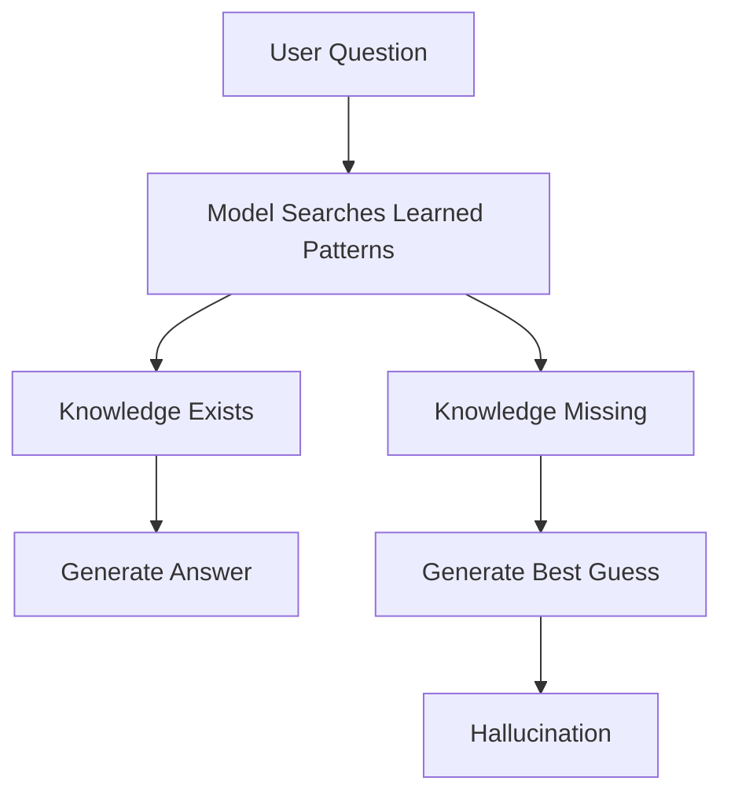
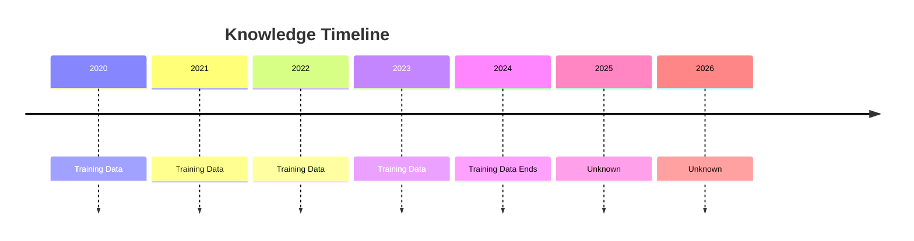

# LLM Limitations

> **Module 1** — Previous: [01-Introduction](01-Introduction.md) · Next chapter: 03-Hallucinations.md → [03-Hallucinations](03-Hallucinations.md)

## Introduction

Large Language Models (LLMs) have transformed the field of Artificial Intelligence.

They can:

- Write code
- Generate articles
- Answer questions
- Summarize documents
- Create reports
- Translate languages
- Generate SQL queries
- Assist with research

Because of these impressive capabilities, many people assume LLMs can solve every problem.

This assumption is one of the biggest mistakes developers make when building AI systems.

To understand why Retrieval-Augmented Generation (RAG) exists, we must first understand the limitations of Large Language Models.

---

## Learning Objectives

By the end of this chapter, you will understand:

- How LLMs generate responses
- Why LLMs are not databases
- The major limitations of LLMs
- Why enterprise systems cannot rely solely on LLMs
- Why these limitations led to the development of RAG

---

## Understanding How LLMs Actually Work

Before discussing limitations, we need to understand what an LLM actually does.

Most beginners imagine something like this:

```text
Question
 ↓
AI Thinks
 ↓
Correct Answer
```

Reality is very different.

An LLM performs:

```text
Question
 ↓
Tokenization
 ↓
Pattern Matching
 ↓
Probability Calculation
 ↓
Next Token Prediction
 ↓
Response
```

The model predicts the most likely next word.

It does not:

- Verify facts
- Search databases
- Check company documents
- Validate sources

Its primary goal is:

```text
Predict the next most probable token
```

This distinction explains nearly every limitation we will discuss.

---

## The Human Memory Analogy

Imagine a student who has read millions of books.

The student remembers patterns and concepts.

However:

- The student forgets details
- The student cannot remember every page
- The student sometimes guesses
- The student can confuse facts

LLMs behave similarly.

They learn patterns from enormous datasets.

They do not store information like a database.

---

## Limitation 1: Hallucinations

One of the most famous limitations of LLMs is hallucination.

A hallucination occurs when a model generates information that sounds correct but is actually false.

Example:

User:

```text
Who won the IPL in 2035?
```

Model:

```text
Chennai Super Kings won IPL 2035.
```

The answer appears confident.

The problem?

The event has not happened.

The model fabricated information.

---

### Why Hallucinations Occur

Consider this workflow:



The model prefers answering over admitting uncertainty.

This creates a major challenge for production AI systems.

---

## Real Business Impact

Hallucinations can cause:

#### Finance

Wrong investment recommendations

#### Healthcare

Incorrect medical guidance

#### Legal

Fabricated legal clauses

#### Compliance

Incorrect regulatory interpretations

#### Customer Support

False information given to customers

---

## Limitation 2: Knowledge Cutoff

LLMs only know information available during training.

Imagine:

```text
Training Data Ends
December 2024
```

Anything occurring after that date is unknown.

Example:

```text
Who won the IPL in 2026?
```

The model may not know.

---

### Visual Representation



This creates a significant challenge for:

- News systems
- Financial systems
- Regulatory systems
- Real-time applications

---

## Limitation 3: No Access to Private Data

This is one of the biggest reasons RAG exists.

Consider your company.

It has:

- Policies
- Contracts
- SOPs
- Internal Documentation
- Compliance Reports
- Customer Data

These documents are private.

They are not part of public training datasets.

Therefore:

```text
LLM
≠
Company Knowledge
```

---

### Enterprise Example

Ask:

```text
What is our leave policy?
```

The model has never seen your HR documents.

Any answer it provides is likely an educated guess.

This makes generic LLMs unsuitable for many enterprise use cases.

---

## Limitation 4: Context Window Restrictions

LLMs cannot process unlimited information.

Every model has a context window.

A context window is the maximum amount of information the model can process at one time.

Example:

```text
Question
+
Conversation
+
Documents
+
Instructions
=
Context Window
```

When the limit is exceeded:

```text
Old Information
Gets Removed
```

---

### Real World Example

Imagine:

```text
10,000 Page Contract Repository
```

You cannot simply paste everything into the prompt.

The model cannot process infinite text.

This becomes a major challenge when building enterprise assistants.

---

### Visual Example

```text
Entire Knowledge Base
┌─────────────────────────┐
│ 10,000 Documents        │
└─────────────────────────┘

LLM Context Window
┌───────────────┐
│ Small Portion │
└───────────────┘
```

The model can only see a fraction of the available information.

---

## Limitation 5: No Source Verification

LLMs generate answers.

They do not automatically verify:

- Government websites
- Company databases
- Official documents
- Regulatory frameworks

Example:

```text
Question
 ↓
LLM
 ↓
Answer
```

Notice:

```text
No Verification Step
```

This is dangerous in:

- Legal AI
- Compliance AI
- Healthcare AI
- Financial AI

---

## Limitation 6: Inconsistent Answers

Ask the same question multiple times.

You may receive slightly different answers.

Example:

```text
Question
 ↓
LLM
 ↓
Answer A
```

Run again:

```text
Question
 ↓
LLM
 ↓
Answer B
```

This happens because generation is probabilistic.

For enterprise systems, consistency is critical.

---

## Limitation 7: Explainability

Many AI systems require explainability.

Users often ask:

```text
Why did you give this answer?
```

A traditional LLM may struggle to provide a verifiable source.

Example:

```text
Question
 ↓
LLM
 ↓
Answer
```

Missing:

```text
Evidence
```

Without evidence:

- Trust decreases
- Audits become difficult
- Compliance becomes challenging

---

## Limitation 8: Compliance Risks

This is particularly important for:

- DPDP
- GDPR
- HIPAA
- PCI-DSS

Example:

User:

```text
What is our data retention period?
```

Actual policy:

```text
30 Days
```

Model response:

```text
90 Days
```

This creates:

- Regulatory risk
- Legal risk
- Customer trust issues

---

## Why These Limitations Matter

Let's imagine a company has:

```text
50,000 PDFs
10,000 Contracts
5,000 Policies
2,000 Compliance Reports
```

Now a user asks:

```text
What does our customer deletion policy say?
```

Traditional LLM workflow:

```text
Question
 ↓
Memory
 ↓
Guess
 ↓
Answer
```

This is not reliable.

---

## The Need for Something Better

Developers needed a way to:

- Access private documents
- Reduce hallucinations
- Retrieve current information
- Provide evidence
- Improve accuracy

This requirement led to the development of:

## Retrieval-Augmented Generation (RAG)

---

## Traditional LLM vs RAG

### Traditional LLM

```text
Question
 ↓
LLM
 ↓
Answer
```

Problems:

- Hallucinations
- Stale knowledge
- No private data access

---

### RAG

```text
Question
 ↓
Retrieve Documents
 ↓
Provide Context
 ↓
LLM
 ↓
Answer
```

Benefits:

- Reduced hallucinations
- Access to enterprise knowledge
- Better accuracy
- Source-backed responses

---

## Key Takeaways

Large Language Models are incredibly powerful.

However, they suffer from several critical limitations:

1. Hallucinations
2. Knowledge Cutoffs
3. No Access to Private Data
4. Context Window Restrictions
5. No Source Verification
6. Inconsistent Responses
7. Limited Explainability
8. Compliance Risks

These limitations are not bugs.

They are natural consequences of how LLMs work.

Understanding these limitations is the first step toward understanding why Retrieval-Augmented Generation became one of the most important architectural patterns in modern AI systems.

---

## What's Next?

In the next chapter, we will dive deep into the most famous limitation of all:

## Hallucinations

We will explore:

- Why they occur
- Different types of hallucinations
- Real-world failures
- How RAG reduces hallucinations
- Why hallucinations can never be completely eliminated

---

## Test Yourself

1. In one sentence, what is the primary job of an LLM when it responds to you?
2. What is a hallucination?
3. Why does a model trained until December 2024 fail on the question "Who won the IPL in 2026?"
4. Why can't a generic LLM correctly answer "What is our leave policy?"
5. Name two reasons why a compliance system cannot rely on a standalone LLM.

<details>
<summary>Answers</summary>

1. It predicts the next most likely token based on patterns learned during training.
2. Content that sounds correct and confident but is actually false or fabricated.
3. The event happened after training, so it is beyond the model's knowledge cutoff.
4. The HR document is private data that was never part of the model's public training data.
5. No source verification and compliance risks such as wrong answers on data retention or regulatory rules.
</details>
