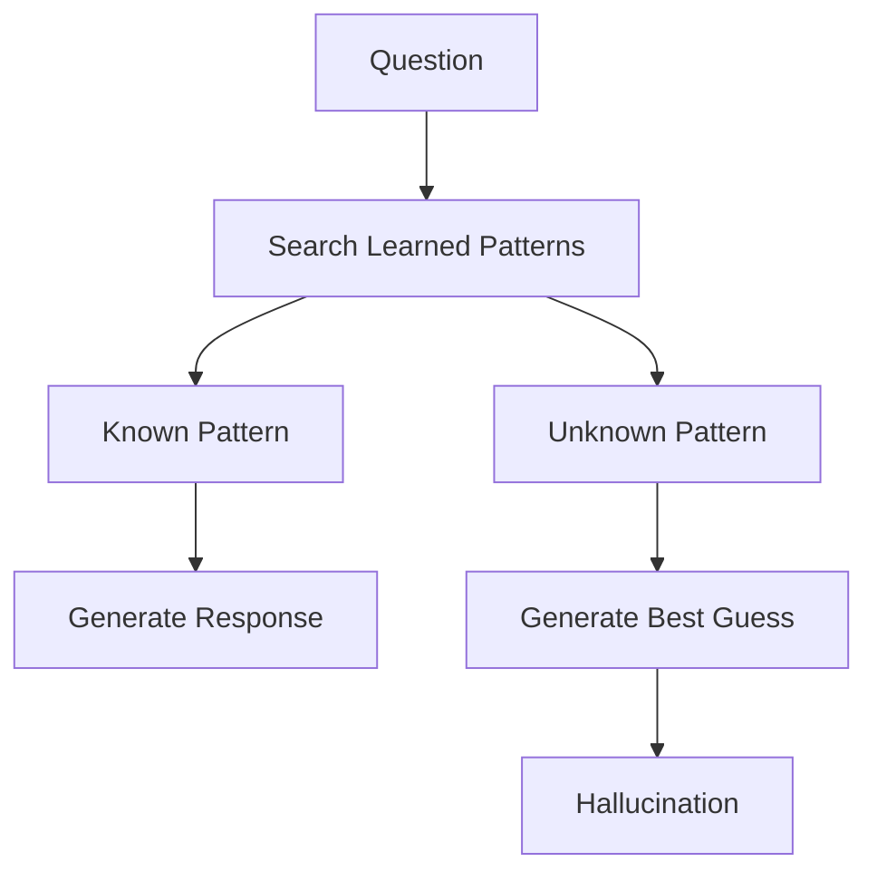
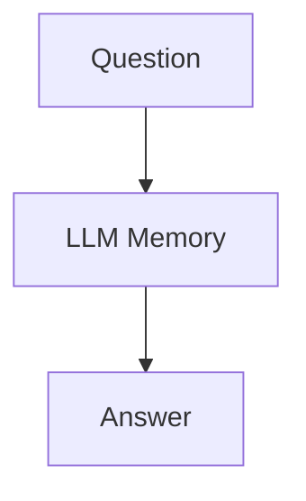
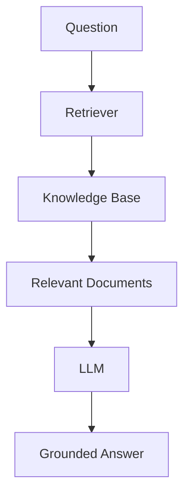

# Hallucinations

# Introduction

Imagine asking an AI:

> Who won the IPL in 2035?

and receiving:

```text
Chennai Super Kings won IPL 2035.
```

The answer sounds confident.

It sounds professional.

It sounds believable.

There is only one problem:

**IPL 2035 has not happened yet.**

The AI completely fabricated the answer.

This phenomenon is known as a **hallucination**.

Hallucinations are one of the most important concepts in Generative AI and one of the primary reasons Retrieval-Augmented Generation (RAG) was created.

Understanding hallucinations is critical before building production AI systems.

---

# Learning Objectives

By the end of this chapter, you will understand:

- What hallucinations are
- Why hallucinations happen
- Different types of hallucinations
- Real-world examples
- Business risks
- Why hallucinations cannot be completely eliminated
- How RAG helps reduce hallucinations

---

# What is a Hallucination?

A hallucination occurs when an AI model generates information that:

- Sounds correct
- Appears logical
- Is presented confidently

but is actually:

- False
- Fabricated
- Misleading
- Unsupported by evidence

---

## Simple Definition

```text
Confidently Wrong
```

---

## Formal Definition

A hallucination is generated content that is not grounded in factual information, training data, retrieved context, or verifiable evidence.

---

# Why Hallucinations Happen

Many beginners assume AI works like this:

```text
Question
 ↓
Search Database
 ↓
Find Truth
 ↓
Answer
```

Reality is different.

LLMs operate like this:

```text
Question
 ↓
Pattern Recognition
 ↓
Probability Calculation
 ↓
Next Token Prediction
 ↓
Answer
```

The model predicts what words are likely to come next.

Its goal is not:

```text
Find Truth
```

Its goal is:

```text
Predict Likely Text
```

This difference is extremely important.

---

# Visual Representation



---

# Example 1: Future Events

User:

```text
Who won the FIFA World Cup in 2050?
```

Possible Response:

```text
Brazil won the FIFA World Cup in 2050.
```

The model has no knowledge of future events.

It simply generates a plausible answer.

---

# Example 2: Fake Sources

User:

```text
Provide sources for this claim.
```

AI:

```text
According to the Global AI Research Report 2027...
```

The report may not exist.

The model invented a citation.

---

# Example 3: Fake Statistics

User:

```text
What percentage of companies use RAG?
```

AI:

```text
73% of companies currently use RAG.
```

The number may be completely fabricated.

---

# Why Confidence Is Dangerous

Humans often associate confidence with correctness.

Consider:

```text
Maybe the answer is 20%.
```

versus

```text
The answer is exactly 20%.
```

Which sounds more trustworthy?

The second one.

Unfortunately AI models often provide:

```text
High Confidence
+
Low Accuracy
```

This combination is dangerous.

---

# Types of Hallucinations

Hallucinations come in many forms.

---

# Type 1: Factual Hallucination

The model invents facts.

Example:

```text
The Moon is 10,000 km from Earth.
```

Reality:

```text
~384,400 km
```

---

# Type 2: Citation Hallucination

The model invents references.

Example:

```text
Source:
Page 156 of AI Research Handbook 2029
```

The book does not exist.

---

# Type 3: Source Hallucination

The model claims information came from a source.

Example:

```text
According to NASA's 2028 report...
```

No such report exists.

---

# Type 4: Mathematical Hallucination

Models can make arithmetic mistakes.

Example:

```text
273 × 84
```

may produce incorrect results.

While newer models are better, errors still occur.

---

# Type 5: Reasoning Hallucination

The information may be correct.

The conclusion may be wrong.

Example:

```text
Premise 1 = True
Premise 2 = True
Conclusion = False
```

---

# Type 6: Context Hallucination

The answer contradicts the provided context.

Example:

Document:

```text
Refund Period = 30 Days
```

Model:

```text
Refund Period = 90 Days
```

The evidence was present.

The model still answered incorrectly.

---

# Enterprise Example

Imagine a company chatbot.

Question:

```text
What is our leave policy?
```

Possible Hallucinated Response:

```text
Employees receive 45 annual leave days.
```

Actual Policy:

```text
Employees receive 30 annual leave days.
```

This creates confusion across the organization.

---

# Healthcare Example

Patient:

```text
Can I combine these medicines?
```

Hallucinated Answer:

```text
Yes, completely safe.
```

Actual Medical Reality:

```text
Potentially dangerous interaction.
```

Consequences can be severe.

---

# Legal Example

Lawyer:

```text
Summarize this contract.
```

AI:

```text
Termination requires 90-day notice.
```

Actual Contract:

```text
Termination requires 30-day notice.
```

This can create legal liabilities.

---

# Financial Example

User:

```text
Should I invest in Company X?
```

AI:

```text
Company X grew 45% last year.
```

If the figure is fabricated:

- Investment decisions become flawed
- Trust is lost
- Financial damage may occur

---

# DPDP Compliance Example

Imagine a privacy compliance assistant.

Question:

```text
What is our data retention policy?
```

Actual Policy:

```text
30 Days
```

AI Response:

```text
90 Days
```

Potential consequences:

- Regulatory violations
- Audit failures
- Compliance penalties

This is why hallucinations are a major concern in compliance systems.

---

# Why Hallucinations Increase

Hallucinations become more likely when:

## Missing Knowledge

```text
Question
+
No Relevant Knowledge
=
Guess
```

---

## Ambiguous Questions

Example:

```text
Tell me about Apple.
```

Which Apple?

- Apple Inc.
- Apple Fruit

Ambiguity increases uncertainty.

---

## Long Conversations

As conversations grow:

```text
More Tokens
↓
More Complexity
↓
Higher Error Probability
```

---

## Poor Prompts

Bad prompts often produce bad outputs.

Example:

```text
Tell me everything about AI.
```

This is vague and open-ended.

---

# Why Hallucinations Cannot Be Fully Eliminated

Many beginners ask:

> Can we remove hallucinations completely?

The answer is:

```text
No
```

Because LLMs are probabilistic systems.

Every response involves prediction.

Prediction always carries uncertainty.

---

# Hallucinations vs Databases

Database:

```text
Question
 ↓
Lookup
 ↓
Exact Answer
```

LLM:

```text
Question
 ↓
Prediction
 ↓
Likely Answer
```

This fundamental difference explains why hallucinations exist.

---

# How RAG Reduces Hallucinations

Without RAG:

```text
Question
 ↓
LLM Memory
 ↓
Guess
 ↓
Answer
```

With RAG:

```text
Question
 ↓
Retrieve Documents
 ↓
Provide Context
 ↓
LLM
 ↓
Answer
```

Now the model has evidence.

Instead of guessing:

```text
Question
 ↓
Evidence
 ↓
Answer
```

---

# Visual Comparison

## Traditional LLM



---

## RAG System



---

# Can RAG Eliminate Hallucinations?

No.

RAG reduces hallucinations.

It does not eliminate them.

Possible failure points:

- Wrong document retrieval
- Poor chunking
- Missing documents
- Weak prompts
- Model reasoning errors

---

# Best Practices for Reducing Hallucinations

## 1. Use RAG

Ground answers in evidence.

---

## 2. Use Citations

Provide sources with responses.

---

## 3. Improve Chunking

Better chunks improve retrieval.

---

## 4. Restrict Answers

Example prompt:

```text
Answer only from the provided context.
If information is unavailable, say so.
```

---

## 5. Use Verification Layers

Validate outputs before returning them.

---

## 6. Use Human Review

Critical decisions should involve humans.

---

# Real-World Lesson

One of the biggest mistakes teams make is believing:

```text
The AI sounds confident.
Therefore it must be correct.
```

Confidence is not accuracy.

Trust should come from:

- Evidence
- Sources
- Validation
- Verification

not from tone.

---

# Key Takeaways

Hallucinations are one of the most important limitations of Large Language Models.

Remember:

- LLMs predict text
- LLMs do not verify truth
- Missing knowledge often leads to guesses
- Hallucinations can be costly in production systems
- RAG significantly reduces hallucinations
- Hallucinations can never be completely eliminated

Understanding hallucinations is the first step toward building reliable AI applications.

---

# What's Next?

In the next chapter, we will explore another major limitation of LLMs:

# Knowledge Cutoff

You will learn:

- Why models become outdated
- Why training data ages quickly
- Why real-time information is difficult for LLMs
- How RAG helps overcome knowledge cutoff limitations
