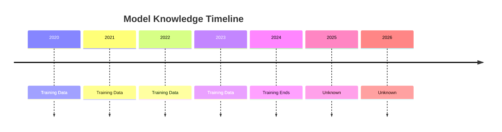
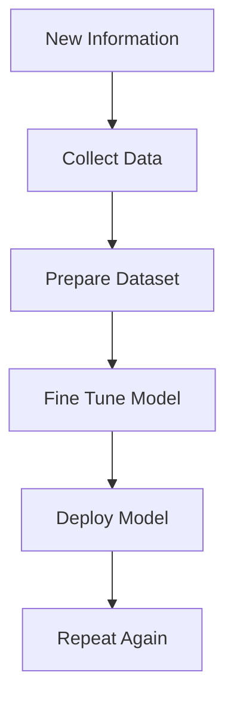
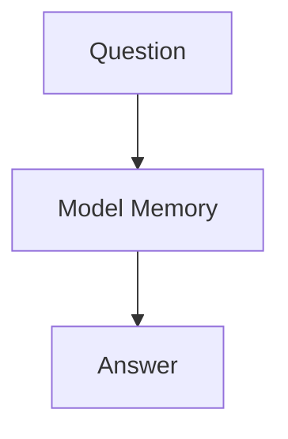
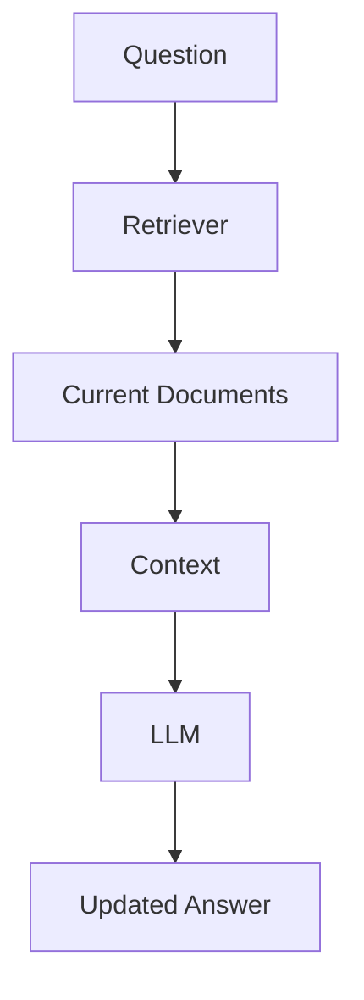

# Knowledge Cutoff

> **Module 1** — Previous: [03-Hallucinations](03-Hallucinations.md) · Next chapter: 05-Private data problem.md → [05-Private data problem](05-Private%20data%20problem.md)

## Introduction

Imagine asking an AI:

```text
Who won the IPL in 2026?
```

The AI responds:

```text
I don't know.
```

or worse:

```text
Chennai Super Kings won IPL 2026.
```

even though the information is unavailable.

Why does this happen?

The answer lies in one of the most fundamental limitations of Large Language Models:

## Knowledge Cutoff

Knowledge Cutoff is one of the primary reasons Retrieval-Augmented Generation (RAG) became essential for modern AI systems.

Even the most powerful AI models cannot know information that did not exist when they were trained.

This chapter explores what Knowledge Cutoff is, why it exists, its impact on real-world applications, and how RAG helps overcome it.

---

## Learning Objectives

By the end of this chapter, you will understand:

- What Knowledge Cutoff means
- Why LLMs become outdated
- How model training affects knowledge
- Why enterprises cannot rely solely on model memory
- Real-world risks caused by outdated information
- How RAG solves the problem

---

## What is Knowledge Cutoff?

Knowledge Cutoff refers to the point in time after which a model has no inherent knowledge.

Simply put:

```text
Training Data Ends
↓
Model Knowledge Ends
```

Anything that happens after the training period is unknown to the model.

---

## Simple Analogy

Imagine a student preparing for an exam.

The student studies books published until:

```text
December 2024
```

Now ask them:

```text
What happened in March 2025?
```

They cannot answer because they never saw that information.

LLMs face the exact same problem.

---

## Visual Representation



Everything after training becomes invisible to the model.

---

## Why Does Knowledge Cutoff Exist?

Many beginners ask:

> Why can't AI just know everything?

Because training an LLM is extremely expensive.

Training involves:

- Massive datasets
- Thousands of GPUs
- Weeks or months of computation
- Enormous costs

A model is essentially a snapshot of knowledge at a particular point in time.

---

## Training as a Snapshot

Think of training like taking a photograph.

```text
World Information
↓
Training Process
↓
Snapshot Captured
↓
Model Created
```

After the snapshot is taken:

```text
New Information
≠
Automatically Known
```

The model cannot magically learn new events.

---

## Example: Sports

Suppose a model was trained until:

```text
December 2024
```

Now ask:

```text
Who won the IPL 2026?
```

The model cannot know.

Possible outcomes:

#### Best Case

```text
I don't have information.
```

#### Worst Case

```text
Mumbai Indians won IPL 2026.
```

which is completely fabricated.

---

## Example: Stock Markets

Question:

```text
What is the current stock price of Tesla?
```

A traditional LLM cannot know.

Stock prices change every second.

Without live access:

```text
Answer = Outdated
```

---

## Example: News

Question:

```text
What happened in today's election?
```

The model cannot know unless:

- It has live internet access
- It uses retrieval systems
- It receives updated information

---

## Example: Regulations

Consider compliance systems.

Question:

```text
What are the latest DPDP Rules?
```

Government regulations evolve.

A model trained before the changes may provide outdated guidance.

This creates:

- Compliance risks
- Legal risks
- Business risks

---

## Enterprise Knowledge Cutoff

Knowledge cutoff becomes even more severe inside organizations.

Imagine:

```text
Company Policy Updated Yesterday
```

Question:

```text
What is our latest leave policy?
```

The LLM cannot know.

Why?

Because:

```text
Company Policy
+
Private Data
+
Recent Update
=
Not In Training Data
```

---

## The Enterprise Problem

Consider a company with:

- 50,000 PDFs
- 20,000 SOPs
- 5,000 Contracts
- 10,000 Policies

Every day:

- Documents change
- Policies change
- Procedures change

Training a new model every time something changes would be impossible.

---

## Visual Example

```text
Company Knowledge Base

2024 Policy
2025 Policy
2026 Policy
2027 Policy

LLM Training
        ↑
Only sees old version
```

The model becomes stale.

---

## Why Fine-Tuning Doesn't Solve This

Many beginners think:

```text
Let's Fine-Tune The Model
```

Problem:

New information keeps arriving.

Imagine:

```text
Daily Documents
+
Daily Policies
+
Daily Reports
```

Would you retrain the model every day?

Not practical.

---

## Fine-Tuning Workflow



This process is:

- Expensive
- Slow
- Difficult to maintain

---

## Real-World Example

Suppose your HR team updates:

```text
Work From Home Policy
```

Yesterday.

Employees ask:

```text
What is our current WFH policy?
```

Without retrieval:

```text
Model Uses Old Knowledge
```

Result:

```text
Wrong Answer
```

---

## Dynamic Data vs Static Models

The world changes continuously.

Models are static.

```text
World
↓
Changes Every Second
```

```text
Model
↓
Changes Only After Retraining
```

This mismatch creates the Knowledge Cutoff problem.

---

## Industries Affected

Knowledge Cutoff impacts nearly every industry.

---

## Finance

Examples:

- Stock prices
- Exchange rates
- Market conditions

These change constantly.

---

## Healthcare

Examples:

- New medical studies
- Drug approvals
- Treatment guidelines

Outdated information can be dangerous.

---

## Legal

Examples:

- Court rulings
- New regulations
- Legislative updates

Incorrect legal advice can create liability.

---

## Compliance

Examples:

- DPDP updates
- GDPR amendments
- Industry regulations

Organizations need current information.

---

## Customer Support

Examples:

- Product releases
- Pricing changes
- New features

Customers expect up-to-date answers.

---

## The Traditional LLM Problem

Traditional workflow:

```text
Question
↓
LLM Memory
↓
Answer
```

The model depends entirely on what it learned during training.

If information is newer:

```text
Answer Quality Drops
```

---

## How RAG Solves Knowledge Cutoff

Instead of relying only on memory:

```text
Question
↓
Search Documents
↓
Retrieve Current Information
↓
LLM
↓
Answer
```

Now the model can access:

- Updated documents
- New policies
- Recent reports
- Live knowledge bases

---

## Visual Comparison

### Traditional LLM



Problem:

```text
Memory Can Become Outdated
```

---

### RAG



---

## Enterprise Example

Question:

```text
What is our latest leave policy?
```

Traditional LLM:

```text
Uses Old Knowledge
```

RAG:

```text
Retrieves Latest HR Policy
↓
Provides Current Answer
```

Huge difference.

---

## RAG as External Memory

A useful mental model:

```text
LLM = Brain
```

```text
RAG = External Memory
```

Together:

```text
Brain
+
Memory
=
Reliable System
```

---

## Does RAG Completely Eliminate Knowledge Cutoff?

Not entirely.

Potential issues:

- Missing documents
- Failed indexing
- Retrieval errors
- Stale databases

However:

```text
Knowledge Cutoff
↓
Massively Reduced
```

compared to standalone LLMs.

---

## Best Practices

### Use RAG for Dynamic Information

Examples:

- Policies
- News
- Regulations
- Documentation

---

### Keep Knowledge Bases Updated

Retrieval is only as good as the data available.

---

### Use Versioned Documents

Maintain historical records.

---

### Refresh Embeddings Periodically

Ensure new content becomes searchable.

---

### Add Source Citations

Help users verify information.

---

## Key Takeaways

Knowledge Cutoff is one of the most important limitations of Large Language Models.

Remember:

- Models only know what existed during training
- New information is invisible to the model
- The world changes faster than model retraining
- Fine-tuning is not a practical solution for constantly changing information
- Enterprises require access to current knowledge
- RAG solves this problem by retrieving fresh information at query time

Knowledge Cutoff is one of the strongest arguments for using Retrieval-Augmented Generation in production AI systems.

---

## What's Next?

In the next chapter:

## Private Data Problem

You will learn:

- Why LLMs cannot access your company documents
- Why enterprise knowledge is different from public knowledge
- The challenge of internal documentation
- Why private data is one of the biggest drivers of RAG adoption

---

## Test Yourself

1. What is Knowledge Cutoff?
2. Why can't an LLM simply "know everything"?
3. Why doesn't fine-tuning solve the Knowledge Cutoff problem for data that changes daily?
4. In the WFH policy example, what happens when the model answers after the policy was updated?
5. How does RAG help with Knowledge Cutoff, and can it eliminate the problem completely?

<details>
<summary>Answers</summary>

1. The point in time after which a model has no inherent knowledge because that information did not exist in its training data.
2. Training is extremely expensive and slow, and a model is a fixed snapshot of knowledge at one point in time.
3. You would need to retrain the model every time a document or policy changes, which is impractical.
4. The model relies on its old training knowledge and returns an outdated, wrong answer.
5. RAG retrieves fresh, current documents at query time, which massively reduces the problem but does not eliminate it entirely.
</details>
