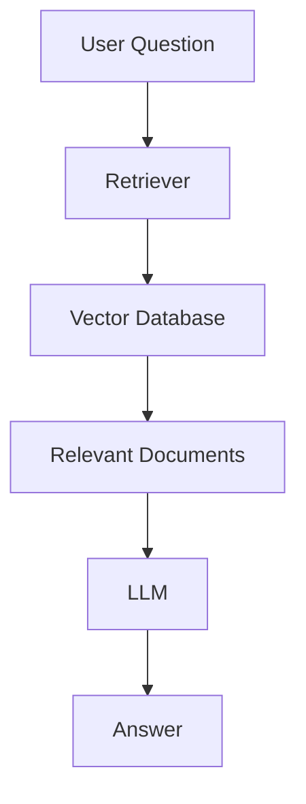

# Private Data Problem

# Introduction

Imagine asking ChatGPT:

```text
What is my company's leave policy?
```

or

```text
What does our internal security policy say about VPN access?
```

or

```text
Summarize the contract we signed with ABC Corp.
```

A standard Large Language Model cannot answer these questions.

Why?

Because the model has never seen those documents.

This limitation is known as the:

# Private Data Problem

It is one of the biggest reasons organizations adopt Retrieval-Augmented Generation (RAG).

In fact, most enterprise AI projects exist not because LLMs are incapable, but because company knowledge is private and inaccessible to them.

---

# Learning Objectives

By the end of this chapter, you will understand:

- What the Private Data Problem is
- Why LLMs cannot access company documents
- Why enterprise knowledge differs from public knowledge
- Challenges of internal documentation
- Why training data is not enough
- Why fine-tuning is not a complete solution
- How RAG solves the problem

---

# What is the Private Data Problem?

Large Language Models are trained on:

- Public websites
- Books
- Research papers
- Documentation
- Public repositories
- Open datasets

They are NOT trained on:

- Your company documents
- Internal policies
- HR manuals
- Contracts
- Customer databases
- Internal SOPs
- Private wikis

Therefore:

```text
LLM Knowledge
≠
Company Knowledge
```

---

# Visual Representation

```text
Public Internet
├── Wikipedia
├── Blogs
├── Research Papers
├── Open Source Code
└── Documentation

        ↓

     LLM Training

        ↓

      AI Model
```

Missing:

```text
Your Company Data
```

---

# Example 1: HR Policy

Question:

```text
What is our leave policy?
```

The LLM cannot know because:

```text
Internal HR Policy
=
Private Document
```

It was never part of training.

---

# Example 2: Customer Support

Question:

```text
What are the refund rules for Product X?
```

The answer may exist inside:

```text
Internal Documentation
```

The LLM has never seen it.

---

# Example 3: Compliance

Question:

```text
What is our DPDP data retention policy?
```

Actual answer:

```text
Retention = 30 Days
```

The model cannot know this unless it has access to the policy.

---

# Public Knowledge vs Private Knowledge

## Public Knowledge

Examples:

```text
Who invented Python?
```

```text
What is Kubernetes?
```

```text
What is Machine Learning?
```

These answers exist publicly.

LLMs perform well.

---

## Private Knowledge

Examples:

```text
What is our employee onboarding process?
```

```text
What are our internal escalation procedures?
```

```text
What clauses exist in Contract A?
```

These answers exist only inside the organization.

LLMs struggle.

---

# Enterprise Knowledge Explosion

Modern companies generate enormous amounts of data.

A medium-sized company may have:

```text
10,000 PDFs
5,000 Policies
20,000 Support Articles
15,000 Contracts
100,000 Emails
```

Every day:

```text
New Documents
New Policies
New Reports
New Procedures
```

This knowledge constantly evolves.

---

# Why Training Cannot Solve This

Many beginners think:

```text
Let's train the model on our data.
```

Sounds reasonable.

Reality is different.

---

# Problem 1: Data Changes Constantly

Imagine:

```text
Policy Updated Today
```

Would you retrain the model?

Tomorrow:

```text
Policy Updated Again
```

Retrain again?

Not practical.

---

# Problem 2: Massive Cost

Training modern models costs:

```text
Thousands
to
Millions of Dollars
```

depending on scale.

Retraining every time a document changes is impossible.

---

# Problem 3: Security Risks

Many organizations cannot expose:

- Customer records
- Legal documents
- Financial data
- Trade secrets

to model training pipelines.

---

# Problem 4: Version Control

Which version should the model learn?

Example:

```text
Policy v1
Policy v2
Policy v3
Policy v4
```

Business users usually need:

```text
Latest Version
```

Training creates stale knowledge.

---

# The Internal Wiki Problem

Imagine a company wiki.

```text
Confluence
Notion
SharePoint
Google Drive
```

Employees store:

- Policies
- SOPs
- Architecture Docs
- Incident Reports

Question:

```text
How do I deploy Service X?
```

Answer exists somewhere.

But the model cannot access it.

---

# Real Enterprise Example

Imagine a bank.

Documents:

```text
KYC Policies
Fraud Detection Rules
Customer Procedures
Audit Reports
```

Employee asks:

```text
What is the latest KYC verification process?
```

The answer may have changed yesterday.

Without retrieval:

```text
Model = Outdated
```

---

# The Search Problem

Even if documents exist:

```text
50,000 PDFs
```

Finding the right document becomes difficult.

Traditional search:

```text
Keyword Matching
```

Problems:

- Synonyms
- Different wording
- Missing keywords

Example:

Document:

```text
Annual Leave Policy
```

User asks:

```text
Vacation Rules
```

Keyword search may fail.

---

# Why Traditional Search Isn't Enough

Traditional Search:

```text
Question
↓
Keyword Match
↓
Results
```

Issues:

- Exact keyword dependency
- Poor semantic understanding
- Too many irrelevant results

---

# Why LLMs Alone Aren't Enough

Traditional LLM:

```text
Question
↓
Model Memory
↓
Answer
```

Issues:

- No access to documents
- No private knowledge
- No latest updates

---

# The Enterprise AI Challenge

Organizations need:

```text
Natural Language Understanding
+
Private Knowledge Access
```

Neither traditional search nor standalone LLMs solve both.

---

# Enter Retrieval-Augmented Generation (RAG)

RAG combines:

```text
Search
+
Retrieval
+
LLMs
```

into a single architecture.

---

# How RAG Solves Private Data Access

Workflow:

```text
Question
↓
Retriever
↓
Company Documents
↓
Relevant Context
↓
LLM
↓
Answer
```

Now the model can use:

- Policies
- SOPs
- Contracts
- Wikis
- Internal Documentation

without retraining.

---

# Visual Architecture



---

# Example: Leave Policy

User:

```text
What is our leave policy?
```

Retriever:

```text
Find HR Policy Document
```

Context:

```text
Employees receive
30 annual leave days.
```

LLM:

```text
Employees are entitled to 30 annual leave days per year.
```

Now the answer is grounded in evidence.

---

# Example: Contract Analysis

Question:

```text
What is the termination clause in Contract A?
```

Retriever:

```text
Fetch Contract A
```

LLM:

```text
Summarize termination clause
```

Result:

```text
Accurate Answer
```

without retraining.

---

# Why Enterprises Love RAG

Benefits:

## Up-to-Date Information

Latest documents can be used immediately.

---

## No Retraining

New files become searchable after indexing.

---

## Better Accuracy

Answers come from actual documents.

---

## Explainability

Sources can be shown.

Example:

```text
Source:
HR_Policy_v5.pdf
Page 12
```

---

## Security

Private knowledge remains inside enterprise systems.

---

# Common Misconception

Many people think:

```text
RAG = Making AI Smarter
```

Not exactly.

A better description:

```text
RAG = Giving AI Access To Knowledge
```

The intelligence comes from the model.

The knowledge comes from retrieval.

---

# Brain and Library Analogy

Think of:

```text
LLM = Employee
```

```text
Company Documents = Library
```

Without library:

```text
Employee Guesses
```

With library:

```text
Employee Reads
↓
Employee Answers
```

RAG gives the employee access to the library.

---

# Key Takeaways

The Private Data Problem is one of the biggest limitations of Large Language Models.

Remember:

- LLMs are trained on public data
- Company knowledge is private
- Internal documents are not part of training
- Retraining is expensive and impractical
- Enterprises need access to current private knowledge
- RAG bridges the gap between AI and enterprise data

Without solving the Private Data Problem, enterprise AI assistants cannot be reliable.

This is why most successful enterprise AI systems today are powered by Retrieval-Augmented Generation.

---

# What's Next?

In the next chapter:

# Context Window Limitations

You will learn:

- What context windows are
- How token limits work
- Why large document collections create problems
- Why even modern LLMs cannot read everything at once
- How RAG intelligently selects only the most relevant information
