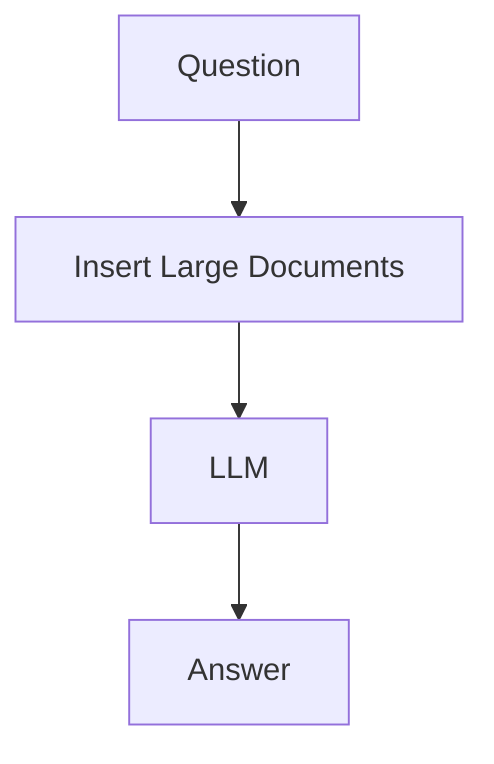
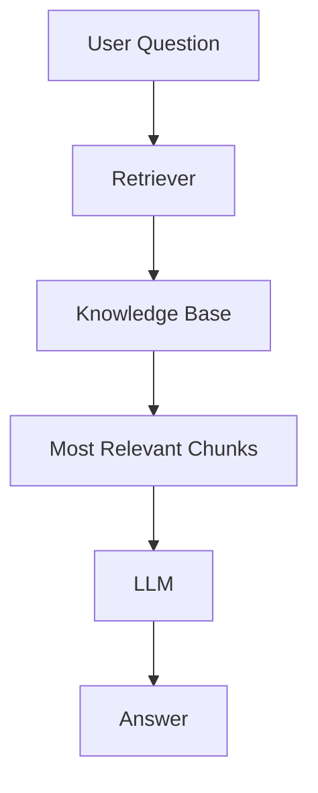

# Context Window Limitations

> **Module 1** — Previous: [05-Private data problem](05-Private%20data%20problem.md) · Next chapter: 07-Fine tunning vs RAG.md → [07-Fine tunning vs RAG](07-Fine%20tunning%20vs%20RAG.md)

## Introduction

Imagine giving an AI model:

```text
10,000 PDFs
50,000 Policies
100,000 Pages of Documentation
```

and asking:

```text
Summarize everything.
```

Most beginners assume modern AI models can simply read everything and answer.

Reality is very different.

Every Large Language Model has a limitation known as a:

## Context Window

The context window determines how much information a model can "see" at one time.

No matter how powerful a model becomes, it cannot process infinite information in a single request.

This limitation is one of the most important reasons Retrieval-Augmented Generation (RAG) exists.

---

## Learning Objectives

By the end of this chapter, you will understand:

- What a Context Window is
- What Tokens are
- How Context Windows work
- Why context limitations exist
- Problems caused by large documents
- Why enterprises face context challenges
- How RAG solves the problem

---

## What is a Context Window?

A Context Window is the amount of information an LLM can process in a single interaction.

Think of it as:

```text
AI Working Memory
```

or

```text
Temporary Attention Span
```

The model can only "see" information inside this window.

Anything outside the window is invisible.

---

## Human Analogy

Imagine reading a book through a small window.

```text
Entire Book
┌─────────────────────┐
│ 1000 Pages          │
└─────────────────────┘

Visible Section
┌──────────────┐
│ Current Page │
└──────────────┘
```

You can only read what is visible.

The same principle applies to LLMs.

---

## What Are Tokens?

Before understanding context windows, we need to understand tokens.

Models do not read text as words.

They read:

```text
Tokens
```

A token can be:

- A word
- Part of a word
- A symbol
- A punctuation mark

---

## Example

Text:

```text
Artificial Intelligence is amazing
```

May become:

```text
Artificial
Intelligence
is
amazing
```

4 tokens

Another example:

```text
unbelievable
```

might become:

```text
un
believ
able
```

3 tokens

---

## Visual Representation

```text
Sentence
↓
Tokenizer
↓
Tokens
↓
Model
```

---

## Why Tokens Matter

Context windows are measured in:

```text
Tokens
```

not pages.

Example:

```text
8K Context Window
```

means:

```text
Approximately 8,000 Tokens
```

---

## Typical Context Sizes

Modern models vary significantly.

Example:

```text
8K Tokens
16K Tokens
32K Tokens
128K Tokens
200K+ Tokens
```

Even large context windows are finite.

---

## Everything Counts Toward Context

Many beginners think:

```text
Only Documents Count
```

Not true.

The context window includes:

```text
System Prompt
+
User Prompt
+
Conversation History
+
Retrieved Documents
+
Model Response
```

Everything consumes tokens.

---

## Visual Breakdown

```text
Context Window

┌─────────────────────────┐
│ System Instructions     │
├─────────────────────────┤
│ Chat History            │
├─────────────────────────┤
│ User Question           │
├─────────────────────────┤
│ Retrieved Documents     │
├─────────────────────────┤
│ Generated Response      │
└─────────────────────────┘
```

---

## The Overflow Problem

What happens when the limit is exceeded?

Example:

```text
Context Limit = 100 Tokens
```

Input:

```text
150 Tokens
```

Something must be removed.

Usually:

```text
Older Information
```

gets discarded.

---

## Example

Conversation:

```text
User: My name is Harini.
```

Later:

```text
User: What is my name?
```

If the conversation becomes too long:

```text
"My name is Harini"
```

may fall outside the context window.

The model forgets.

---

## Why This Is a Major Enterprise Problem

Imagine a company with:

```text
50,000 Policies
100,000 Support Articles
25,000 Contracts
```

Question:

```text
Summarize our compliance requirements.
```

You cannot simply send everything.

The context window would overflow.

---

## Visual Example

```text
Knowledge Base

█████████████████████████████

Context Window

████
```

Only a small portion can fit.

---

## Why Bigger Context Windows Don't Fully Solve It

Many people assume:

```text
Bigger Context Window
=
Problem Solved
```

Not exactly.

Even if a model supports:

```text
1 Million Tokens
```

large enterprises may have:

```text
Billions of Tokens
```

The problem still exists.

---

## Cost Problems

Larger context means:

```text
More Tokens
↓
More Processing
↓
Higher Cost
```

For example:

```text
10 Pages
```

costs far less than:

```text
1000 Pages
```

---

## Performance Problems

As context grows:

```text
More Information
↓
More Noise
↓
Harder Retrieval
```

The model may struggle to identify what is important.

---

## Lost in the Middle Problem

Researchers discovered an interesting issue.

Even when information exists inside the context window:

```text
Beginning
Middle
End
```

Models often struggle to find information hidden in the middle.

This is called:

## Lost in the Middle

---

## Example

Document:

```text
Page 1
Page 2
Page 3
...
Page 200
```

Critical information:

```text
Page 103
```

The model may miss it.

---

## Visual Representation

```text
Beginning  ✓

Middle     ✗

End        ✓
```

Information in the middle is sometimes overlooked.

---

## Multi-Document Problem

Suppose:

```text
Contract A
Contract B
Policy C
Policy D
Report E
```

are all inserted into context.

The model now needs to:

- Read everything
- Understand everything
- Remember everything
- Answer correctly

This becomes increasingly difficult.

---

## Traditional LLM Approach



Problems:

- Expensive
- Slow
- Limited by context size

---

## Why RAG Was Created

Instead of sending:

```text
Entire Knowledge Base
```

RAG retrieves only:

```text
Relevant Information
```

---

## RAG Workflow



---

## Example

Knowledge Base:

```text
100,000 Documents
```

Question:

```text
What is the leave policy?
```

RAG retrieves:

```text
HR Policy Document
```

instead of:

```text
Entire Company Database
```

This dramatically reduces context usage.

---

## Smart Context vs Large Context

Traditional Approach:

```text
Send Everything
```

RAG Approach:

```text
Send Only What Matters
```

This is the key insight behind modern retrieval systems.

---

## Context Window and RAG

Without RAG:

```text
Question
↓
Massive Documents
↓
Context Overflow
↓
Poor Answers
```

With RAG:

```text
Question
↓
Retrieve Relevant Chunks
↓
Small Context
↓
Better Answers
```

---

## Real Enterprise Example

Question:

```text
What is our VPN policy?
```

Company Knowledge Base:

```text
10,000 Documents
```

RAG retrieves:

```text
VPN Policy.pdf
Section 4.2
```

Only relevant information enters the context window.

---

## Best Practices

### Retrieve Before Generate

Always retrieve relevant information first.

---

### Keep Chunks Small

Smaller chunks fit more efficiently into context.

---

### Use Reranking

Select the most relevant chunks.

---

### Avoid Dumping Entire Documents

Large documents waste context.

---

### Monitor Token Usage

Track how much context is being consumed.

---

## Key Takeaways

Context Window Limitations are one of the most important challenges in modern AI systems.

Remember:

- Models have finite working memory
- Context is measured in tokens
- Large document collections exceed context limits
- Bigger context windows help but do not solve everything
- Cost and performance degrade with large contexts
- RAG solves the problem by retrieving only relevant information

A powerful AI system is not the one that reads everything.

It is the one that knows what information to read.

That is exactly what Retrieval-Augmented Generation enables.

---

## What's Next?

In the next chapter:

## Why Fine-Tuning Is Not Enough

You will learn:

- What Fine-Tuning actually does
- Common misconceptions about Fine-Tuning
- Fine-Tuning vs RAG
- When to use each approach
- Why most enterprise AI systems use RAG instead of continuous fine-tuning

---

## Test Yourself

1. What is a context window?
2. What is a token?
3. Besides the user question, what else consumes tokens inside the context window?
4. What is the "lost in the middle" problem?
5. How does RAG reduce context usage when a knowledge base has 100,000 documents?

<details>
<summary>Answers</summary>

1. The maximum amount of information an LLM can process in a single interaction, like working memory.
2. A unit of text the model reads, which can be a word, part of a word, a symbol, or a punctuation mark.
3. The system prompt, conversation history, retrieved documents, and the generated response.
4. Models often fail to notice critical information placed in the middle of a long context window.
5. RAG retrieves only the most relevant chunks instead of sending the entire knowledge base.
</details>
