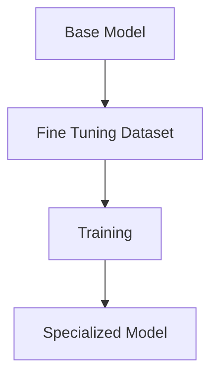
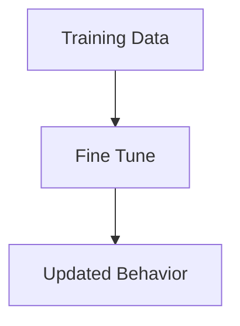
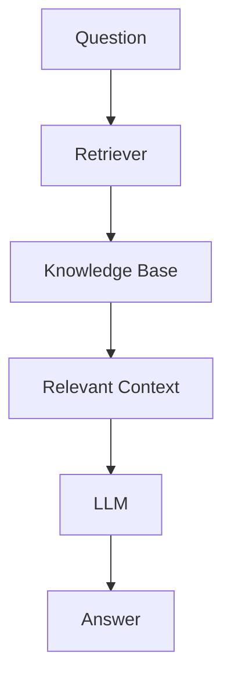
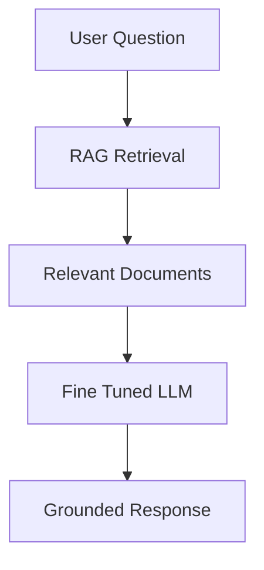

# Why Fine-Tuning Is Not Enough

> **Module 1** — Previous: [06-Context Window](06-Context%20Window.md) · Next chapter: 08-When not to use RAG.md → [08-When not to use RAG](08-When%20not%20to%20use%20RAG.md)

## Introduction

After learning about:

- Hallucinations
- Knowledge Cutoff
- Private Data Access
- Context Window Limitations

many engineers arrive at the same conclusion:

> Why don't we just fine-tune the model?

At first glance, fine-tuning seems like the perfect solution.

Need company knowledge?

```text
Fine-Tune
```

Need better answers?

```text
Fine-Tune
```

Need compliance knowledge?

```text
Fine-Tune
```

Need domain expertise?

```text
Fine-Tune
```

Unfortunately, reality is much more complicated.

While fine-tuning is a powerful technique, it is often misunderstood and frequently misused.

One of the biggest lessons in enterprise AI is:

```text
Fine-Tuning Is Not A Replacement For RAG
```

Understanding this distinction is critical for building scalable AI systems.

---

## Learning Objectives

By the end of this chapter, you will understand:

- What Fine-Tuning actually is
- What Fine-Tuning changes
- Common misconceptions
- Why Fine-Tuning cannot solve dynamic knowledge problems
- Fine-Tuning vs RAG
- When to use each approach
- Why most enterprise systems use RAG

---

## What is Fine-Tuning?

Fine-Tuning is the process of training an existing model on additional data to modify its behavior.

Think of it as:

```text
Teaching New Habits
```

rather than

```text
Giving New Memory
```

This distinction is extremely important.

---

## Human Analogy

Imagine hiring a new employee.

The employee already knows:

- English
- Communication
- Writing
- Problem Solving

Now you train them on:

```text
Company Communication Style
```

You are not giving them every company document.

You are teaching:

```text
How To Behave
```

Fine-Tuning works similarly.

---

## Visual Representation



The model learns patterns from the new dataset.

---

## What Fine-Tuning Changes

Fine-Tuning is excellent for changing:

### Tone

Example:

```text
Formal
Casual
Professional
Friendly
```

---

### Writing Style

Example:

```text
Marketing Style
Legal Style
Technical Style
Medical Style
```

---

### Domain Vocabulary

Example:

```text
Medical Terminology
Financial Terms
Legal Language
```

---

### Structured Outputs

Example:

```json
{
  "summary": "",
  "risk_level": "",
  "recommendation": ""
}
```

Fine-tuning can improve consistency.

---

## What Fine-Tuning Does NOT Change

Many beginners incorrectly assume:

```text
Fine-Tuning = Uploading Knowledge
```

This is false.

Fine-Tuning does not turn a model into a database.

---

## Example

Training Data:

```text
Company Leave Policy
```

Fine-Tune Model.

Question:

```text
What is our current leave policy?
```

Six months later:

```text
Policy Changed
```

The model still remembers:

```text
Old Policy
```

unless retrained.

---

## The Biggest Misconception

Many teams believe:

```text
Fine-Tuning
=
Knowledge Storage
```

Reality:

```text
Fine-Tuning
=
Behavior Modification
```

Knowledge storage is better handled by:

```text
Retrieval Systems
```

---

## The Static Knowledge Problem

Suppose your company has:

```text
50,000 Documents
```

Today:

```text
Policy A Updated
```

Tomorrow:

```text
Policy B Updated
```

Next Week:

```text
Contract C Updated
```

Would you retrain every time?

Not practical.

---

## Visual Example

```text
Company Knowledge

Day 1  → Version 1
Day 2  → Version 2
Day 3  → Version 3
Day 4  → Version 4
```

Fine-Tuning creates:

```text
Frozen Snapshot
```

Knowledge continues evolving.

---

## Why Fine-Tuning Cannot Solve Knowledge Cutoff

Recall the Knowledge Cutoff problem.

Model training ends.

```text
Knowledge Stops
```

Fine-Tuning has the same issue.

After fine-tuning:

```text
New Information
↓
Model Doesn't Know
```

until another training cycle occurs.

---

## Fine-Tuning vs Database

Consider this question:

```text
What is the latest leave policy?
```

Fine-Tuned Model:

```text
Uses Learned Patterns
```

RAG System:

```text
Retrieves Latest Document
```

Which is more reliable?

Usually:

```text
RAG
```

---

## Enterprise Example

Imagine a company with:

```text
100,000 Internal Documents
```

Fine-Tuning all documents creates several problems:

- Cost
- Retraining complexity
- Version management
- Data governance

A retrieval system is often a better solution.

---

## Why Fine-Tuning Large Knowledge Bases Fails

Suppose you attempt:

```text
Upload Entire Company Wiki
```

Problems:

#### Data Changes

Information becomes outdated.

#### Cost

Training is expensive.

#### Scalability

Documents continue growing.

#### Explainability

Hard to trace where answers came from.

---

## The Explainability Problem

Question:

```text
Where did this answer come from?
```

Fine-Tuned Model:

```text
Somewhere In Training
```

Not ideal.

RAG:

```text
HR_Policy_v8.pdf
Page 14
```

Much better.

---

## Compliance Example

Imagine:

```text
DPDP Policy Updated Yesterday
```

Fine-Tuned Model:

```text
Still Uses Old Version
```

RAG:

```text
Retrieves New Version
```

Critical difference.

---

## Fine-Tuning vs RAG

### Fine-Tuning

Purpose:

```text
Change Behavior
```

Examples:

- Tone
- Style
- Formatting
- Task specialization

---

### RAG

Purpose:

```text
Provide Knowledge
```

Examples:

- Documents
- Policies
- Contracts
- Wikis
- Reports

---

## Visual Comparison

### Fine-Tuning



---

### RAG



---

## Memory vs Skill

A useful analogy:

### Fine-Tuning

```text
Teaching Skills
```

Examples:

- Better writing
- Better formatting
- Better reasoning patterns

---

### RAG

```text
Providing Memory
```

Examples:

- Company documents
- Policies
- Reports
- Contracts

---

## Real-World Analogy

Think about a lawyer.

Fine-Tuning:

```text
Teaching Legal Writing
```

RAG:

```text
Giving Access To Legal Library
```

The best lawyer has:

```text
Skill
+
Library
```

The best AI system has:

```text
Fine-Tuning
+
RAG
```

---

## When Fine-Tuning Makes Sense

Fine-Tuning is useful when:

### Consistent Formatting

Example:

```json
{
 "risk":"high",
 "reason":"..."
}
```

---

### Brand Voice

Example:

```text
Friendly Support Agent
```

---

### Domain Language

Example:

```text
Healthcare
Legal
Finance
```

---

### Specialized Tasks

Examples:

- Classification
- Extraction
- Labeling
- Summarization

---

## When RAG Makes Sense

Use RAG when:

### Knowledge Changes Frequently

Examples:

- Policies
- News
- Regulations

---

### Large Knowledge Bases

Examples:

- Wikis
- Contracts
- Manuals

---

### Private Data

Examples:

- HR documents
- Internal SOPs
- Customer documentation

---

### Source Citations Matter

Examples:

- Compliance
- Legal
- Auditing

---

## Why Most Enterprise AI Systems Use RAG

Enterprise knowledge changes constantly.

Examples:

```text
Policy Updates
Contract Updates
Procedure Updates
Regulatory Updates
```

Fine-Tuning cannot keep up.

RAG provides:

```text
Dynamic Knowledge
```

without retraining.

---

## The Best Modern Architecture

Most production systems combine both.

```text
Fine-Tuning
+
RAG
```

---

## Architecture Diagram



Benefits:

- Better behavior
- Better accuracy
- Better grounding
- Better user experience

---

## Common Mistakes

### Mistake 1

```text
Fine-Tune Entire Company Wiki
```

Use RAG instead.

---

### Mistake 2

```text
Use Fine-Tuning For Real-Time Data
```

Use Retrieval.

---

### Mistake 3

```text
Expect Fine-Tuning To Eliminate Hallucinations
```

It won't.

---

### Mistake 4

```text
Ignore Source Attribution
```

Users need evidence.

---

## Key Takeaways

Fine-Tuning is a powerful tool.

However:

```text
Fine-Tuning ≠ Knowledge Base
```

Remember:

- Fine-Tuning changes behavior
- Fine-Tuning improves style
- Fine-Tuning improves formatting
- Fine-Tuning does not solve dynamic knowledge problems
- Fine-Tuning does not replace retrieval
- RAG is better for storing and accessing knowledge
- Most enterprise AI systems use both together

The most successful AI architectures understand that:

```text
Fine-Tuning Provides Skills

RAG Provides Memory
```

Together, they create intelligent and reliable AI systems.

---

## What's Next?

In the next chapter:

## When NOT To Use RAG

You will learn:

- Situations where RAG adds unnecessary complexity
- Cases where Fine-Tuning is a better choice
- When a simple prompt is enough
- Cost-benefit tradeoffs of retrieval systems
- How to choose the right architecture for your use case

---

## Test Yourself

1. What does fine-tuning actually change about a model?
2. Why does a fine-tuned model return an outdated answer after a policy changes?
3. Why is it difficult to trace where a fine-tuned model's answer came from?
4. When is fine-tuning the better choice instead of RAG?
5. What is the best modern enterprise architecture for combining the two?

<details>
<summary>Answers</summary>

1. It changes behavior, tone, style, and formatting — not the model's stored knowledge.
2. Fine-tuning creates a frozen snapshot, so the model keeps the old policy until it is retrained.
3. The knowledge is compressed somewhere inside training, with no verifiable source to cite.
4. For consistent formatting, brand voice, domain language, and specialized structured-output tasks.
5. Use RAG for knowledge access and fine-tuning for behavior, combining both together.
</details>
