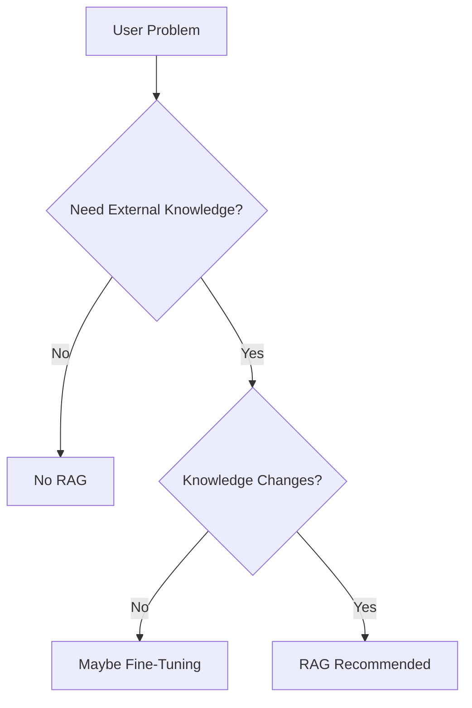
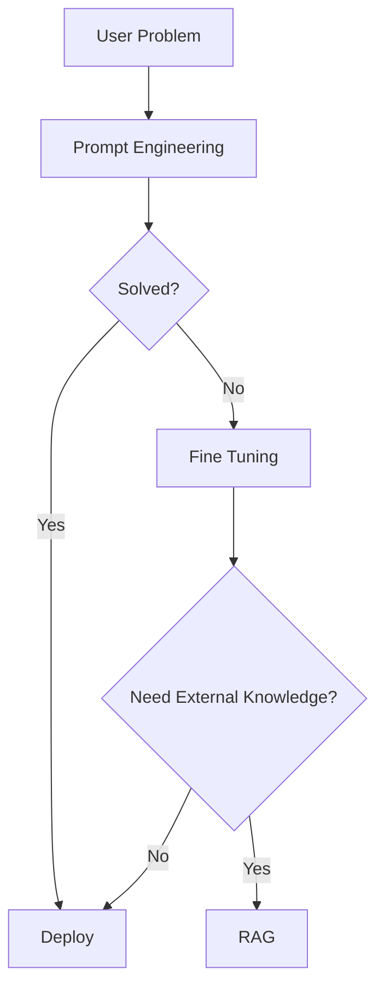

# When NOT To Use RAG

> **Module 1** — Previous: [07-Fine tunning vs RAG](07-Fine%20tunning%20vs%20RAG.md) · Next: End of module

## Introduction

After learning about:

- Hallucinations
- Knowledge Cutoff
- Private Data Problems
- Context Window Limitations
- Fine-Tuning Limitations

many engineers arrive at a dangerous conclusion:

```text
RAG solves everything.
```

This is not true.

One of the biggest mistakes in AI engineering is adding Retrieval-Augmented Generation (RAG) where it is not needed.

RAG introduces:

- Additional infrastructure
- Vector databases
- Embedding generation
- Retrieval latency
- Maintenance overhead
- Increased costs

If your use case does not require retrieval, adding RAG can make the system worse rather than better.

A good AI engineer knows:

```text
When To Use RAG

and

When NOT To Use RAG
```

This chapter focuses on identifying situations where RAG is unnecessary.

---

## Learning Objectives

By the end of this chapter, you will understand:

- When RAG should not be used
- Common RAG overengineering mistakes
- Simpler alternatives
- Fine-Tuning vs RAG decisions
- Cost considerations
- Architecture selection strategies

---

## The Golden Rule

Before adding RAG ask:

```text
Does the model actually need external knowledge?
```

If the answer is:

```text
No
```

then RAG is probably unnecessary.

---

## Decision Framework



---

## Scenario 1: General Knowledge Questions

Question:

```text
What is Python?
```

Question:

```text
Explain Kubernetes.
```

Question:

```text
What is Machine Learning?
```

These topics already exist in model training.

No retrieval is required.

---

### Bad Architecture

```text
Question
↓
Retriever
↓
Vector DB
↓
LLM
↓
Answer
```

---

### Better Architecture

```text
Question
↓
LLM
↓
Answer
```

Simple.

Fast.

Cheap.

---

## Scenario 2: Content Generation

Question:

```text
Write a blog about AI.
```

Question:

```text
Write a LinkedIn post.
```

Question:

```text
Generate a product description.
```

The model is creating content.

It is not searching for knowledge.

RAG usually provides little value.

---

## Example

User:

```text
Write a poem about the moon.
```

Do we need:

```text
Vector Database?
```

No.

The model already has sufficient language understanding.

---

## Scenario 3: Brainstorming

Question:

```text
Give me startup ideas.
```

Question:

```text
Suggest YouTube content ideas.
```

Question:

```text
Suggest app ideas for students.
```

These tasks involve creativity.

Not retrieval.

RAG adds complexity without improving output.

---

## Scenario 4: Translation

Question:

```text
Translate English to Tamil.
```

Question:

```text
Translate French to English.
```

Translation relies on language capabilities.

No external knowledge is needed.

---

## Example

```text
Hello
↓
Vanakkam
```

No retrieval involved.

---

## Scenario 5: Grammar Correction

Question:

```text
Correct my grammar.
```

Question:

```text
Rewrite professionally.
```

Question:

```text
Improve this email.
```

The model only needs language understanding.

RAG provides no benefit.

---

## Scenario 6: Sentiment Analysis

Question:

```text
Is this review positive or negative?
```

Example:

```text
The service was terrible.
```

Output:

```text
Negative
```

This is classification.

Not retrieval.

---

## Scenario 7: Structured Extraction

Question:

```text
Extract name, phone number, and email.
```

Input:

```text
John Doe
john@gmail.com
9876543210
```

Output:

```json
{
  "name": "John Doe",
  "email": "john@gmail.com",
  "phone": "9876543210"
}
```

No retrieval required.

---

## Scenario 8: Summarization of Single Documents

User uploads:

```text
100-page PDF
```

Question:

```text
Summarize this document.
```

Many beginners immediately think:

```text
Use RAG
```

Not necessary.

If the document fits within context:

```text
Document
↓
LLM
↓
Summary
```

is sufficient.

---

## Scenario 9: Code Generation

Question:

```text
Create a Python REST API.
```

Question:

```text
Generate React Login Page.
```

The model already knows programming patterns.

No retrieval is needed.

---

## Scenario 10: Mathematical Problems

Question:

```text
Solve x² + 5x + 6 = 0
```

or

```text
Calculate compound interest.
```

This is reasoning.

Not knowledge retrieval.

---

## Common Beginner Mistake

Many developers build:

```text
RAG Chatbot
```

for:

```text
"What is Python?"
```

This creates:

- Embedding costs
- Retrieval latency
- Infrastructure complexity

for zero practical benefit.

---

## The Cost Problem

RAG introduces additional components.

---

### Without RAG

```text
User
↓
LLM
↓
Answer
```

---

### With RAG

```text
User
↓
Embedding Model
↓
Vector Search
↓
Retriever
↓
Context Assembly
↓
LLM
↓
Answer
```

More components.

More failures.

More maintenance.

---

## The Latency Problem

### Without RAG

```text
Request
↓
LLM
↓
Response
```

---

With RAG:

```text
Request
↓
Embedding
↓
Vector Search
↓
Retrieve Chunks
↓
Build Prompt
↓
LLM
↓
Response
```

Additional processing increases response time.

---

## The Maintenance Problem

RAG systems require:

- Embedding pipelines
- Vector databases
- Re-indexing
- Chunking strategies
- Monitoring

This infrastructure has operational costs.

---

## When Fine-Tuning Is Better

Suppose your goal is:

```text
Consistent JSON Output
```

Example:

```json
{
  "risk": "",
  "reason": ""
}
```

Fine-Tuning is often better.

No retrieval needed.

---

## Example

Goal:

```text
Teach AI how to generate DPDP compliance reports.
```

Need:

```text
Formatting
Consistency
Style
```

Fine-Tuning may help more than RAG.

---

## When Prompt Engineering Is Enough

Question:

```text
Write a professional resignation email.
```

Good prompt:

```text
Write a professional resignation email
for a software engineer leaving after 2 years.
```

No RAG required.

Sometimes prompt engineering solves the problem.

---

## When Context Alone Is Enough

Suppose user provides:

```text
Paste Document
↓
Ask Question
```

If the document fits inside context:

```text
RAG Not Needed
```

The model already has access to the information.

---

## Enterprise Example

Bad Use Case:

```text
Internal Calculator
```

Adding:

```text
Vector DB
Embeddings
Retriever
```

makes no sense.

---

Good Use Case:

```text
100,000 Internal Documents
```

Need:

```text
Search
Retrieve
Answer
```

RAG becomes valuable.

---

## Simple Architecture Selection Guide

### Use Prompting When

- General questions
- Content generation
- Rewriting
- Translation

---

### Use Fine-Tuning When

- Consistent style
- Structured outputs
- Domain-specific behavior

---

### Use RAG When

- Private data
- Dynamic knowledge
- Large document collections
- Source citations are needed

---

## Comparison Table

| Requirement | Prompting | Fine-Tuning | RAG |
|------------|-----------|-------------|-----|
| General Knowledge | ✅ | ❌ | ❌ |
| Content Creation | ✅ | ❌ | ❌ |
| Translation | ✅ | ❌ | ❌ |
| Custom Tone | ❌ | ✅ | ❌ |
| Structured Output | ❌ | ✅ | ❌ |
| Company Documents | ❌ | ❌ | ✅ |
| Policies | ❌ | ❌ | ✅ |
| Contracts | ❌ | ❌ | ✅ |
| Latest Information | ❌ | ❌ | ✅ |

---

## Real-World Engineering Principle

A senior AI engineer asks:

```text
Can I avoid RAG?
```

A junior AI engineer asks:

```text
How do I add RAG?
```

The goal is not to build the most complex system.

The goal is to build the simplest system that solves the problem.

---

## Architecture Hierarchy

Always start here:

```text
Prompting
```

If insufficient:

```text
Fine-Tuning
```

If knowledge access is required:

```text
RAG
```

---

## Visual Representation



---

## Key Takeaways

RAG is powerful.

But:

```text
RAG Is Not A Universal Solution
```

Remember:

- RAG adds complexity
- RAG adds cost
- RAG adds latency
- Many problems do not require retrieval
- Prompting should be your first option
- Fine-Tuning changes behavior
- RAG provides knowledge access

The best architecture is usually:

```text
The Simplest One That Works
```

---

## Module 1 Project

You now understand the major limitations of LLMs and why RAG was invented.

In the next section, we will build:

## Project 1: Comparing LLM vs RAG

You will create a practical demo that shows:

- Hallucinations
- Knowledge Cutoff
- Private Data Limitations
- Context Window Challenges
- How RAG solves these problems

---

## Test Yourself

1. What is the golden rule to apply before adding RAG to a system?
2. Is RAG needed to answer "What is Python?" Why or why not?
3. Name three costs that RAG introduces into a system.
4. When is fine-tuning a better choice than RAG?
5. What is the recommended architecture hierarchy when solving a new problem?

<details>
<summary>Answers</summary>

1. Ask whether the model actually needs external knowledge; if not, RAG is probably unnecessary.
2. No, that knowledge already exists in the model's training data, so no retrieval is required.
3. Additional infrastructure, retrieval latency, and maintenance overhead (plus embedding costs).
4. When you need consistent structured outputs, a custom style, or domain-specific behavior.
5. Start with prompting, move to fine-tuning if needed, and use RAG only when external knowledge access is required.
</details>

