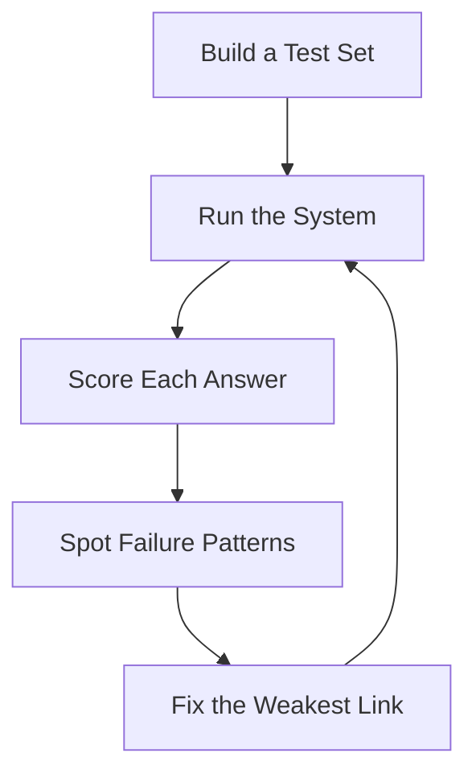

# Why Evaluate

## Introduction

Imagine showing your RAG system to a colleague.

```text
"Ask it anything about our policies."
```

It answers three questions perfectly. Everyone is impressed.

Now deploy it for the whole company. It starts producing wrong answers for
questions nobody tested.

This is the trap of **demo success**. Without measurement, you do not know what
the system is actually good at.

---

## Learning Objectives

By the end of this chapter, you will understand:

- Why demos are not evidence of quality
- What a test set is
- How an evaluation loop works
- The difference between retrieval quality and answer quality

---

## The Evaluation Loop



Evaluation is not a one-time task. It is a **loop** you run whenever you change
chunking, embeddings, retrieval, or prompts.

---

## What Is a Test Set?

A test set is a list of realistic questions with known correct answers.

```text
Question: What is the annual leave policy?
Expected: 30 leave days, unused leave can be carried forward.

Question: How many RSUs were Microsoft employees granted in 2023?
Expected: ...
```

Size matters less than coverage. 20-100 questions that cover the main topics of
your documents beat 500 questions about one topic.

---

## Two Things to Measure

RAG has two independent quality risks:

| Layer | Question it answers | Example failure |
|---|---|---|
| Retrieval | Did we fetch the right chunks? | Right answer exists but was never retrieved |
| Generation | Did the LLM use the chunks correctly? | Chunks are correct but the answer hallucinates |

You must measure both. A system can retrieve perfectly and still answer badly,
and vice versa.

---

## Key Takeaways

- Demos prove nothing; measurement does.
- A small, well-chosen test set is the foundation of evaluation.
- Evaluate retrieval and generation separately.
- Evaluation is a loop, not a one-time check.

---

## Test Yourself

1. Why is a three-question demo not proof of system quality?
2. What is a test set?
3. What are the two independent quality layers in RAG?
4. True or False: If retrieval returns the right chunks, the final answer will always be correct.
5. When should you re-run your evaluation?

<details>
<summary>Answers</summary>

1. Because it only proves the system works on those three questions.
2. A list of realistic questions with known correct answers used to score the system.
3. Retrieval (did we fetch the right chunks?) and generation (did the LLM use them correctly?).
4. False. The LLM can still misread or ignore the correct chunks.
5. After any change to chunking, embeddings, retrieval, or prompts.
</details>
