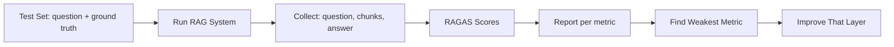

# RAGAS Introduction

## Introduction

You have learned the metrics: recall, precision, faithfulness, relevance.

Computing them by hand is slow. **RAGAS** (Retrieval-Augmented Generation
Assessment) is a framework that computes these metrics automatically at scale.

RAGAS formalizes the retrieval layer and the generation layer into named,
measurable metrics.

---

## Learning Objectives

By the end of this chapter, you will understand:

- What RAGAS is
- The four core RAGAS metrics
- How RAGAS computes scores
- When to use RAGAS and when to score manually

---

## The Core Metrics

| Metric | Layer | What it measures |
|---|---|---|
| Context Precision | Retrieval | Are the retrieved chunks relevant to the question? |
| Context Recall | Retrieval | Did we retrieve all the chunks that answer the question? |
| Faithfulness | Generation | Is the answer supported by the retrieved context? |
| Answer Relevancy | Generation | Does the answer actually address the question? |

---

## How RAGAS Works

RAGAS scores each metric with an **LLM judge**.

For example, to score faithfulness it:

```text
1. Breaks the answer into individual claims
2. For each claim, checks whether the retrieved context supports it
3. Faithfulness = supported claims ÷ total claims
```

Context recall compares the retrieved chunks against a reference answer
(ground truth) you provide.

---

## A Simple Flow



---

## Output Example

```text
context_precision: 0.82
context_recall:    0.66
faithfulness:      0.91
answer_relevancy:  0.74
```

Context recall is weak — retrieval is missing chunks. That tells you where to
focus: chunking, embedding model, or k.

---

## RAGAS vs Manual Scoring

| | RAGAS | Manual |
|---|---|---|
| Scale | Hundreds of questions | A handful |
| Cost | Needs an LLM API | Free |
| Setup | Install + API key | Just a spreadsheet |
| Explainability | Good | Best |

---

## Key Takeaways

- RAGAS automates retrieval and answer metrics using an LLM judge.
- Context precision/recall score retrieval; faithfulness and answer relevancy score generation.
- The metric scores tell you which layer to fix.
- RAGAS needs an LLM API; for small checks, manual scoring works fine.

---

## Test Yourself

1. What does RAGAS do?
2. Which two metrics measure the retrieval layer?
3. What does the faithfulness metric compare?
4. If context recall is low, which part of the pipeline should you examine?
5. True or False: RAGAS can score answers without any API access.

<details>
<summary>Answers</summary>

1. Automatically computes retrieval and answer quality metrics using an LLM judge.
2. Context precision and context recall.
3. The answer's claims against the retrieved context.
4. Retrieval — chunking, embedding model, or k.
5. False. RAGAS uses an LLM to score, so it needs API access.
</details>
