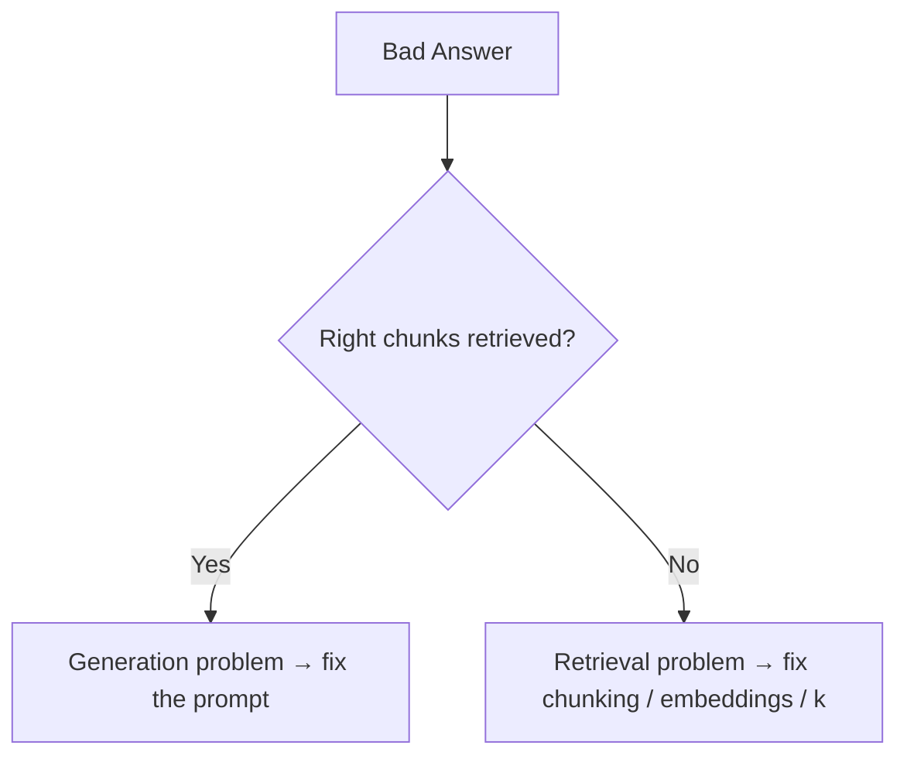
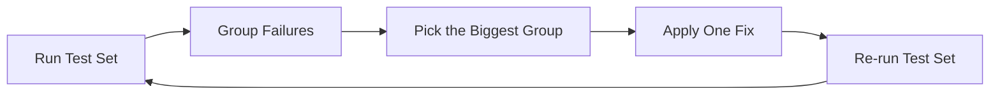

# Failure Modes and Improving

## Introduction

Evaluation does not just tell you whether the system is good. It tells you
**why** it fails.

Most RAG failures fall into a small set of patterns. Once you recognize the
pattern, the fix is usually obvious.

---

## Learning Objectives

By the end of this chapter, you will understand:

- The most common RAG failure modes
- How to diagnose a failure from its symptom
- Which layer to fix for each symptom
- How to build an improvement loop

---

## The Failure Table

| Symptom | Likely cause | Fix |
|---|---|---|
| Wrong answer, but the right chunks were retrieved | Generation ignored or misread the context | Fix the prompt; add "answer only from context" |
| Right chunks were NOT retrieved | Retrieval failure | Improve chunking, embedding model, or increase k |
| Chunks are retrieved but too big / noisy | Chunking too coarse | Reduce chunk size, or use parent document retrieval |
| Answer repeats one topic, misses others | Retrieved chunks are too similar | Use MMR for diversity, or multi-query retrieval |
| Follow-up questions fail | No chat history handling | Use history-aware RAG (Module 9) |
| Vague questions retrieve badly | Query quality | Add query rewriting |
| Same fact appears in many chunks, answer inconsistent | Duplicated content | Deduplicate chunks or use a parent document structure |

---

## Diagnosing: Answer vs Retrieval

The single most useful question to ask:

```text
Did the retriever return the right chunks?
```



This one question splits nearly every failure into one of two categories.

---

## The Improvement Loop



Change **one thing at a time**. If you change chunking and the embedding model
together, you will not know which one helped.

---

## Best Practices

- Keep a test set; re-run it after every change.
- Change one layer at a time.
- Track metrics per layer (retrieval vs generation).
- Add new real failures to your test set as you find them.
- Performance "improvements" are only real if the test set says so.

---

## Key Takeaways

- Most failures are retrieval failures or generation failures — diagnose which.
- A symptom-to-fix table speeds up debugging.
- Improve in a loop, one change at a time, measured against your test set.

---

## Test Yourself

1. If the right chunks were retrieved but the answer is wrong, which layer should you fix?
2. If the right chunks were never retrieved, what is the likely problem?
3. Why should you change only one thing between evaluations?
4. Name one fix for "retrieved chunks are too similar to each other".
5. True or False: A new real-world failure should be added to your test set.

<details>
<summary>Answers</summary>

1. Generation — the prompt and how the LLM uses the context.
2. Retrieval — chunking, embedding model, or k.
3. So you know which change caused the improvement or regression.
4. Use MMR for diversity (or multi-query retrieval).
5. True. Your test set should grow with real failures.
</details>
