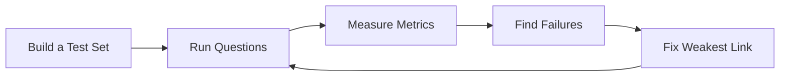

# Module 10: Evaluation

## Introduction

Your RAG system answers questions. But is it any good?

A demo that works on three questions tells you nothing about a system that must
answer thousands of questions correctly.

**Evaluation** is the trust layer of RAG. It turns "it seems to work" into "it
works for these questions, fails for these, and here is why".

---

## The Evaluation Loop

---

## Chapters

| Chapter | File | What you will learn |
|---|---|---|
| 01 | `01-Why-Evaluate.md` | Why evaluation matters and what a test set is |
| 02 | `02-Retrieval-Metrics.md` | Recall@k and Precision@k for retrieval quality |
| 03 | `03-Answer-Metrics.md` | Faithfulness and relevance of generated answers |
| 04 | `04-RAGAS-Introduction.md` | The RAGAS evaluation framework |
| 05 | `05-Failure-Modes-and-Improving.md` | Diagnosing and fixing weak parts of the pipeline |

---

## Sample Code

| File | What it demonstrates | How to run |
|---|---|---|
| `01-evaluation-basics.py` | Manual Recall@k / Precision@k and groundedness checks on a toy example | `python "Module-10-Evaluation/01-evaluation-basics.py"` |

This example runs fully offline — no API key needed.

---

## Navigation

- Back to [Module 9: Advanced RAG](../Module-9-Advanced-RAG/README.md)
- Forward to [Module 11: Mini Project](../Module-11-Mini-Project/README.md)
- Course home: [README](../README.md)
