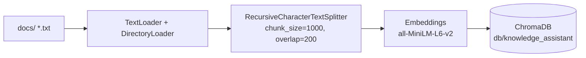
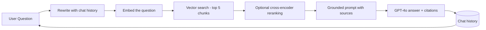

# Module 11: Project Overview — Company Knowledge Assistant

This chapter explains the mini project before you run a single line of code. Read it once, then follow the `README.md` "How to Run" section and build the assistant step by step.

---

## The Scenario

Imagine you work for a large company. Important knowledge lives all over the place: HR policies, employee handbooks, contracts, product documentation. When a new hire asks *"How do I file an expense report?"* or *"What is our remote work policy?"*, someone has to dig through folders to find the answer — and a plain chatbot would happily *make something up*.

That is exactly the problem RAG solves. Our **Company Knowledge Assistant** will:

1. Read the company's documents once (ingestion).
2. For every new question, **find the real evidence** in those documents (retrieval).
3. Answer **only from that evidence**, and tell you **which file** each fact came from (grounded generation with citations).
4. Remember the conversation, so follow-ups like *"And when does that policy start?"* work naturally (chat history).

You can replace the sample `docs/` with your own HR policies, contracts, or manuals and the whole pipeline works unchanged.

---

## The Full Pipeline

There are two pipelines, just like in every RAG system we built in Modules 2–9.

### Ingestion Pipeline (Step 1 → Step 2)

The goal of ingestion is to turn unstructured files into a searchable index:

- **Load** — pull the raw text out of each file with LangChain loaders.
- **Chunk** — split long files into ~1000-character pieces with a 200-character overlap so no context is lost at the seams.
- **Embed** — convert every chunk into a vector (a list of numbers) with a local embedding model.
- **Store** — save the vectors in ChromaDB, persisted to `db/knowledge_assistant` so we only do this expensive work once.

### Query Pipeline (Step 3 → Step 4 → Step 5)

Every question flows through the same loop:

- **Rewrite** — if the question is a follow-up ("and when was that?"), the chat history is used to turn it into a standalone, searchable question.
- **Retrieve** — the question is embedded and the 5 most similar chunks are pulled from ChromaDB (optionally re-ordered by a reranker).
- **Generate** — the chunks are handed to GPT-4o inside a prompt that forbids answering from general knowledge and demands a `Source: <file>` citation for everything it says.

---

## What Each File Does

| File | Purpose | Run it when... |
|---|---|---|
| `step1_ingest.py` | Loads every `.txt` in `docs/`, prints count + preview of each document | First run, or after adding new files |
| `step2_build_vector_store.py` | Chunks, embeds, stores to `db/knowledge_assistant` (idempotent) | After step1 — creates the index |
| `step3_retrieve.py` | Retrieves top-5 chunks for a question, prints them with sources | After step2 — see retrieval in action |
| `step4_answer.py` | Retrieves + generates a grounded answer with citations via GPT-4o | After step2 + `.env` key — one-off Q&A |
| `step5_chat.py` | Full chat assistant: history, query rewriting, citations | After step2 + `.env` key — the final app |

### Step 1 — `step1_ingest.py`

Uses `DirectoryLoader` with `TextLoader` to read every `*.txt` file in `docs/`. It prints how many documents were found and a preview of each one's content and metadata. The `source` metadata is the file path — later steps turn it into a citation. The script also carries a note about `PyPDFLoader` for when you want to ingest PDFs.

### Step 2 — `step2_build_vector_store.py`

Splits each document with `RecursiveCharacterTextSplitter` (`chunk_size=1000`, `chunk_overlap=200`), embeds the chunks with `HuggingFaceEmbeddings` (`all-MiniLM-L6-v2`, fully offline), and persists them to ChromaDB at `db/knowledge_assistant`. It prints the chunk count and the store location. Because it checks whether the folder already exists, re-running it loads the store instead of rebuilding — the same idempotency trick from the Module 6 ingestion script.

### Step 3 — `step3_retrieve.py`

Loads the store with the **same** embedding model used in step2 (a mismatch here silently returns garbage). Takes a question, runs a similarity search, and prints the top-5 chunks with their source metadata. A `try/except` catches the case where step2 hasn't run yet and tells you exactly what to do. An optional cross-encoder reranking section re-orders the results by true relevance.

### Step 4 — `step4_answer.py`

Adds generation to retrieval. It builds a **grounded prompt** that forces GPT-4o to:

- answer **only** from the provided documents,
- cite the source file name from metadata at the end (e.g. `Source: microsoft.txt`), and
- say *"I don't have enough information..."* when the answer is not in the documents.

It prints the retrieved sources first, then the final answer. Requires `OPENAI_API_KEY` — with a friendly `try/except` if the key is missing.

### Step 5 — `step5_chat.py`

The finished product. A terminal chat loop that combines everything from the course:

- **Chat history** — Human and AI messages are appended after every turn.
- **Query rewriting** — follow-ups are rewritten into standalone questions using the history.
- **Retrieval** — top-5 chunks fetched for the rewritten question.
- **Grounded answering with citations** — same rules as step4.
- Type `quit` to exit.

---

## The Evaluation Idea

Any RAG system should be checked before it is trusted. Here are a few question-and-answer pairs to try against `docs/`, along with what a *good* answer looks like:

| # | Question | Expected behavior |
|---|---|---|
| 1 | "How much did Microsoft pay to acquire GitHub?" | Answer with **$7.5 billion** and cite `Source: microsoft.txt` |
| 2 | "When was Google founded and by whom?" | **September 4, 1998, by Larry Page and Sergey Brin** + `Source: google.txt` |
| 3 | "Who founded NVIDIA and when?" | **Jensen Huang (et al.), April 5, 1993** + `Source: Nvidia.txt` |
| 4 | Follow-up to #2: "And when was that?" | The system rewrites it using chat history and still cites `google.txt` |
| 5 | "What is our work-from-home policy?" | Honest "I don't have enough information..." — *not* a hallucinated answer |

**What to check in every answer:**

- **Grounding** — every claim is supported by the retrieved text.
- **Citation** — the correct source file appears at the end.
- **Honesty** — out-of-scope questions are refused, not invented.
- **Context** — follow-up questions keep working across turns.

---

## Test Yourself

1. What is the difference between `step1_ingest.py` and `step2_build_vector_store.py`?
2. Why does this project store its vectors in `db/knowledge_assistant` instead of the course's `db/chroma_db`?
3. Why must `step3_retrieve.py` and `step2_build_vector_store.py` use the **same** embedding model?
4. What problem does query rewriting in `step5_chat.py` solve?
5. The generation prompt tells the model to say "I don't have enough information..." — why is that important?

Click to reveal the Answers

1. **Step1 loads the raw text** out of the files into memory (documents). **Step2 turns those documents into a searchable index**: it chunks them, embeds each chunk, and persists the vectors to ChromaDB. Step1 changes nothing on disk; step2 creates `db/knowledge_assistant`.
2. So the project is **self-contained**. It reuses `docs/` but keeps its own collection, so running the mini project can never overwrite or interfere with the vector store that Modules 6–9 depend on.
3. Embeddings are model-specific: a vector produced by one model means nothing to another. If the retrieval step embedded questions with a different model than the one used to embed the chunks, the similarity scores would be meaningless and retrieval would fail silently.
4. Follow-up questions ("And when was that?", "What about it?") are ambiguous on their own. Query rewriting uses the chat history to turn them into standalone, searchable questions so retrieval actually finds the right chunks.
5. It prevents **hallucination**. A RAG assistant must never answer beyond its evidence. Saying "I don't know" when the documents lack an answer keeps the system trustworthy — the whole point of the course.

