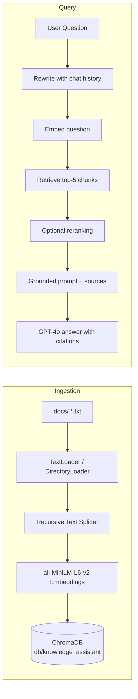

# Module 11: Mini Project — Company Knowledge Assistant

Welcome to the capstone mini project of the RAG course! Over five small steps you will build a complete **Company Knowledge Assistant** — a chatbot that answers questions about your company documents using RAG (Retrieval-Augmented Generation).

Instead of letting a generic LLM guess at answers, the assistant **retrieves real evidence from your files** and quotes it back with **citations**, so every answer can be verified.

---

## What You Will Build

A working end-to-end RAG application with two pipelines:

- **Ingestion pipeline** — loads your company documents, splits them into chunks, embeds them, and stores them in a vector database.
- **Query pipeline** — takes a user question, retrieves the most relevant chunks, and asks GPT-4o to answer *only* from those chunks, citing which file each fact came from.

## Features

- Ingest documents (`.txt` files in `docs/`, with notes on adding PDFs)
- Chunk + embed + store in a self-contained ChromaDB collection
- Retrieve with reranking (optional cross-encoder re-ordering of results)
- Answer with citations (`Source: microsoft.txt`)
- Chat history with query rewriting for follow-up questions

---

## Architecture



---

## Folder Layout

```
RAG-TUT/
├── docs/                          # sample company documents (shared with the course)
│   ├── google.txt
│   ├── microsoft.txt
│   └── Nvidia.txt
├── db/
│   └── knowledge_assistant/       # THIS project's vector store (built by step2)
└── Module-11-Mini-Project/
    ├── README.md                  # you are here
    ├── 01-Project-Overview.md     # the chapter: scenario, pipeline, quiz
    ├── step1_ingest.py            # load the documents
    ├── step2_build_vector_store.py# chunk, embed, store
    ├── step3_retrieve.py          # retrieve top-5 chunks
    ├── step4_answer.py            # grounded answer with citations
    └── step5_chat.py              # the full chat assistant
```

> Note: this project uses its **own** vector store at `db/knowledge_assistant`, separate from the course's `db/chroma_db`, so it stays self-contained and never touches the other modules' data.

---

## How to Run

Each step is a Python script you run from the **repo root** (so relative paths like `docs/` and `db/` resolve correctly). Run the steps **in order** — each one builds on the previous.

```bash
python "Module-11-Mini-Project/step1_ingest.py"
python "Module-11-Mini-Project/step2_build_vector_store.py"
python "Module-11-Mini-Project/step3_retrieve.py"
python "Module-11-Mini-Project/step4_answer.py"
python "Module-11-Mini-Project/step5_chat.py"
```

### Step 1 — Load the documents
Loads every `.txt` file in `docs/` and prints a preview of each one. Nothing is stored yet — this is just "getting the text out of your files."

### Step 2 — Build the vector store
Splits the documents with a recursive text splitter, embeds the chunks with `all-MiniLM-L6-v2`, and persists them to `db/knowledge_assistant`. Runs again, it simply loads the existing store instead of rebuilding (idempotent).

### Step 3 — Retrieve
Loads your store, takes a question, and retrieves the top-5 most similar chunks with their source metadata. Includes an **optional reranking** section that re-orders the results with a cross-encoder.

### Step 4 — Answer with citations
Retrieves the top-5 chunks and asks **GPT-4o** to answer using *only* the retrieved documents — ending with `Source: microsoft.txt` style citations, and saying "I don't know" when the answer is not in the documents. Needs `OPENAI_API_KEY`.

### Step 5 — Chat with history
The finished product: a terminal chat loop with chat history, query rewriting for follow-ups, retrieval, grounded answers with citations, and a friendly `quit` command.

---

## Requirements

Before running the steps, make sure you have:

1. **Python packages** — install the course dependencies once from the repo root:
   ```bash
   pip install -r requirements.txt
   ```
2. **An OpenAI API key** — create a `.env` file in the repo root:
   ```bash
   echo OPENAI_API_KEY=your-key > .env
   ```
   (Only step4 and step5 call GPT-4o, so this is required for those two.)
3. **A vector store to query** — either:
   - Run the **Module 6 ingestion pipeline** (`python "Module-6-Vector-Databases/01-ingestion-pipeline.py"`) to build the course's `db/chroma_db`, **or**
   - Run **step1 + step2** in this module to build this project's own store at `db/knowledge_assistant`.

Steps 3–5 query `db/knowledge_assistant`, so make sure step2 has run first.

---

## Course Links

- [Course Home (RAG-TUT)](../README.md)
- [Module 10: Evaluation](../Module-10-Evaluation/README.md)
