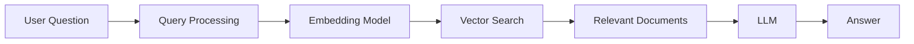
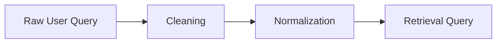
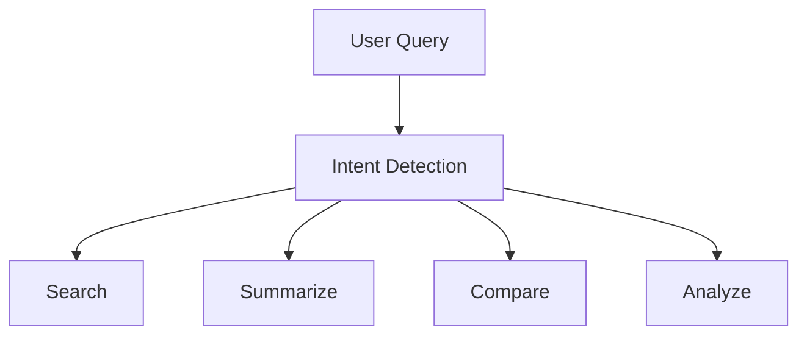
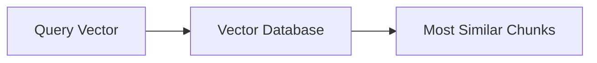
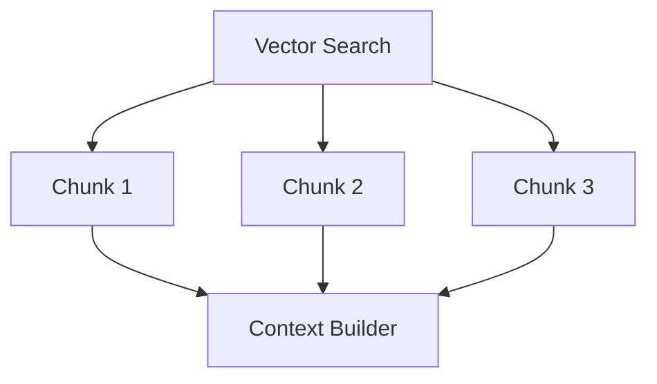
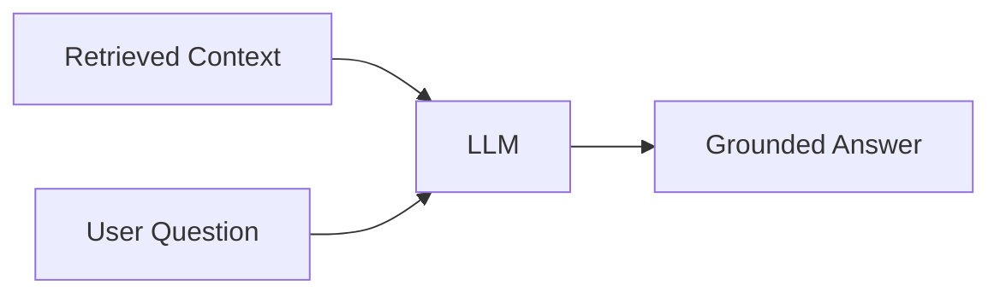
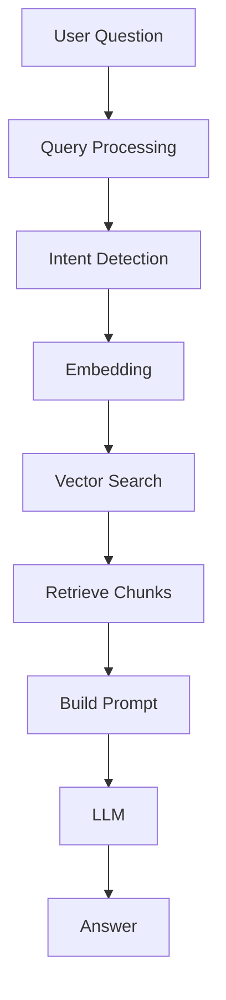

# User Query Flow

# Introduction

Every Retrieval-Augmented Generation (RAG) system starts with a single event:

```text
The User Asks A Question
```

For example:

```text
What is our leave policy?
```

or

```text
Summarize the VPN policy.
```

or

```text
How many annual leave days do employees receive?
```

Most beginners think the AI immediately searches a database and generates an answer.

In reality, a surprisingly complex pipeline begins the moment the user submits a query.

Understanding this flow is critical because:

```text
Poor Query Handling
=
Poor Retrieval
=
Poor Answers
```

This chapter explores the complete journey of a user query inside a RAG system.

---

# Learning Objectives

By the end of this chapter, you will understand:

- What happens after a user asks a question
- How RAG systems process queries
- Query transformation
- Query embedding
- Retrieval preparation
- Query optimization
- Real-world query flow architecture

---

# The User Query Journey

At a high level:



Everything starts with:

```text
User Question
```

---

# Step 1: User Asks a Question

Example:

```text
What is our annual leave policy?
```

This is called:

```text
User Query
```

---

# Visual Representation

```text
Human
  |
  v
"What is our annual leave policy?"
```

---

# Why User Queries Matter

RAG systems are only as good as the questions they receive.

Example:

Good Query:

```text
What is the annual leave policy?
```

Bad Query:

```text
leave thing
```

The clearer the query:

```text
Better Retrieval
```

---

# User Query Types

A RAG system may receive many kinds of queries.

---

## Informational Queries

Example:

```text
What is the leave policy?
```

---

## Summarization Queries

Example:

```text
Summarize the employee handbook.
```

---

## Comparison Queries

Example:

```text
Compare Policy A and Policy B.
```

---

## Analytical Queries

Example:

```text
What are the risks mentioned in this contract?
```

---

## Search Queries

Example:

```text
Find information about VPN access.
```

---

# Step 2: Query Processing

Before retrieval begins, the query is processed.

Example:

Original Query:

```text
What are the vacation rules?
```

System may normalize it to:

```text
leave policy
```

---

# Query Processing Pipeline



---

# Query Cleaning

Removes:

- Extra spaces
- Unnecessary characters
- Formatting issues

Example:

Input:

```text
    What is our leave policy???
```

Output:

```text
What is our leave policy
```

---

# Query Normalization

Converts:

```text
Vacation Policy
```

into

```text
Leave Policy
```

if the system understands they mean the same thing.

---

# Why Normalization Matters

Users rarely use exact document wording.

Document:

```text
Annual Leave Policy
```

User asks:

```text
Vacation Rules
```

Without normalization:

```text
No Match
```

With normalization:

```text
Successful Retrieval
```

---

# Step 3: Query Understanding

Modern RAG systems often analyze:

```text
User Intent
```

---

# Example

Question:

```text
Summarize the security policy.
```

Intent:

```text
Summarization
```

---

Question:

```text
What is MFA?
```

Intent:

```text
Information Retrieval
```

---

Question:

```text
Compare VPN policy and BYOD policy.
```

Intent:

```text
Comparison
```

---

# Intent Detection Flow



---

# Step 4: Query Embedding

This is where RAG becomes powerful.

The text query is converted into numbers.

Example:

Query:

```text
What is our leave policy?
```

Becomes:

```text
[0.23, 0.84, -0.11, ...]
```

This numerical representation is called:

# Embedding

---

# Why Convert Text To Numbers?

Computers cannot understand:

```text
leave policy
```

directly.

They understand:

```text
Vectors
```

---

# Visual Representation

```text
Text
 ↓

"What is our leave policy?"

 ↓

Embedding Model

 ↓

[0.23, 0.84, -0.11, ...]
```

---

# Semantic Meaning

Embeddings capture meaning.

Example:

```text
Leave Policy
```

and

```text
Vacation Rules
```

produce similar vectors.

---

# Visual Example

```text
Leave Policy

     *
    /
   /
  *

Vacation Rules
```

Close together in vector space.

---

# Step 5: Vector Search

Now the query vector searches the vector database.

---

# Process



---

# Example

User Query:

```text
What is annual leave?
```

Database Chunks:

```text
Chunk 1 → Security Policy

Chunk 2 → Leave Policy

Chunk 3 → VPN Policy
```

Similarity Scores:

```text
Chunk 1 = 0.21

Chunk 2 = 0.94

Chunk 3 = 0.18
```

Winner:

```text
Chunk 2
```

---

# Visual Similarity Search

```text
Query

    *

Chunk 2

     *

Chunk 1

                    *

Chunk 3

                          *
```

Nearest chunk wins.

---

# Step 6: Retrieve Relevant Chunks

The system selects top results.

Example:

```text
Top 3 Results
```

---

Retrieved Context:

```text
Employees receive
30 annual leave days.
```

```text
Unused leave may be
carried forward.
```

```text
Leave requests must be
approved by managers.
```

---

# Why Multiple Chunks?

One chunk may not contain everything.

Retrieving multiple chunks improves completeness.

---

# Retrieval Flow



---

# Step 7: Build Augmented Prompt

Now RAG creates a larger prompt.

---

# Example

Prompt:

```text
Context:

Employees receive
30 annual leave days.

Unused leave may
be carried forward.

Question:

What is the leave policy?
```

---

# Visual Representation

```text
Retrieved Documents
        +
User Question
        =
Augmented Prompt
```

---

# Step 8: Send To LLM

The augmented prompt is sent to the LLM.

---

# Workflow



---

# Step 9: Generate Answer

The model now answers using evidence.

---

# Example

Without RAG:

```text
Most companies provide
20-25 leave days.
```

Hallucination.

---

With RAG:

```text
Employees receive
30 annual leave days.
```

Grounded.

---

# Complete Query Lifecycle



---

# Real Enterprise Example

Question:

```text
What are the VPN requirements?
```

System Flow:

```text
Question
↓
Embedding
↓
Vector Search
↓
VPN Policy Document
↓
Relevant Section
↓
LLM
↓
Answer
```

---

# Query Expansion (Advanced)

Some RAG systems improve queries automatically.

---

User Query:

```text
vacation policy
```

Expanded Query:

```text
leave policy
annual leave
holiday policy
time off policy
```

This improves retrieval.

---

# Multi-Query Retrieval

Advanced systems generate multiple queries.

---

Example:

Original:

```text
How do I access VPN?
```

Generated Queries:

```text
VPN Access

Remote Access

VPN Requirements

VPN Authentication
```

Each query searches independently.

---

# Why Query Quality Matters

Bad Query:

```text
thing about leave
```

May retrieve wrong chunks.

---

Good Query:

```text
What is the employee annual leave policy?
```

Retrieves better results.

---

# Common Mistakes

## Mistake 1

Skipping query preprocessing.

---

## Mistake 2

Using keyword matching only.

---

## Mistake 3

Ignoring user intent.

---

## Mistake 4

Retrieving too many chunks.

---

## Mistake 5

Sending irrelevant context to the LLM.

---

# Best Practices

## Understand Intent

Know what the user wants.

---

## Generate High-Quality Embeddings

Good embeddings improve retrieval.

---

## Retrieve Only Relevant Chunks

Avoid noise.

---

## Limit Context Size

Keep prompts efficient.

---

## Monitor Retrieval Quality

Poor retrieval causes poor answers.

---

# Key Takeaways

Every RAG system begins with:

```text
User Query
```

The query then moves through:

```text
Query Processing
↓
Intent Detection
↓
Embedding
↓
Vector Search
↓
Chunk Retrieval
↓
Prompt Construction
↓
LLM
↓
Answer
```

The quality of retrieval depends heavily on:

```text
The Quality Of The User Query
```

A great RAG system is not simply a powerful model.

It is a system that understands the user's question and retrieves the right knowledge before generating an answer.

---

# Next Chapter

# 02 - Document Loading

In the next chapter you will learn:

- How documents enter a RAG system
- Supported file formats
- PDF ingestion
- DOCX ingestion
- HTML ingestion
- Website crawling
- Data pipelines
- Enterprise document ingestion architecture
