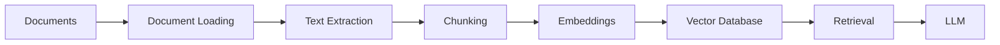
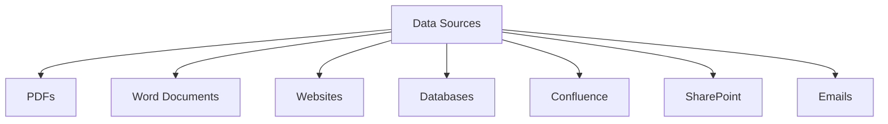
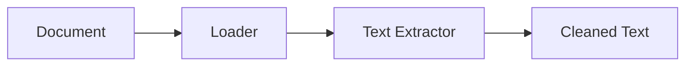
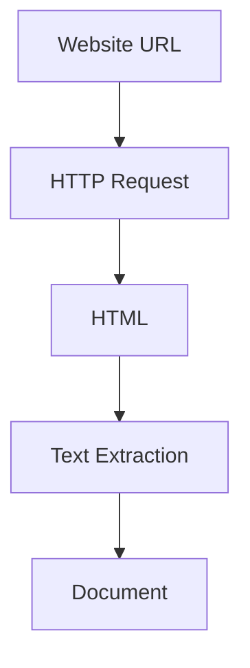
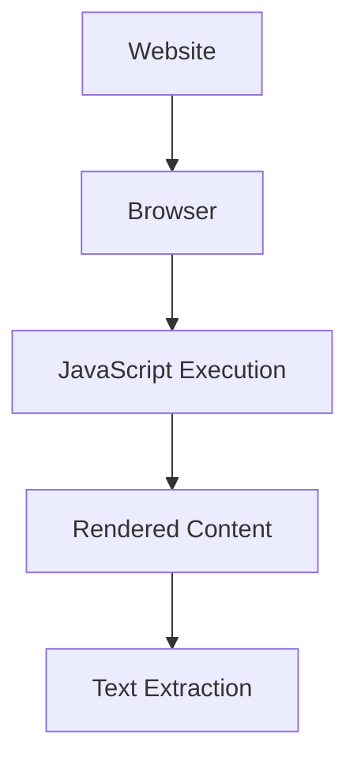
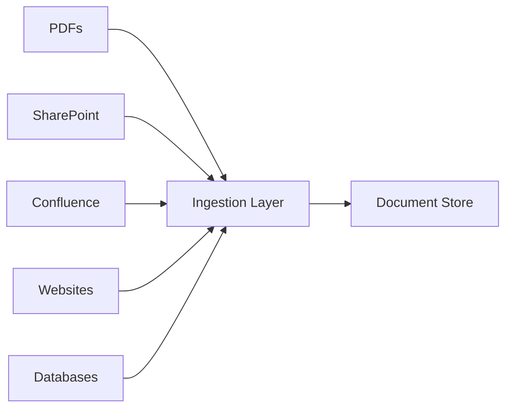
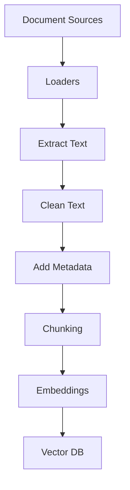

# Document Loading

# Introduction

A Retrieval-Augmented Generation (RAG) system is only as good as the documents it can access.

No matter how advanced your:

- LLM
- Embedding Model
- Vector Database
- Retriever

are,

the system becomes useless if documents never enter the pipeline.

This stage is called:

# Document Loading

Document Loading is the process of ingesting data from various sources and converting it into a format that can later be:

```text
Loaded
↓
Processed
↓
Chunked
↓
Embedded
↓
Stored
↓
Retrieved
```

Every RAG system starts here.

---

# Learning Objectives

By the end of this chapter, you will understand:

- What document loading is
- Why it is important
- Supported document types
- Document ingestion pipelines
- Enterprise document loading architecture
- Common challenges
- Best practices

---

# Where Document Loading Fits

A complete RAG pipeline looks like:



Document loading is the first stage.

Without it:

```text
No Data
=
No Knowledge
```

---

# What Is A Document?

In RAG, a document is any source of information.

Examples:

```text
PDF
DOCX
TXT
HTML
CSV
JSON
Database Records
Emails
Wiki Pages
API Responses
```

Everything eventually becomes:

```text
Text
```

because LLMs consume text.

---

# Visual Representation

```text
PDF
DOCX
HTML
EMAIL
DATABASE

     ↓

TEXT

     ↓

RAG Pipeline
```

---

# Why Document Loading Matters

Imagine building a chatbot for:

```text
Company Policies
```

The policies exist as:

```text
PDF Files
```

The LLM cannot directly access those PDFs.

First we must:

```text
Load
Extract
Convert
```

them into usable text.

---

# Step 1: Identify Data Sources

Most organizations store data in multiple locations.

Example:

```text
HR Policies
→ PDFs

Engineering Docs
→ Confluence

Contracts
→ SharePoint

Support Docs
→ Websites

Logs
→ Databases
```

A RAG system may need to load all of them.

---

# Enterprise Data Sources



---

# Common Document Formats

## TXT Files

Simplest format.

Example:

```text
leave_policy.txt
```

Content:

```text
Employees receive
30 annual leave days.
```

Easy to load.

---

## PDF Files

Most common enterprise format.

Example:

```text
HR_Policy.pdf
```

Challenges:

- Images
- Tables
- Scanned documents
- Multi-column layouts

---

## DOCX Files

Microsoft Word documents.

Example:

```text
Employee_Handbook.docx
```

Often easier to extract than PDFs.

---

## HTML Pages

Used for:

- Knowledge bases
- Websites
- Internal portals

Example:

```text
https://company.com/policies
```

---

## CSV Files

Useful for:

```text
Structured Data
```

Example:

```csv
Employee,Department
John,Engineering
Jane,HR
```

---

## JSON Files

Often used in APIs.

Example:

```json
{
  "policy": "Leave Policy",
  "days": 30
}
```

---

# Document Loading Workflow



---

# Example: Loading TXT Files

Python Example:

```python
with open("leave_policy.txt", "r") as f:
    text = f.read()
```

Output:

```text
Employees receive
30 annual leave days.
```

---

# Example: Loading PDFs

Python Example:

```python
from pypdf import PdfReader

reader = PdfReader("policy.pdf")

text = ""

for page in reader.pages:
    text += page.extract_text()
```

---

# Flow

```text
PDF

↓

PDF Loader

↓

Extract Text

↓

Raw Content
```

---

# Example: Loading DOCX Files

```python
from docx import Document

doc = Document("policy.docx")

text = "\n".join(
    paragraph.text
    for paragraph in doc.paragraphs
)
```

---

# Example: Loading Websites

```python
import requests

html = requests.get(url).text
```

Then:

```python
BeautifulSoup
```

extracts text.

---

# Website Loading Pipeline



---

# Web Crawling

Sometimes one page is not enough.

Example:

```text
company.com
```

contains:

```text
100 Documentation Pages
```

Crawler visits:

```text
Page 1
Page 2
Page 3
...
Page 100
```

and collects content.

---

# Visual Example

```text
Homepage

├── Policy Page
├── FAQ
├── Support
└── Security
```

Crawler follows links automatically.

---

# Dynamic Websites

Modern websites often use:

```text
React
Angular
Vue
```

Content loads using JavaScript.

Simple requests may fail.

---

# Example

HTML Response:

```html
<div id="root"></div>
```

Actual content appears later.

---

# Solution

Use:

```text
Playwright
```

or

```text
Selenium
```

to render the page.

---

# Browser Rendering Pipeline



---

# Database Loading

Sometimes data lives inside databases.

Example:

```sql
SELECT *
FROM policies;
```

Result:

```text
Policy Records
```

become documents.

---

# API-Based Loading

Many systems expose APIs.

Example:

```http
GET /policies
```

Response:

```json
{
  "title":"Leave Policy"
}
```

Loaded directly into the RAG pipeline.

---

# Real Enterprise Example

Company Knowledge Sources:

```text
Confluence
SharePoint
PDF Policies
Jira Tickets
Support Docs
Internal Wiki
```

All are loaded into a centralized pipeline.

---

# Enterprise Architecture



---

# Document Metadata

Documents are not stored as plain text only.

Metadata is important.

Example:

```json
{
  "file_name": "leave_policy.pdf",
  "author": "HR Team",
  "created_date": "2026-01-01",
  "department": "HR"
}
```

---

# Why Metadata Matters

Question:

```text
Show HR policies created in 2026.
```

Metadata helps retrieval.

---

# Raw Document vs Structured Document

Raw:

```text
Employees receive
30 annual leave days.
```

Structured:

```json
{
 "source":"leave_policy.pdf",
 "department":"HR",
 "content":"Employees receive..."
}
```

Structured documents improve search quality.

---

# Common Challenges

---

## Challenge 1

Scanned PDFs

Example:

```text
Image-Based PDF
```

No text exists.

---

Solution:

```text
OCR
```

(Optical Character Recognition)

---

## Challenge 2

Duplicate Documents

Same file appears multiple times.

---

Solution:

```text
Deduplication
```

---

## Challenge 3

Poor Formatting

PDFs often contain:

```text
Broken Sentences
Headers
Footers
Page Numbers
```

Need cleaning.

---

## Challenge 4

Huge Documents

Example:

```text
1000 Page Policy
```

Cannot send directly to LLM.

Later:

```text
Chunking
```

solves this.

---

# Best Practices

---

## Preserve Metadata

Never lose source information.

---

## Clean Documents

Remove:

- Headers
- Footers
- Noise

---

## Validate Extraction

Check extracted text quality.

---

## Handle Updates

Documents change frequently.

Build re-ingestion pipelines.

---

## Maintain Source Traceability

Always know:

```text
Where did this chunk come from?
```

---

# Real Production Pipeline



---

# Key Takeaways

Document Loading is the foundation of every RAG system.

It is responsible for:

```text
Collecting Knowledge
```

from:

- PDFs
- DOCX
- Websites
- Databases
- APIs
- Wikis

and transforming them into text that can later be:

```text
Chunked
Embedded
Stored
Retrieved
```

A powerful retrieval system starts with a reliable ingestion pipeline.

Without good document loading:

```text
Garbage In
=
Garbage Out
```

---

# Next Chapter

# 03 - Text Chunking

In the next chapter you will learn:

- Why documents must be split
- Chunk size strategies
- Chunk overlap
- Sliding windows
- Semantic chunking
- Recursive chunking
- Chunking mistakes
- Production chunking strategies
