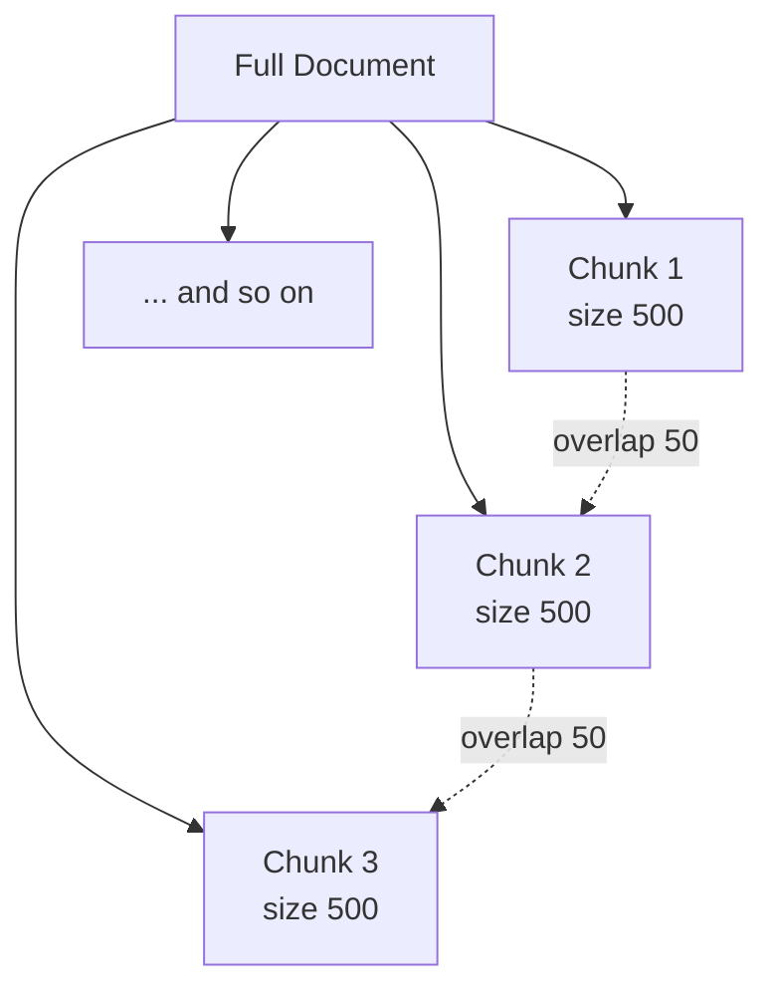

# Chunking Overview

## Introduction

In the previous chapter you saw how documents enter the RAG system. But a document almost never enters the system as one giant block of text.

Imagine a **300-page employee handbook**. If we tried to embed and retrieve that entire handbook as a single text, we would face two problems:

```text
1. Meaning gets diluted
   One vector must represent 300 pages of very different topics
   (leave, payroll, security, travel, hiring ...)

2. The context window would explode
   We cannot stuff 300 pages into the prompt every time
```

The solution is to **split the document into smaller pieces** before embedding. This stage is called:

```text
Chunking
```

Chunking is the bridge between **document loading** (chapter 02) and **embeddings** (chapter 04). In this chapter we learn what a chunk is, why chunk size and overlap matter, and preview the three main strategies.

---

## Learning Objectives

By the end of this chapter, you will understand:

- Why long documents must be split before embedding
- What a chunk is
- The concepts of `chunk_size` and `chunk_overlap`
- How overlap keeps related ideas connected across chunk boundaries
- A preview of character, recursive, and semantic chunking strategies

---

## Why Split Long Documents at All?

An embedding model converts text into a single vector. The embedding of a sentence like *"Employees receive 30 annual leave days"* is a precise, meaningful vector.

But the embedding of an entire handbook is a **blurry average** of everything. The vector ends up representing "a bit of HR, a bit of security, a bit of travel" — and matches nothing well.

```text
One giant blob of text  →  one muddy vector  →  bad retrieval

Many focused chunks     →  many precise vectors  →  good retrieval
```

A user asking *"How many leave days do I get?"* wants the chunk about **leave**, not a vector that mixes leave, payroll, and security together.

---

## What Is a Chunk?

A **chunk** is a small, self-contained piece of text cut from a larger document.

```text
Document
  ├── Chunk 1   "Employees receive 30 annual leave days."
  ├── Chunk 2   "Leave must be requested via Workday."
  ├── Chunk 3   "Unused leave may be carried forward."
  └── ...
```

Each chunk becomes:

```text
Chunk text  →  embedding  →  stored in the vector database
```

When a user asks a question, the system compares the query against **chunk vectors**, not the whole document. So a good chunk is:

- Small enough to have **one clear topic**
- Large enough to contain **enough context** to answer
- Clean enough to be embedded with meaning intact

---

## The Two Main Knobs: `chunk_size` and `chunk_overlap`

All chunking strategies share two settings.

### chunk_size

How long each chunk is, usually measured in **characters** or **tokens**.

```python
chunk_size = 500   # roughly 500 characters per chunk
```

```text
[Chunk 1: characters 0..500]
[Chunk 2: characters 500..1000]
[Chunk 3: characters 1000..1500]
```

Too small:

```text
Chunk 1: "Employees receive 30 annual"
Chunk 2: "leave days and 15 sick days."
```

The idea is cut in half — each chunk is meaningless on its own.

Too large:

```text
Chunk 1: half the handbook
```

Back to the muddy-vector problem.

Finding the right size is a balancing act, and it is exactly what Module 4 covers in depth.

### chunk_overlap

The number of characters (or tokens) **shared between neighboring chunks**, so that sentences near the boundary appear in both chunks.

```python
chunk_size    = 500
chunk_overlap = 50   # 50 characters shared between neighbors
```

```text
[Chunk 1: characters 0..500]
[Chunk 2: characters 450..950]
[Chunk 3: characters 900..1400]
```

The overlap protects against one classic failure:

```text
"Unused leave may"  → end of Chunk 1
"be carried forward." → start of Chunk 2
```

Without overlap, the sentence is split across a boundary and neither chunk contains the full idea. With overlap, the complete sentence appears in **both** chunks.

---

## Chunking Diagram



Or as plain text:

```text
Document:  |---------------------------------------------- 1500 chars ----|

Chunk 1:   [     500 chars     ]
Chunk 2:        [     500 chars     ]
Chunk 3:              [     500 chars     ]
               ^^^^  overlap of 50 chars between neighbors
```

The arrows show how overlap stitches neighboring chunks together so no idea is lost at a seam.

---

## Chunking Strategies — Preview

Three strategies dominate RAG pipelines. You will implement and compare all of them in Module 4, but here is the one-line version of each.

### Character Splitter

Cuts text by **counting characters** at fixed intervals.

```text
Every 500 characters → new chunk
```

Simple and fast, but it can cut mid-word or mid-sentence.

### Recursive Splitter

Splits on **natural separators** first — paragraphs, then sentences, then words — and only falls back to raw characters when nothing else fits.

```text
Split on "\n\n" first → then "\n" → then ". " → then " "
```

The default choice in most RAG frameworks because it respects sentence boundaries.

### Semantic Chunker

Groups sentences by **meaning** instead of fixed sizes. It embeds sentences, measures how similar neighboring sentences are, and breaks a new chunk where meaning shifts.

```text
Sentence about leave  →  sentence about leave  →  KEEP together
Sentence about leave  →  sentence about security →  NEW chunk
```

Smartest, but slower because it needs embeddings to decide the boundaries.

---

## Real Enterprise Example

A company ingests its **2026 Employee Handbook** (400 pages). It chooses:

```python
chunk_size    = 800
chunk_overlap = 100
```

The handbook becomes roughly **2,400 chunks**. A user asks:

```text
"Can I carry unused leave into next year?"
```

The system finds the chunk containing:

```text
"Unused leave may be carried forward for up to 90 days."
```

Because that idea lives in its own focused chunk, retrieval finds it quickly and cleanly — exactly what chunking makes possible.

---

## Key Takeaways

- Long documents must be split because **one vector for a whole document is too vague** to match any specific question.
- A **chunk** is a small, self-contained piece of text that becomes one vector.
- `chunk_size` controls **how big** each chunk is.
- `chunk_overlap` controls how much text **neighboring chunks share**, so no sentence is lost at a boundary.
- Good chunking = chunks that are **one topic**, big enough to make sense, small enough to stay focused.
- Character, recursive, and semantic splitters are the three strategies you will master in Module 4.

> **Deep dive: covered in Module 4** — [Module 4: Chunking](../Module-4-Chunking/README.md) builds and compares real splitters, and teaches you how to pick `chunk_size` and `chunk_overlap` for your data.

---

## Test Yourself

1. Why can't we just embed an entire 300-page handbook as one vector?
2. What is a chunk?
3. What problem does `chunk_overlap` solve?
4. If `chunk_size` is too small, what goes wrong?
5. Which splitter splits on natural boundaries like paragraphs and sentences first?

<details>
<summary>Answers</summary>

1. One vector for a huge document is a **blurry average** of many different topics. It matches any specific question poorly, and the full document cannot fit in the context window.
2. A chunk is a **small, self-contained piece of text** cut from a larger document that gets embedded and stored as its own vector.
3. `chunk_overlap` makes neighboring chunks **share text** so a sentence that falls at a chunk boundary still appears complete in both chunks.
4. Ideas get **cut mid-sentence**, leaving chunks that are too short to understand or embed meaningfully.
5. The **recursive splitter** splits on paragraphs, then sentences, then words, and only falls back to characters last.

</details>

---

## Next Chapter

Next up: [04-Embeddings-Overview.md](04-Embeddings-Overview.md) — how each chunk becomes a vector that computers can compare.
