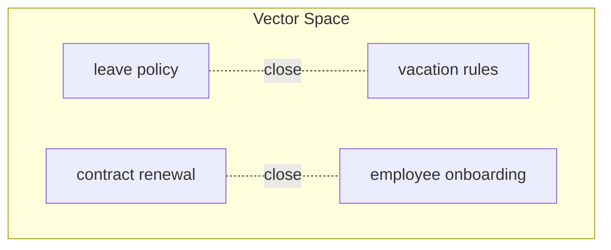

# Embeddings Overview

## Introduction

You now have a document split into focused chunks. But a computer cannot compare the *words* "leave policy" and "vacation rules" — those are just strings of characters.

To make retrieval possible, RAG converts text into **numbers**. This magic trick is called:

```text
Embedding
```

An **embedding** is a list of numbers (a vector) that represents the *meaning* of a piece of text. This chapter explains what embeddings are, why similar meanings produce similar vectors, and previews the embedding models you will use in Module 5.

---

## Learning Objectives

By the end of this chapter, you will understand:

- What an embedding is (text → numbers)
- Why the numbers capture meaning rather than spelling
- Why semantically similar texts get similar vectors
- How vector similarity powers matching
- Which embedding models exist (local MiniLM, OpenAI, BGE)

---

## What Is an Embedding?

An embedding model takes text and produces a vector — an ordered list of numbers.

```text
"Employees receive 30 annual leave days."
                ↓
      [0.02, -0.34, 0.87, -0.11, 0.05, ... ]   (384 or 1024+ numbers)
```

```text
Text  →  Embedding Model  →  Vector
```

These numbers are not random. They are learned coordinates that place the text in a **high-dimensional space** where:

```text
similar meanings  →  nearby points
different meanings →  distant points
```

---

## Why Text Becomes Numbers

Computers cannot do arithmetic with words:

```text
"leave policy" + "vacation rules"  →  meaningless
```

But they can do arithmetic with vectors:

```text
[0.21, 0.74, ...] is "close to" [0.24, 0.71, ...]
```

The whole retrieval step depends on this. When a user asks a question, we embed the *question*, then look for stored chunk vectors that are **close to** the question vector. No exact word matching required — just meaning matching.

---

## Why Similar Meanings Get Similar Vectors

The embedding model is trained on massive amounts of text. During training it learns that certain words and phrases appear in the same contexts, so it pushes their vectors together.

The result:

```text
"leave policy"      → [0.31, 0.62, ...]
"vacation rules"    → [0.33, 0.60, ...]   ← almost the same
"contract renewal"  → [-0.88, 0.11, ...]  ← far away
```

The model has no idea that "leave" and "vacation" are related because of any dictionary — it learned they *behave the same way* in real language. That is why a user can say "vacation rules" and still find a document titled "Leave Policy".

```text
Vector space (simplified to 2D):

        vacation rules
              •
        leave policy
              •
                              contract renewal
                                      •
                              onboarding process
                                      •

Similar ideas cluster together; unrelated ideas drift apart.
```

---

## A Small Embedding Example

Say we embed four small texts. Here is how they might fall in a simplified 2-D space:



The two HR-leave phrases sit **close together**, and the two unrelated phrases sit in their own corner. A query about "time off" lands near the first cluster — and that is exactly how the system decides which chunks are relevant.

---

## A Real Chunking + Embedding Pipeline

Combined with the previous chapter:


Each chunk becomes a vector. In the next chapters we store those vectors (Module 2 chapter 05) and search them (chapter 06).

---

## Embedding Models — Preview

Many embedding models exist. You will choose among them in Module 5, but here is the landscape:

### Local / Open-Weight Models (run on your own machine)

- **MiniLM** (`all-MiniLM-L6-v2`) — small, fast, works fully offline, produces **384-dimension** vectors. Great for learning and prototyping.
- **BGE** (BAAI General Embedding) — strong open models available in several sizes, a popular choice for production open-source systems.

### Hosted / API Models

- **OpenAI** (`text-embedding-3-small` / `text-embedding-3-large`) — high quality, easy to call over an API, but you send your text to OpenAI's servers and pay per token.

### How to Think About the Choice

```text
MiniLM   →  offline, free, fast, 384 dims   →  good default to learn with
BGE      →  open source, strong quality       →  good for self-hosted production
OpenAI   →  hosted, excellent quality         →  easy but costs money + sends data out
```

One important detail: **the same embedding model must be used** to embed chunks and to embed the user's query. Mixing models produces vectors that cannot be compared.

---

## Real Enterprise Example

An HR assistant embeds 2,400 chunks of the employee handbook with `all-MiniLM-L6-v2`.

An employee asks:

```text
"How many days off do I get per year?"
```

The system embeds that question and finds the stored chunk:

```text
"Employees receive 30 annual leave days."
```

The question uses the words "days off", while the chunk says "annual leave days". No exact word match — but their vectors are close, so retrieval succeeds. That is the power of embeddings.

---

## Key Takeaways

- An **embedding** is a list of numbers (a vector) that represents the *meaning* of text.
- Embeddings let computers **compare meaning** instead of spelling.
- Semantically similar texts get **similar vectors** and cluster together in vector space.
- Retrieval = embed the query, then find chunk vectors that are **close** to it.
- Popular models: local **MiniLM** and **BGE**, hosted **OpenAI** embeddings.
- Always use the **same embedding model** for chunks and queries.

> **Deep dive: covered in Module 5** — [Module 5: Embeddings](../Module-5-Embeddings/README.md) explains vectors and distance metrics in detail, and lets you visualize similarity yourself.

---

## Test Yourself

1. What is an embedding?
2. Why do "leave policy" and "vacation rules" get similar vectors?
3. How many dimensions does `all-MiniLM-L6-v2` produce?
4. What happens if you embed documents with one model and the query with a different model?
5. Which embedding option runs fully offline without any API key?

<details>
<summary>Answers</summary>

1. An embedding is a **list of numbers (a vector)** that represents the meaning of a piece of text, placing it in a high-dimensional space.
2. Because the model learned that the phrases are used in similar contexts, so their vectors end up **close together** in vector space.
3. **384 dimensions**.
4. The vectors come from different spaces and **cannot be compared meaningfully** — retrieval quality collapses.
5. **Local open-weight models like MiniLM** (and BGE when self-hosted) run offline; OpenAI embeddings need an API key and network access.

</details>

---

## Next Chapter

Next up: [05-Vector-Database-Overview.md](05-Vector-Database-Overview.md) — where all those chunk vectors go to live.
