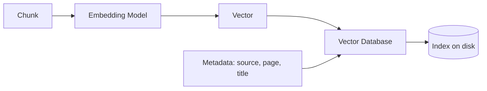
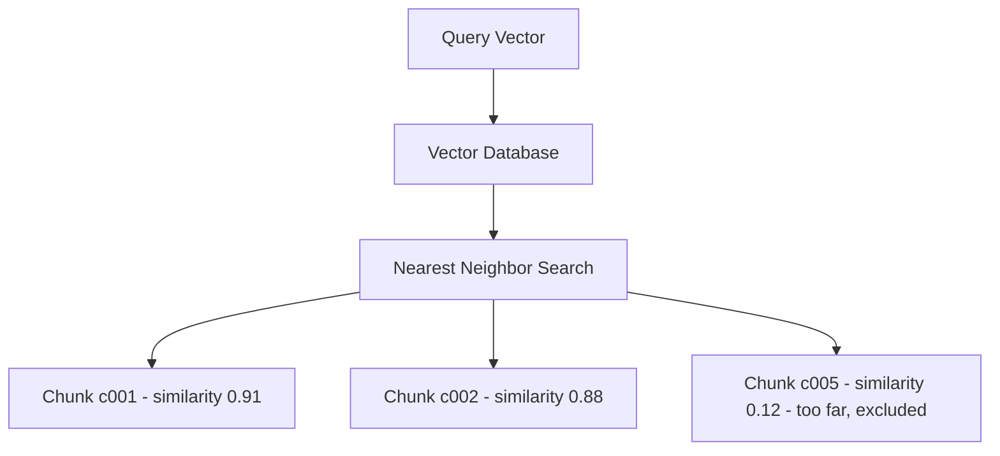

# Vector Database Overview

## Introduction

Embeddings are powerful, but they need somewhere to live. We cannot keep thousands of chunk vectors in memory and scan them all by hand.

The place embeddings live is called a:

```text
Vector Database
```

A vector database stores chunks together with their vectors, and — crucially — it can answer the question that makes RAG work:

```text
"Which stored vectors are closest to this query vector?"
```

This chapter explains what a vector database is, how it stores embeddings, how it searches by similarity, and previews the three tools you will use in Module 6: **ChromaDB**, **FAISS**, and **Pinecone**.

---

## Learning Objectives

By the end of this chapter, you will understand:

- What a vector database is
- How it stores embeddings (vector + text + metadata)
- How similarity search works (nearest neighbors)
- The role of indexes and persistence
- Examples of vector databases: ChromaDB, FAISS, Pinecone

---

## What Is a Vector Database?

A **vector database** is a storage system optimized for vectors. Its job:

```text
Store vectors      →  given text, return its vector
Search vectors     →  given a query vector, return the closest stored vectors
```

Think of a normal database as:

```text
Employee  |  Department  |  Leave Days
John      |  Engineering |  30
Jane      |  HR          |  30
```

A vector database stores *different* rows — each row is a **chunk + its vector + metadata**:

```text
Chunk id  |  Vector (384 numbers)          |  Text                        |  Source
c001      |  [0.31, 0.62, -0.11, ...]      |  "Employees receive 30..."   |  handbook.pdf
c002      |  [0.33, 0.60, -0.09, ...]      |  "Leave requested via..."    |  handbook.pdf
c003      |  [-0.88, 0.11, 0.45, ...]      |  "Renew contract by..."      |  vendors.docx
```

It is the storage layer of the RAG system, sitting right between the embedding model and the retrieval step.

---

## How a Vector Database Stores Embeddings

The ingestion pipeline hands the database completed records:



Every stored record has three parts:

```text
1. The vector        →  numbers that encode meaning
2. The original text →  so we can read it back and send it to the LLM
3. Metadata          →  source file, page number, department, date ...
```

The database then builds an **index** over all the vectors so that searches are fast even with millions of chunks.

---

## Similarity Search: Nearest Neighbors

When a query arrives, the database must find the stored vectors **closest** to the query vector. The standard approach is called **nearest-neighbor search**:

```text
Query vector
   ↓
Compare against every stored vector
   ↓
Compute a distance score for each pair
   ↓
Return the k closest ones
```

```text
Stored chunks                Query: "how many leave days?"

    c003  contract renewal          ·        
                                      ·
    c002  leave request            ·
    c001  leave policy            ·   ← nearest! (highest similarity)

The database returns c001 and c002.
```

"Closeness" is measured with a mathematical distance — cosine similarity is the most common. The details of the math are Module 5/6 territory; the concept here is simple:

```text
Close vectors  =  similar meanings  =  relevant chunks
```

---

## Search Diagram



The database returns the chunks whose vectors sit closest to the query — those are the candidates we call **retrieved context**.

---

## Indexes and Persistence

Two concepts that make vector databases production-ready:

### Index

A data structure that organizes vectors so the search does not have to compare the query against **every single stored vector**.

```text
Without an index → scan 100,000 vectors one by one  →  slow
With an index    → follow a structure, prune branches →  fast
```

Indexes trade a tiny bit of accuracy (approximate results) for a huge gain in speed. You will tune this in Module 6.

### Persistence

By default, an in-memory store forgets everything when the process stops. **Persistence** saves the index to disk:

```text
Run once → store embeddings on disk → restart later → embeddings still there
```

This is what lets you ingest documents once and serve questions for weeks:

```text
db/chroma_db/          ← files on disk, survives restarts
```

---

## Vector Database Options — Preview

You will work hands-on with these in Module 6:

| Tool | Type | Good for |
|---|---|---|
| **ChromaDB** | Embedded vector DB (runs in your Python process) | Learning, small/medium projects, metadata filters |
| **FAISS** | Library from Meta, highly optimized for similarity search | Speed at scale, fine-grained control |
| **Pinecone** | Fully managed cloud vector database | Production, zero infra to manage, scales automatically |

All three implement the same core idea — **store vectors, search by similarity** — so the concepts you learn in this chapter apply to any of them.

---

## Real Enterprise Example

A company's HR assistant stores **2,400 chunks** of the employee handbook in ChromaDB, with metadata like `source: handbook.pdf` and `department: HR`. The database is persisted to disk, so the assistant only ingests once.

An employee asks:

```text
"How many leave days do I get?"
```

The system embeds the query and the vector database returns the two closest chunks:

```text
chunk c001  similarity 0.91  →  "Employees receive 30 annual leave days."
chunk c007  similarity 0.84  →  "Leave balances reset each January."
```

Both chunks are now the **retrieved context** — which the next chapters use to build the answer.

---

## Key Takeaways

- A **vector database** stores chunks together with their vectors and metadata.
- It searches by **nearest neighbors**: find the stored vectors closest to the query vector.
- **Closeness in vector space = similarity in meaning**.
- **Indexes** make searches fast; **persistence** saves the data to disk so you ingest once.
- Popular options: **ChromaDB** (embedded), **FAISS** (fast library), **Pinecone** (managed cloud).
- The vector database connects the embedding model (chapter 04) to retrieval (chapter 06).

> **Deep dive: covered in Module 6** — [Module 6: Vector Databases](../Module-6-Vector-Databases/README.md) builds a real ChromaDB collection, adds metadata filters, and shows you FAISS.

---

## Test Yourself

1. What three things does a vector database store per chunk?
2. What kind of search does a vector database perform to answer "which chunks are relevant?"
3. Why do we need an index?
4. What does persistence allow you to do?
5. Which tool is a fully managed cloud vector database?

<details>
<summary>Answers</summary>

1. The **vector**, the **original text**, and **metadata** (source, page, department, etc.).
2. **Nearest-neighbor (similarity) search** — it finds the stored vectors closest to the query vector.
3. So search is **fast**: instead of scanning every stored vector, the database uses an index structure to prune the search space.
4. Persistence saves the index to **disk**, so embeddings survive restarts and you only need to ingest documents once.
5. **Pinecone**.

</details>

---

## Next Chapter

Next up: [06-Retrieval-Overview.md](06-Retrieval-Overview.md) — the step that turns a question into the right chunks.
