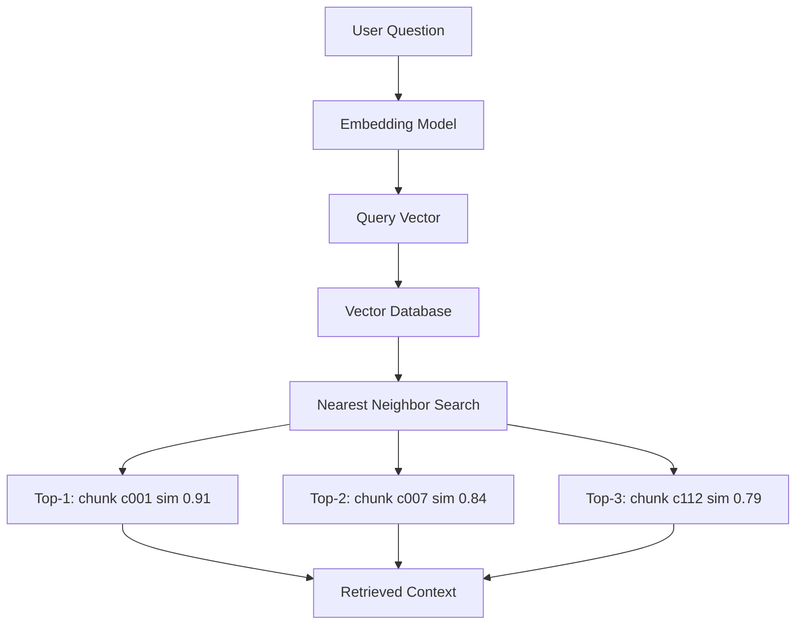

# Retrieval Overview

## Introduction

The vector database is full of chunk vectors. Now for the moment RAG has been building toward: **finding the right chunks for the user's question**.

This step is called:

```text
Retrieval
```

Retrieval takes the user's query, converts it into a vector, searches the vector database, and returns the **top-k** most similar chunks. Those chunks become the "retrieved context" that the LLM will answer from.

Everything before this chapter — loading, chunking, embedding, storing — exists so this step can work. If retrieval is good, the answer has a chance; if retrieval is bad, no LLM in the world can save it.

---

## Learning Objectives

By the end of this chapter, you will understand:

- How a query becomes a vector
- How the system finds the top-k similar chunks
- What `k` means and how to choose it
- What "relevant context" means
- Why retrieval quality controls answer quality

---

## The Retrieval Step, Step by Step

### 1. Embed the query

The user's question is run through the **same embedding model** that embedded the chunks.

```text
"How many leave days do I get?"  →  [0.12, 0.71, -0.03, ...]
```

### 2. Search the vector database

That query vector is compared against every stored chunk vector (with the help of the index).

### 3. Get back the top-k chunks

The database returns the `k` chunks whose vectors are closest.

```text
Query: "How many leave days do I get?"

chunk c001  similarity 0.91   ← rank 1
chunk c007  similarity 0.84   ← rank 2
chunk c112  similarity 0.79   ← rank 3
```

The `k` in "top-k" is the number of chunks you ask for. If `k = 3`, you get the 3 closest chunks.

---

## Retrieval Diagram



The retrieved context is handed to the prompt-construction step in the next chapter.

---

## What Is `k` and How Do We Choose It?

`k` is the **number of chunks retrieved** and placed into the prompt.

```text
k = 3   →  prompt contains the 3 best chunks
k = 10  →  prompt contains the 10 best chunks
```

Small `k`:

```text
Focused, but the answer may be missing
```

Large `k`:

```text
Complete, but the prompt gets long and may include noise
```

The right value is a balance:

```text
k too small  →  relevant facts left out        →  LLM guesses
k too large  →  irrelevant text crowds the prompt →  LLM confused
```

Common practice is `k = 3` to `k = 10` depending on chunk size. Module 7 will teach you how to tune it for your data.

---

## What Does "Relevant Context" Mean?

**Relevant context** is the set of chunks that actually contain the information needed to answer the question.

```text
Question:  "How many annual leave days do I get?"
Relevant:  "Employees receive 30 annual leave days."          ✓
Relevant:  "Unused leave may be carried forward for 90 days." ✓
Noise:     "The cafeteria menu changes weekly."               ✗
```

A good retrieval step returns mostly **relevant** chunks and little noise. Two failure modes to remember:

```text
Missed context   →  the right chunk exists but was not retrieved
Noisy context    →  irrelevant chunks were retrieved anyway
```

Both hurt the final answer, which is why retrieval is often called the **most important step** in RAG.

---

## Retrieval Is Search Over Meaning

Note what retrieval is *not*:

```text
Not keyword search:   "vacation rules" vs "leave policy"
Not exact matching:   the words do not have to appear in the chunk
It IS semantic search: it matches meaning via vectors
```

That is why a user asking "vacation" finds chunks titled "leave" — the retrieval step found them close in vector space, even though the words differ.

---

## Real Enterprise Example

An employee asks the HR assistant:

```text
"Can I carry unused leave into next year?"
```

The retrieval step runs:

```text
1. Embed the question
2. Search the handbook chunks
3. Return top-3:

   "Unused leave may be carried forward for up to 90 days."   sim 0.93
   "Carry-forward requests must be filed before December."    sim 0.81
   "New hires receive prorated leave."                        sim 0.55
```

With `k = 3`, the prompt will contain the first two highly relevant chunks (and maybe drop the third). The answer can now be grounded in real evidence.

---

## Key Takeaways

- **Retrieval** turns the question into a vector and finds the top-k most similar chunks.
- The same embedding model must be used for chunks and for the query.
- `k` is the **number of chunks retrieved**; too small misses facts, too large adds noise.
- **Relevant context** = chunks that actually contain the information the question needs.
- Retrieval is **semantic search over meaning**, not keyword matching.
- Retrieval quality is the single biggest driver of answer quality.

> **Deep dive: covered in Module 7** — [Module 7: Retrieval](../Module-7-Retrieval/README.md) covers similarity scores, choosing `k`, score thresholds, MMR, and hybrid search.

---

## Test Yourself

1. What are the three steps of retrieval?
2. What does "top-k" mean?
3. What happens if `k` is too small?
4. What is "relevant context"?
5. Why can a user say "vacation rules" and still find a chunk titled "Leave Policy"?

<details>
<summary>Answers</summary>

1. **Embed the query** with the same model used for chunks, **search the vector database** for nearest neighbors, and **return the top-k** closest chunks.
2. "Top-k" means returning the **`k` most similar chunks** — if `k = 3`, the three best matches.
3. If `k` is too small, relevant facts may be **left out of the prompt**, so the LLM has to guess.
4. Relevant context is the set of chunks that actually **contain the information needed to answer** the question.
5. Because retrieval is **semantic** — "vacation rules" and "Leave Policy" have similar vectors, so the search finds them by meaning, not by matching words.

</details>

---

## Next Chapter

Next up: [07-Generation-Overview.md](07-Generation-Overview.md) — how the retrieved chunks and the question become one prompt and a grounded answer.
