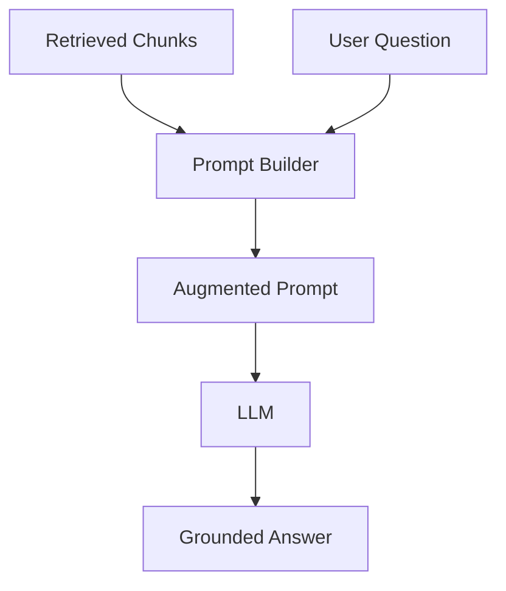
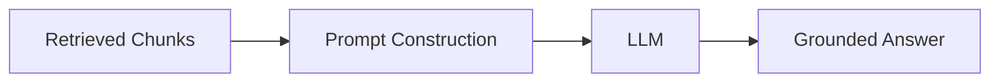

# Generation Overview

## Introduction

Retrieval has done its job: we have a handful of relevant chunks. Now comes the step the user actually sees — **generating an answer**.

But this is not just asking an LLM "what is the leave policy?" out of the blue. RAG **combines the retrieved evidence with the question into a single prompt**, and only then asks the LLM to answer.

```text
Retrieved chunks  +  user question  →  augmented prompt  →  LLM  →  grounded answer
```

This chapter explains how the prompt is built, why grounding prevents hallucinations, and shows a simple prompt template you can use.

---

## Learning Objectives

By the end of this chapter, you will understand:

- How retrieved chunks and the question are combined into one prompt
- What prompt construction is
- How the LLM answers grounded in evidence
- Why grounding reduces hallucinations
- A simple prompt template you can use

---

## Combining Evidence and Question

The generation step has two inputs:

```text
Input 1: the retrieved chunks (the evidence)
Input 2: the user's question
```

These are fused into a single **augmented prompt**:

```text
Retrieved Chunks
      +
User Question
      =
Augmented Prompt
```



The prompt tells the LLM two things:

```text
1. "Here is the evidence from our documents"
2. "Answer the question using ONLY this evidence"
```

---

## A Simple Prompt Template

Here is the heart of every RAG system — a template that places evidence and question together:

```text
You are a helpful assistant for Company Inc.
Answer the user's question using ONLY the context below.
If the context does not contain the answer, say
"I don't have that information in the policy documents."

Context:
---
Employees receive 30 annual leave days.
Unused leave may be carried forward for up to 90 days.
Leave requests must be approved by a manager.
---

Question:
How many annual leave days do I get?
```

The template has three parts:

```text
1. System instructions  →  what the LLM must do (and not do)
2. Context section      →  the retrieved chunks
3. Question             →  the user's original question
```

With that prompt, the LLM reads the evidence and produces:

```text
"You receive 30 annual leave days per year, and unused leave
 can be carried forward for up to 90 days."
```

---

## Grounded Answers vs Hallucinations

The difference between a grounded answer and a hallucination comes down to **what the model had to work from**.

### Without RAG

Ask a plain LLM:

```text
Question: "How many leave days do employees at our company get?"
Answer:   "Most companies provide 20–25 leave days."
```

The model **made it up** — it has no access to your company's policy, so it generalizes from whatever it saw in training. That is a **hallucination**.

### With RAG

Ask the same question with the retrieved evidence in the prompt:

```text
Context: "Employees receive 30 annual leave days."
Question: "How many leave days do employees at our company get?"
Answer:   "Our policy gives employees 30 annual leave days."
```

The answer is **grounded** — every fact traces back to the evidence in the prompt.

```text
Evidence in prompt  →  grounded, verifiable answer
No evidence         →  guessed, hallucinated answer
```

The instruction "if the context does not contain the answer, say you don't know" is the safety net that turns "confident guess" into "honest unknown".

---

## Why This Matters in the Pipeline

Generation is the **last** step of the query pipeline:



It is also the step where all earlier stages pay off:

```text
Good chunks + good prompt  →  grounded answer
Bad chunks + good prompt   →  wrong answer, confidently stated
Good chunks + bad prompt   →  ignored evidence, guesswork
```

The LLM does not magically know the company policy — it knows only what the **prompt hands it**. That is the entire philosophy of RAG.

---

## Real Enterprise Example

An HR assistant retrieves the following chunk for the question *"Can I carry unused leave?"*:

```text
"Unused leave may be carried forward for up to 90 days."
```

The prompt template places it into the context section, the LLM answers:

```text
"Yes — unused leave can be carried forward for up to 90 days.
 Please file the carry-forward request before December."
```

The second sentence ("before December") is correct only if a second retrieved chunk contained it. If the evidence had not mentioned it, the instruction in the prompt would stop the model from inventing it.

---

## Key Takeaways

- **Generation** = combine retrieved chunks + question into one augmented prompt, then ask the LLM.
- The prompt has **instructions + context + question**.
- A **grounded answer** cites evidence from the prompt; a **hallucination** is a guess with no evidence.
- The instruction "answer only from context" and "say you don't know" prevent fabrication.
- Generation quality depends on the **prompt construction** and the **retrieval** before it.

> **Deep dive: covered in Module 8** — [Module 8: Generation](../Module-8-Generation/README.md) covers grounded prompting, citations, answer quality, and chat history.

---

## Test Yourself

1. What two things are combined to build the augmented prompt?
2. What are the three parts of the prompt template in this chapter?
3. What is a hallucination?
4. What should the model do if the context does not contain the answer?
5. Why is generation only as good as the chunks before it?

<details>
<summary>Answers</summary>

1. The **retrieved chunks** (evidence) and the **user's question**.
2. **System instructions**, the **context section**, and the **question**.
3. A hallucination is an answer the model **makes up** because it had no evidence to work from.
4. Say **"I don't have that information in the policy documents"** — the template instructs the model to admit when evidence is missing.
5. Because the LLM only knows what the prompt hands it — **bad or missing chunks mean the answer cannot be grounded**, no matter how smart the model is.

</details>

---

## Next Chapter

Next up: [08-Complete-RAG-Architecture.md](08-Complete-RAG-Architecture.md) — the capstone that fits every piece together into one complete picture.
