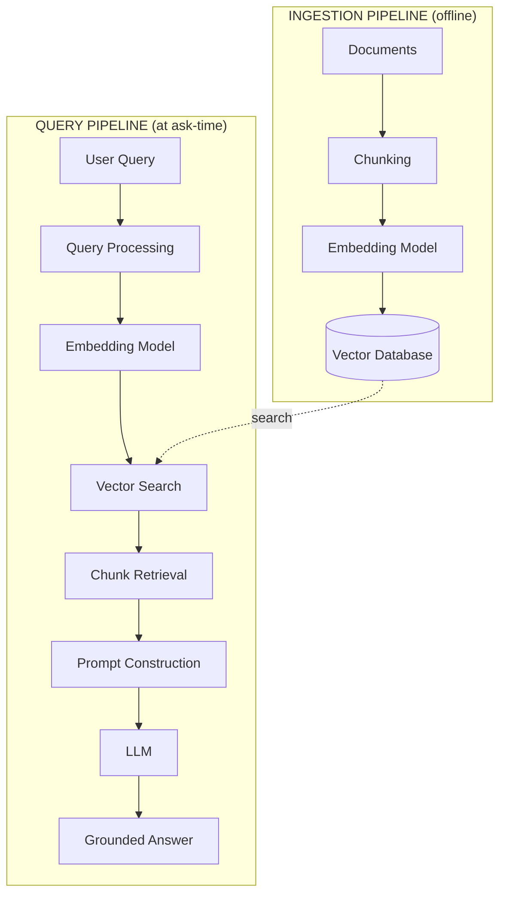
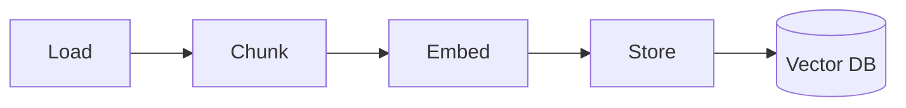
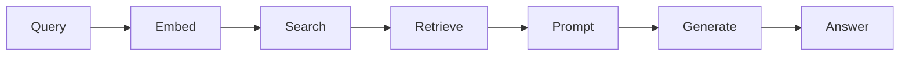
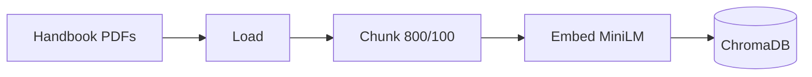
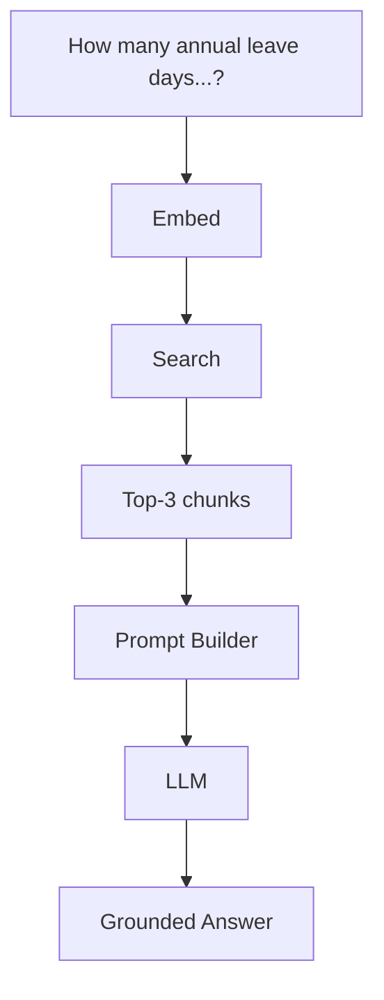

# Complete RAG Architecture

## Introduction

You have now seen every stage of RAG. This final chapter of Module 2 puts them all together into **one complete picture** — the full architecture with both pipelines working together.

A real RAG system is really **two pipelines** that meet at the vector database:

```text
Ingestion pipeline  →  fills the knowledge base (runs when documents change)
Query pipeline      →  answers questions         (runs on every user query)
```

By the end of this chapter you will be able to explain a RAG system end to end, trace a real enterprise question through every stage, and pass the module's final quiz.

---

## Learning Objectives

By the end of this chapter, you will understand:

- The full RAG architecture in one diagram
- The ingestion pipeline: Load → Chunk → Embed → Store
- The query pipeline: Query → Embed → Search → Retrieve → Prompt → Generate
- How the two pipelines connect through the vector database
- A worked enterprise example from start to finish

---

## The Full RAG Architecture

Here is the complete system in one diagram:



The connection is the **vector database**: the ingestion pipeline writes vectors into it, and the query pipeline searches it.

---

## Pipeline 1: Ingestion (offline)

Runs whenever documents are added or updated. It builds the knowledge base.



```text
Step 1  Load    →  read PDFs, DOCX, websites, databases (Module 2 ch. 02)
Step 2  Chunk   →  split into focused pieces with chunk_size & overlap (ch. 03)
Step 3  Embed   →  convert each chunk into a vector (ch. 04)
Step 4  Store   →  save vector + text + metadata in the vector DB (ch. 05)
```

This pipeline runs **once per document set**. The output is a searchable knowledge base that persists on disk.

---

## Pipeline 2: Query (at ask-time)

Runs for **every single question**.



```text
Step 1  Query    →  receive and clean the user's question (ch. 01)
Step 2  Embed    →  convert the question into a vector (ch. 04)
Step 3  Search   →  find nearest neighbors in the vector DB (ch. 05)
Step 4  Retrieve →  take the top-k most similar chunks (ch. 06)
Step 5  Prompt   →  combine chunks + question into one prompt (ch. 07)
Step 6  Generate →  LLM produces a grounded answer (ch. 07)
```

The two pipelines share the **embedding model** and the **vector database** — which is exactly why earlier chapters stressed using one consistent model.

---

## Side-by-Side Comparison

```text
INGESTION PIPELINE                    QUERY PIPELINE
==================                    ================
Load      →  read sources            Query     →  process user question
Chunk     →  split into pieces       Embed     →  vectorize the question
Embed     →  vectorize each chunk    Search    →  nearest neighbors
Store     →  write to vector DB      Retrieve  →  top-k chunks
                                      Prompt    →  evidence + question
                                      Generate  →  grounded answer
```

Ingestion is **write**; the query pipeline is **read**. Both touch the same vector database.

---

## Worked Enterprise Example: The HR Assistant

Company Inc. builds an HR assistant on its **2026 Employee Handbook** (400 pages). Let us trace the whole system.

### Ingestion (done once)

```text
1. LOAD     PDF handbook, SharePoint HR docs, policy website   →  raw text
2. CHUNK    chunk_size 800, chunk_overlap 100                  →  ~2,400 chunks
3. EMBED    all-MiniLM-L6-v2 (384 dims)                        →  2,400 vectors
4. STORE    ChromaDB on disk, metadata: {source, department}   →  knowledge base
```



### Query (every time an employee asks)

An employee asks:

```text
"How many annual leave days do I get and can I carry them over?"
```

```text
1. QUERY     clean the question
2. EMBED     convert to a 384-dim vector
3. SEARCH    compare against 2,400 stored vectors
4. RETRIEVE  top-3 chunks:

   c001  sim 0.91  "Employees receive 30 annual leave days."
   c007  sim 0.84  "Unused leave may be carried forward for up to 90 days."
   c112  sim 0.55  "New hires receive prorated leave."  (dropped / low value)

5. PROMPT    build the augmented prompt with instructions + context + question
6. GENERATE  the LLM answers from the evidence
```



The final answer:

```text
"You receive 30 annual leave days per year. Unused leave may
 be carried forward for up to 90 days."
```

Every claim traces back to a retrieved chunk. Compare this to a plain LLM, which would have guessed a generic industry number — that is RAG's entire reason for existing.

---

## Where Each Chapter Fits

| Module 2 chapter | Stage of the architecture |
|---|---|
| [01-User%20Query.md](01-User%20Query.md) | Query pipeline, steps 1–2 |
| [02-document%20loading.md](02-document%20loading.md) | Ingestion pipeline, step 1 |
| [03-Chunking-Overview.md](03-Chunking-Overview.md) | Ingestion pipeline, step 2 |
| [04-Embeddings-Overview.md](04-Embeddings-Overview.md) | Both pipelines, the Embed step |
| [05-Vector-Database-Overview.md](05-Vector-Database-Overview.md) | The shared storage between both pipelines |
| [06-Retrieval-Overview.md](06-Retrieval-Overview.md) | Query pipeline, steps 3–4 |
| [07-Generation-Overview.md](07-Generation-Overview.md) | Query pipeline, steps 5–6 |

And in the wider course: Modules 3–8 are the deep dives into each of these stages, in the same order you learned them here.

---

## Key Takeaways

- A RAG system is **two pipelines** sharing a vector database.
- The **ingestion pipeline** is offline: Load → Chunk → Embed → Store.
- The **query pipeline** is at ask-time: Query → Embed → Search → Retrieve → Prompt → Generate.
- The **vector database** is the shared heart where the pipelines meet.
- Good answers require every stage to work — weak retrieval can never be fixed by a smarter LLM.
- You can now explain the whole architecture, which is the goal of Module 2.

> **Next steps:** Modules 3–8 go deep on each stage. You already have the map; now you will learn the mechanics.

---

## Module 2 Final Quiz

1. In which order do the stages of the complete pipeline run?
2. What is the difference between the ingestion pipeline and the query pipeline?
3. Where do the two pipelines meet (share data)?
4. If retrieval returns irrelevant chunks, what will happen to the generated answer?
5. Name the six steps of the query pipeline in order.
6. Why must the query be embedded with the same model used for chunks?
7. What do `chunk_size` and `chunk_overlap` control?
8. In the HR example, why can the answer "30 leave days" be trusted?

<details>
<summary>Answers</summary>

1. User Query → Query Processing → Embedding → Vector Search → Chunk Retrieval → Prompt Construction → LLM → Grounded Answer.
2. Ingestion is **offline and runs rarely** — it builds the knowledge base. The query pipeline **runs on every question** — it reads from that knowledge base to answer.
3. At the **vector database** — ingestion writes vectors in; the query pipeline searches them.
4. The answer will be **wrong or hallucinated**, because the LLM is forced to work from bad or missing evidence — retrieval quality drives answer quality.
5. **Query → Embed → Search → Retrieve → Prompt → Generate**.
6. Vectors from different models live in different spaces and **cannot be meaningfully compared** — the search would not find the right chunks.
7. `chunk_size` controls **how big** each chunk is; `chunk_overlap` controls how much text **neighboring chunks share** so no sentence is lost at a boundary.
8. Because the claim is **grounded in a retrieved chunk** ("Employees receive 30 annual leave days") that was placed in the prompt as evidence — not guessed from training data.

</details>

---

## Beyond Module 2

You now understand *how RAG works*. Time to go deep:

- **Next module:** [Module 3: Document Loading](../Module-3-Document-Loading/README.md) — loaders, text extraction, metadata, enterprise ingestion.
- Then follow the deep dives in order: Chunking → Embeddings → Vector Databases → Retrieval → Generation.
- Back to the module index: [README.md](README.md) — or to the course home: [../README.md](../README.md).

> Deep dives ahead: Modules 3–8 are each the "Module X" mentioned in the notes of chapters 03–07.
