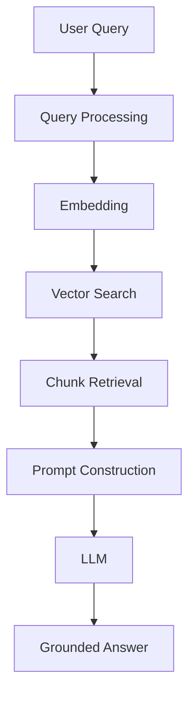

# Module 2: How RAG Works

Module 2 is the **end-to-end tour of a RAG system**. Before we dive into any single building block, you need to see the whole machine running: how a user's question travels through the pipeline and comes back as a grounded answer.

This is the **architecture module**. It answers the big question — *"How does RAG actually work?"* — at a conceptual level. Later modules (3 through 8) each take one stage and go deep.

---

## The Complete RAG Pipeline

Here is the entire journey, end to end, in one picture:



Two things happen behind the scenes to make this possible:

```text
INGESTION PIPELINE (offline)          QUERY PIPELINE (at ask-time)
==========================            ===========================
Documents                            User Query
  → Load                               → Process
  → Chunk                              → Embed
  → Embed                              → Search
  → Store in Vector DB                 → Retrieve chunks
  (build the knowledge base)           → Build prompt
                                       → LLM
                                       → Grounded answer
```

The ingestion pipeline fills the knowledge base **once**; the query pipeline runs **every time someone asks a question**.

---

## Chapters in This Module

| File | What it covers |
|---|---|
| [01-User%20Query.md](01-User%20Query.md) | The user query journey: processing, intent, embedding, vector search, prompt building, generation, multi-query |
| [02-document%20loading.md](02-document%20loading.md) | Document types, loaders, PDF/DOCX/HTML/web/database/API loading, metadata, enterprise ingestion |
| [03-Chunking-Overview.md](03-Chunking-Overview.md) | Why documents are split, chunks, chunk_size & chunk_overlap, strategy preview (character, recursive, semantic) |
| [04-Embeddings-Overview.md](04-Embeddings-Overview.md) | Text → numbers, semantic similarity in vector space, embedding models (MiniLM, OpenAI, BGE) |
| [05-Vector-Database-Overview.md](05-Vector-Database-Overview.md) | What a vector database is, storage, nearest-neighbor search, indexes & persistence, ChromaDB/FAISS/Pinecone |
| [06-Retrieval-Overview.md](06-Retrieval-Overview.md) | Turning a query into a vector, top-k search, the meaning of `k`, what "relevant context" means |
| [07-Generation-Overview.md](07-Generation-Overview.md) | Prompt construction, grounded answers vs hallucinations, a simple prompt template |
| [08-Complete-RAG-Architecture.md](08-Complete-RAG-Architecture.md) | The capstone: full architecture, ingestion + query pipelines side by side, enterprise example, final quiz |

Chapters 01–02 are already complete. Chapters 03–08 take you through each stage of the pipeline in order.

---

## How to Use This Module

1. Read the chapters **in order**. They follow the pipeline top to bottom, so later chapters build on earlier ones.
2. After chapters 01 and 02, read **03-Chunking** → **04-Embeddings** → **05-Vector Database** → **06-Retrieval** → **07-Generation**.
3. Finish with **08-Complete-RAG-Architecture** to see how every piece fits together — it includes the module's final quiz.
4. Try the **"Test Yourself" quiz at the end of every chapter** before moving on. Check your answers inside the `<details>` block.

> Keep the pipeline diagram above handy while reading. Whenever a chapter mentions a stage, ask yourself: *where does this stage sit in the big picture?*

---

## Where This Module Fits in the Course

| Previous | Current | Next |
|---|---|---|
| Module 1: Why RAG Exists | **Module 2: How RAG Works** | [Module 3: Document Loading](../Module-3-Document-Loading/README.md) |

Wait — Module 1 is the *why*, Module 2 is the *how* (the whole machine), and starting with **Module 3** each stage gets a full deep dive.

```text
Module 1  →  Why RAG exists          (the problem)
Module 2  →  How RAG works           (the architecture)   ← you are here
Modules 3–8  →  Deep dives            (the building blocks)
Module 9  →  Advanced RAG            (make it better)
Module 10 →  Evaluation              (prove it works)
Module 11 →  Mini Project            (put it all together)
```

Links:

- Back to the course home: [../README.md](../README.md)
- Forward to the next module: [../Module-3-Document-Loading/README.md](../Module-3-Document-Loading/README.md)

> "Deep dive: covered in Module X" notes inside each chapter tell you exactly where to go next for the full details.
