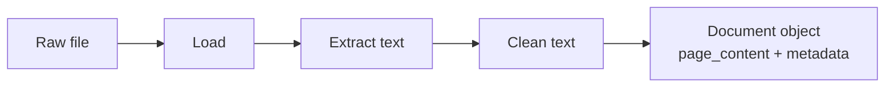

# What Is Document Loading?

## Introduction

Every RAG system starts with the same unglamorous step: **getting your documents into the pipeline.**

In Module 2 you saw the pipeline as a diagram with "document loading" as one box. In this chapter we zoom into that box. No LLM, no embeddings, no vector database — just the question of how raw files become text a computer can search.

Document loading is the **foundation** of RAG. If this stage fails, nothing else can save you. A mediocre loader can silently poison every answer your system ever produces.

---

## Learning Objectives

By the end of this chapter, you will understand:

- Why document loading is the foundation of every RAG system
- The difference between a raw document and plain text
- The **load → extract → clean** flow
- A real-world example of loading at enterprise scale (50,000 PDF policies)

---

## Why Loading Is the Foundation

An LLM has been trained on public text from the internet. It has never seen your HR policy, your contracts, or your internal wiki. Retrieval only works if the information you want to retrieve is **actually in your knowledge base** — and the only way it gets there is through document loading.

The chain of dependence is absolute:

```text
No documents loaded  →  nothing to retrieve  →  no grounded answers
Garbage documents    →  garbage chunks       →  garbage answers
```

Every later stage consumes whatever loading produces:

- **Chunking** (Module 4) cuts the loaded text into pieces
- **Embeddings** (Module 5) turns those pieces into vectors
- **Vector store** (Module 6) stores them
- **Retrieval** (Module 7) finds them
- **Generation** (Module 8) reads them and answers

If the text is wrong, missing, or noisy at the loading stage, all of those stages inherit the problem. That is why this module comes first.

---

## Document vs Text

A file on disk is **bytes**. Its structure depends entirely on its format:

```text
PDF    →  objects, fonts, images, compressed streams
DOCX   →  a zip file full of XML
HTML   →  markup tags around text
CSV    →  rows and columns of raw data
```

None of that is directly usable by an LLM. An LLM consumes **text** — plain, readable characters.

Document loading is the translation layer:

```text
PDF / DOCX / TXT / HTML / CSV / Web
        ↓   (document loading)
          plain text
```

But it is not *just* text. A loader wraps the extracted text in a **Document** object with two parts:

```text
Document
  ├── page_content   →  the extracted text itself
  └── metadata       →  facts about the document
                       (source file, page number, title, author ...)
```

You will meet this object in detail in chapter 02. For now, remember the golden rule:

```text
Raw file   +   context about it   =   a usable Document
```

---

## The Load → Extract → Clean Flow

Loading is rarely a single action. Behind the scenes it is three jobs:

### 1. Load

Open the source — read a file from disk, pull a page from a URL, query a database. This is where errors happen first: missing files, locked files, dead links.

### 2. Extract

Pull the readable text out of the format. A PDF's text may be scattered across internal objects; an HTML page's text is buried inside tags. Extraction is the job of libraries like `pypdf`, `python-docx`, and BeautifulSoup.

### 3. Clean

Strip the noise that comes along for the ride: headers, footers, page numbers, navigation menus, repeated boilerplate. Cleaning happens at loading time so the rest of the pipeline only sees useful text.



Notice the order matters: you must **load** before you can **extract**, and you must **extract** before you can **clean**. Skipping the cleaning step is one of the most common beginner mistakes — and it silently degrades retrieval quality.

---

## Real-World Example: 50,000 PDF Policies

A large insurance company wants an assistant that answers questions about its policies. It has **50,000 PDFs**, a mix of:

- old **scanned** contracts (images, no text layer)
- modern **formatted** PDFs with tables and footers
- Word documents exported to PDF

Onboarding all of them means the loading stage must:

1. **Handle three different kinds of PDF** — extraction quality differs hugely between them, and scanned ones need OCR (chapter 03).
2. **Record provenance** — the system must know which file each policy came from, so answers can be cited and traced.
3. **Run in bulk, then continuously** — ingest the existing 50,000 once, then ingest every new policy as it arrives.

If loading cannot handle volume, variety, and traceability, no amount of clever retrieval or prompt engineering will rescue the project. **The foundation decides everything.**

---

## Key Takeaways

- Document loading is the **foundation** of RAG — every later stage consumes its output.
- Raw formats (PDF, DOCX, HTML) are **bytes**, not text; loading is the translation layer.
- The flow is always **load → extract → clean**.
- Loaders produce LangChain **Document objects**: `page_content` + `metadata`.
- At enterprise scale, loading must handle **volume, variety, and traceability**.
- Skip or rush loading and you get the classic failure: *garbage in, garbage out.*

---

## Test Yourself

1. Why does document loading sit at the *start* of every RAG pipeline?
2. What is the difference between a raw PDF file and text?
3. What are the two parts of a LangChain `Document` object?
4. Name the three jobs that happen inside "document loading", in order.
5. In the 50,000-PDF example, why is recording *where each policy came from* important?

<details>
<summary>Answers</summary>

1. Because every later stage — chunking, embedding, storage, retrieval, generation — consumes what loading produces. If no documents are loaded, there is nothing to retrieve.
2. A raw PDF is a collection of **bytes and internal objects**; text is **plain readable characters**. An LLM can only consume text, so loading must convert the file into text.
3. `page_content` (the extracted text) and `metadata` (facts about the document, like source file and page number).
4. **Load → Extract → Clean**.
5. **Source traceability** — so any answer can be traced back to the exact policy document it came from, which is essential for citations, audits, and debugging.

</details>

---

## Next Chapter

Next up: [02-Loading-Text-Files.md](02-Loading-Text-Files.md) — the simplest format first, with `TextLoader`, `DirectoryLoader`, and the LangChain `Document` object in action.
