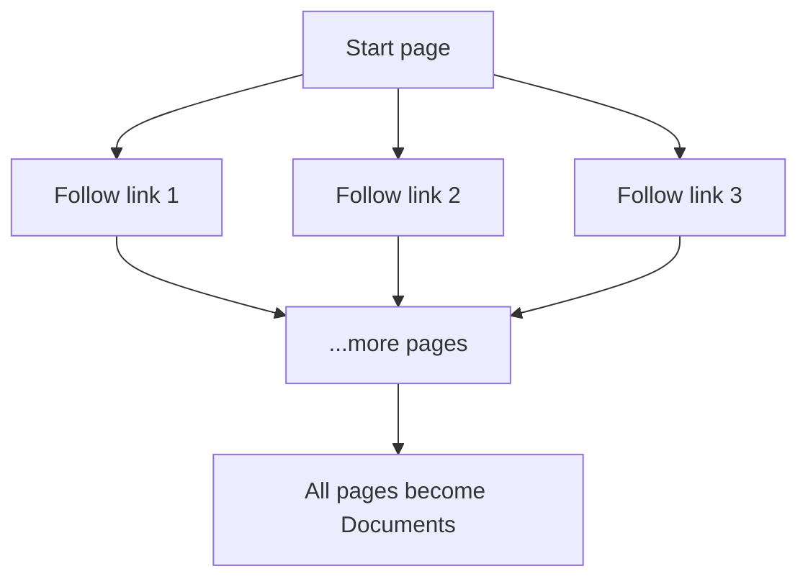

# Web Loading and Crawling

## Introduction

Not all knowledge lives in files. Companies keep documentation on **websites**: public help centers, internal wikis, support portals, developer docs. For those, the loader needs to go and fetch a page across the internet — which is a different skill from reading a local file.

In this chapter you will load a live web page with `WebBaseLoader`, learn how crawling scales from one page to a whole site, and understand the ethics of fetching other people's content.

---

## Learning Objectives

By the end of this chapter, you will understand:

- How to load a web page with `WebBaseLoader`
- How crawling loads many pages from one starting point
- Why JavaScript-rendered pages need a real browser (Playwright / Selenium)
- The ethics and rules of the web: `robots.txt` and respectful crawling

---

## WebBaseLoader: One Page

`WebBaseLoader` fetches a URL and extracts its text using BeautifulSoup — the same HTML parser you met in chapter 04, but fed by a network request instead of a local file:

```python
from langchain_community.document_loaders import WebBaseLoader

loader = WebBaseLoader(web_path="https://www.example.com")
documents = loader.load()

doc = documents[0]
print(doc.metadata.get("title"))
print(f"{len(doc.page_content)} characters")
print(doc.page_content[:150])
```

```text
Example Domain
1256 characters
"Example Domain
This domain is for use in illustrative examples in documents. You may use this
domain in literature without prior coordination or asking for permission.
..."
```

What you get back is the familiar `Document` shape:

```text
Document
  ├── page_content  →  the visible text of the page
  └── metadata      →  {source: the URL, title: the <title>}
```

The `source` metadata now holds a **URL** instead of a file path — traceability works exactly the same way.

### Key point: web loading needs the internet

Fetching a URL is a network operation. No connection, no page:

```text
No internet  →  request fails  →  loader raises an error
```

Real pipelines always wrap web loading so one dead link doesn't crash the run.

### The safe-to-fetch example

The module script [02-loading-web.py](02-loading-web.py) loads `https://www.example.com` — a page maintained by IANA specifically for documentation examples, so it is safe to fetch. Run it when you are online:

```bash
python "Module-3-Document-Loading/02-loading-web.py"
```

If your network is down, the script prints a friendly message instead of crashing:

```text
Could not load the web page: <the error>
This usually means you are offline, the site is unreachable, or the
network is blocking the request. Connect to the internet and try again.
```

---

## Crawling Many Pages

One page is rarely enough. A support portal has hundreds of articles; a company site has dozens of product pages. You need to **crawl** — start at one page and follow links.

```text
Help Center (start)
  ├── Article: VPN setup
  ├── Article: Password reset
  ├── Article: Billing
  └── Article: Two-factor auth
```

The crawler visits each page, extracts its text, follows its links, and keeps going until the site is covered (or a depth/domain limit stops it).



In practice, teams write a small crawl loop that feeds discovered URLs into `WebBaseLoader` one at a time, or use a dedicated scraper framework. The important idea for this course: **crawling is just web loading, repeated intelligently.**

---

## Dynamic JavaScript Pages

Some modern sites (built with React, Angular, or Vue) load their real content with JavaScript *after* the initial HTML arrives. A simple HTTP request gets an almost-empty shell:

```html
<html>
  <body>
    <div id="root"></div>   ← real content appears here only via JS
  </body>
</html>
```

`WebBaseLoader` cannot see the JavaScript-generated content, because it never runs a browser. For these pages you need a **headless browser** that executes the JavaScript and then hands you the rendered page:

```text
Playwright   →  modern, fast, Python + JS friendly
Selenium     →  the long-standing automation standard
```

You only need them for **dynamic** sites; static HTML pages load fine with `WebBaseLoader` alone. (They are heavier — a real browser is slower than a plain HTTP request — so use them only where needed.)

---

## robots.txt and Ethics: A Brief Note

Just because a page is public does not mean you should hammer it with requests.

- **`robots.txt`** — a file on a website that states which parts the owner allows automated access to. Professional crawlers check it first.
- **Rate limiting** — fetch politely, with delays between requests, so you don't overload a server.
- **Terms of service & copyright** — respect the site's rules and the content's license. Scraping content you don't have the right to use can cause serious legal problems.

The one-line rule: **fetch publicly, fetch politely, and only keep content you are allowed to use.** A good RAG system is built on content you have the right to index.

---

## Real-World Example: Help Center Ingestion

A software company wants its RAG assistant to answer support questions from the public help center. The portal has 400 static articles. The team crawls it once a week:

1. Start at the help center homepage.
2. Follow article links, load each with `WebBaseLoader`.
3. Store each article as a `Document` with `source = article URL`.
4. On the next crawl, only pick up **new and changed** articles.

Because each `Document` keeps its URL in metadata, every support answer can link back to the live article — users get a citation they can click.

---

## Key Takeaways

- `WebBaseLoader` fetches a URL and returns a `Document` with `source = URL`.
- Web loading **needs the internet** — always wrap it so failures are handled gracefully.
- **Crawling** is loading repeated across many linked pages.
- **Dynamic JS sites** need a real browser: **Playwright** or **Selenium**.
- Be a good citizen: respect `robots.txt`, rate-limit requests, and only keep content you have rights to.

---

## Test Yourself

1. What is in the `metadata` of a `Document` loaded by `WebBaseLoader`?
2. Why does the module script print a friendly message instead of crashing when the fetch fails?
3. What is the difference between loading one page and *crawling* a site?
4. Why can't `WebBaseLoader` read content on a JavaScript-rendered page?
5. What should you check before crawling a website at scale?

<details>
<summary>Answers</summary>

1. `source` (the page URL) and `title` (the page's `<title>` tag).
2. Because fetching is a network operation that can fail (offline, blocked, dead link) — the script catches the error and explains what to do instead of throwing an unhelpful traceback.
3. Loading fetches **one URL**; crawling starts at one page and **follows links**, repeatedly loading many pages across a site.
4. Because the real content is generated by JavaScript in the browser after the initial HTML arrives; a plain HTTP request only receives the empty shell. You need Playwright or Selenium to execute the JavaScript.
5. The site's `robots.txt`, and whether your terms allow it — plus you should rate-limit requests to be polite.

</details>

---

## Next Chapter

Next up: [06-Metadata-and-Cleaning.md](06-Metadata-and-Cleaning.md) — making your documents traceable and your text clean before anything else touches them.
