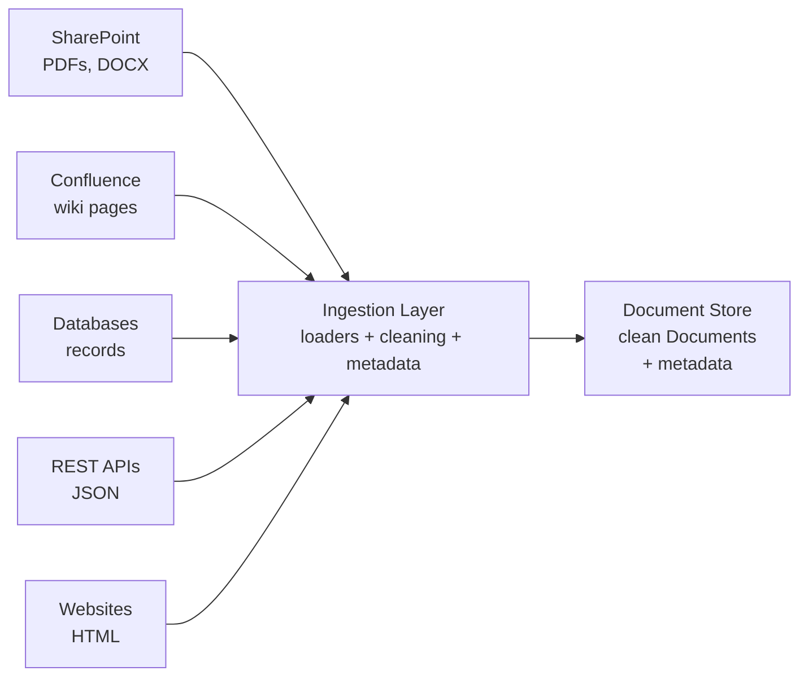

# Enterprise Ingestion

## Introduction

So far you have loaded individual formats: text, PDF, Word, HTML, CSV, web pages. In a real company, though, knowledge does not live in one neat folder. It is scattered across **SharePoint, Confluence, databases, APIs, email, and shared drives** — each with its own format, access rules, and update cadence.

Enterprise ingestion is the discipline of getting **all of those sources** into one clean, traceable document store, reliably and repeatedly. This chapter is the capstone of the module: the real architecture, the real challenges, and the practices that make it work.

---

## Learning Objectives

By the end of this chapter, you will understand:

- The shape of real enterprise data sources
- The architecture: sources → ingestion layer → document store
- The big challenges: deduplication, updates, and versioning
- Best practices for production ingestion pipelines

---

## The Real Shape of Enterprise Data

Ask any large organization where its knowledge lives and you'll get a long list:

```text
HR Policies          →  PDFs on SharePoint
Engineering Docs     →  Confluence wiki
Contracts            →  Contract management system (API)
Support Articles     →  Public help-center website
Employee Records     →  Database
Announcements        →  Email / Slack
```

Each source has its own format, its own access method, and its own rate of change. Contracts are edited rarely; wiki pages change weekly. A realistic ingestion pipeline has to talk to all of them.

---

## Ingestion Architecture

The pattern that handles this variety is remarkably simple: **every source feeds one ingestion layer, which produces one document store.**



What happens inside the ingestion layer:

1. **Connect** to each source (file shares, wikis, databases, APIs).
2. **Load** with the right loader for each format (`PyPDFLoader`, `BSHTMLLoader`, `CSVLoader`, API clients ...).
3. **Clean** the extracted text (chapter 06).
4. **Enrich** with metadata — department, author, last-modified, source URL.
5. **Emit** uniform `Document` objects into the document store.

The document store is the single source of truth that chunking (Module 4) and everything after it consumes. The power of this design: **any new source only adds a new connector** — the downstream pipeline never changes.

---

## The Three Big Challenges

Real ingestion is harder than the diagram suggests. Three problems dominate:

### 1. Duplicates

The same contract exists as `contract.pdf` on SharePoint *and* `contract_v2.pdf` in email *and* an entry in the contract API. Without deduplication you index the same content three times — which means retrieval returns the same answer from three places, and (worse) maybe three **different versions**.

Deduplication techniques:

```text
Exact match    →  hash the content, drop identical copies
Near-duplicate →  similarity score (e.g. shingling or embeddings)
Canonical ID   →  a stable ID per real-world document
```

### 2. Updates

Documents change. A policy is revised; a wiki page is edited. If your pipeline only ingests once, your assistant answers with **stale facts** — a compliance nightmare. The fix is **continuous ingestion**: re-scan sources on a schedule, and re-ingest anything whose content or last-modified date changed.

```text
Detect change  →  re-load that document only  →  update the store
```

### 3. Versioning

When a document *does* change, do you keep the old version? For regulated industries the answer is usually **yes** — you may need to prove what a policy said at a specific date. Versioning means each version is a separate, dated document:

```text
leave-policy_v2 (2025)   ← superseded
leave-policy_v3 (2026)   ← current
```

Retrieval then asks for the **current** version by default, but can also answer "what did the policy say in 2025?" This is where the `last_reviewed` metadata from chapter 06 pays off.

---

## Best Practices

### Track every document

Give every document a stable ID and record its `source`, `hash`, and `last_updated`. You cannot deduplicate, update, or version what you cannot identify.

### Make ingestion idempotent

Running the pipeline twice should produce the **same store**, not duplicates. On every run: find changed docs, re-ingest them, and remove docs whose source disappeared.

### Validate output quality

Sample the loaded text and check for empty pages, garbled extraction, or missing metadata. Catch problems at the loader, not at retrieval.

### Monitor and alert

Log how many documents each source produced, how long each step took, and how many failed. A silent loader that stops ingesting is a silent knowledge-base outage.

### Preserve provenance end-to-end

Keep `source` (and page/version) in metadata from loading to answer. Every claim the assistant makes should be traceable back to a specific document.

---

## Real-World Example: A Bank's Compliance Knowledge Base

A bank ingests for a regulatory-compliance assistant. Its sources:

```text
Policy PDFs on SharePoint     →  PyPDFLoader + OCR for scans
Confluence procedures         →  Confluence API + BSHTMLLoader
Approved-vendor list          →  CSVLoader
New regulatory alerts         →  REST API (JSON)
```

The nightly ingestion job:

1. Connects to all four sources and pulls anything changed in the last 24 hours.
2. Loads, cleans, and stamps each document with `department`, `source`, `version`, and `last_reviewed`.
3. Deduplicates against existing content by content hash.
4. Upserts into the document store — new docs added, changed docs replaced, deleted docs removed.

Every morning the compliance team can ask questions and trust that the answers reflect **today's** documents, with full traceability to the source policy.

---

## Key Takeaways

- Enterprise knowledge lives in **many sources** — SharePoint, Confluence, databases, APIs, websites.
- The architecture is always **sources → ingestion layer → document store**.
- The three big challenges are **deduplication, updates, and versioning**.
- Continuous ingestion beats one-time ingestion: documents change, and your store must change with them.
- **Idempotency, validation, monitoring, and provenance** turn a prototype loader into a production pipeline.

---

## Test Yourself

1. Draw (in words) the enterprise ingestion architecture — what are the three layers?
2. What goes wrong if the same contract is ingested from three different sources?
3. Why is one-time ingestion dangerous for policies that get revised?
4. What does it mean for ingestion to be *idempotent*?
5. Name two practices that keep an ingestion pipeline healthy in production.

<details>
<summary>Answers</summary>

1. **Sources** (SharePoint, Confluence, databases, APIs, websites) → **ingestion layer** (loaders + cleaning + metadata) → **document store**.
2. You index the content multiple times, so retrieval returns the same answer from several places — and potentially different **versions** of the contract, creating conflicting answers.
3. Because policies change — after a revision your assistant would keep answering from the **stale** old version, which is dangerous (e.g. for compliance).
4. Running it twice produces the **same store** — no duplicate documents, no double-ingestion — instead of compounding errors on every run.
5. **Validation** (sample the output, catch garbled text) and **monitoring** (log per-source counts, durations, and failures so a silent outage is caught quickly). Both go well with idempotency and provenance.

</details>

---

## Next Chapter

Module 3 is complete. Next up: [Module 4: Chunking](../Module-4-Chunking/README.md) — now that your documents are clean and in the store, it's time to cut them into pieces.
