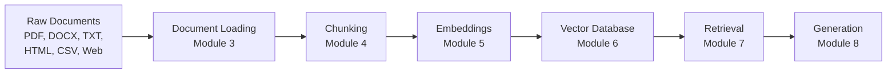

# Module 3: Document Loading

Module 3 is the first **building-block deep dive**. In Module 2 you saw the whole RAG pipeline from a distance; from here on, each module takes one stage and teaches you how to build it well.

This module is about the very first stage: **getting your documents out of their native format and into the pipeline.** Before a RAG system can answer a single question, it has to read your data — TXT, PDF, DOCX, HTML, CSV, even live web pages — and turn it into clean text with useful metadata.

> Rule of the whole course: if loading is broken, everything downstream is broken. A great vector database and a great LLM cannot save a system whose documents never made it in.

---

## Where Document Loading Fits in the Pipeline



Document loading is the **gateway**. Every later stage consumes what it produces:

```text
Loaded Documents
   → Chunked   (Module 4)
   → Embedded  (Module 5)
   → Stored    (Module 6)
   → Retrieved (Module 7)
   → Answered  (Module 8)
```

---

## Chapters in This Module

| File | What it covers | Runnable code |
|---|---|---|
| [01-What-is-Document-Loading.md](01-What-is-Document-Loading.md) | Why loading is the foundation, Document vs text, the load → extract → clean flow, the 50,000-PDF problem | — |
| [02-Loading-Text-Files.md](02-Loading-Text-Files.md) | `TextLoader`, `DirectoryLoader`, the LangChain `Document` object, `metadata`, loading every `.txt` in `docs/` | [01-loading-txt-pdf-docx.py](01-loading-txt-pdf-docx.py) |
| [03-Loading-PDFs.md](03-Loading-PDFs.md) | `PyPDFLoader` / `pypdf`, why PDFs are hard (scans, tables, multi-column), OCR concept | [01-loading-txt-pdf-docx.py](01-loading-txt-pdf-docx.py) |
| [04-Loading-Word-and-HTML.md](04-Loading-Word-and-HTML.md) | `Docx2txtLoader` / `python-docx`, `BSHTMLLoader` / BeautifulSoup, `CSVLoader` | [01-loading-txt-pdf-docx.py](01-loading-txt-pdf-docx.py) |
| [05-Web-Loading-and-Crawling.md](05-Web-Loading-and-Crawling.md) | `WebBaseLoader`, crawling many pages, dynamic JS pages, robots.txt & ethics | [02-loading-web.py](02-loading-web.py) |
| [06-Metadata-and-Cleaning.md](06-Metadata-and-Cleaning.md) | Why metadata matters, adding custom metadata, cleaning text, "garbage in garbage out" | — |
| [07-Enterprise-Ingestion.md](07-Enterprise-Ingestion.md) | Multi-source enterprise architecture, dedup, updates, versioning, best practices | — |

The sample company documents live in `docs/` at the repo root (`google.txt`, `microsoft.txt`, `Nvidia.txt`). The loaders in this module read from that folder.

---

## Setup

The scripts in this module need a few extra packages. They are already listed in the course `requirements.txt`, but if you are installing just for this module:

```bash
pip install pypdf python-docx beautifulsoup4
```

- `pypdf` → reading PDFs
- `python-docx` → reading Word documents (the `Docx2txtLoader` used in the examples also needs `docx2txt`, install it with `pip install docx2txt` if missing)
- `beautifulsoup4` → reading HTML pages and web content

### Running the sample scripts

Run from the repo root (the scripts also auto-locate the `docs/` folder themselves):

```bash
python "Module-3-Document-Loading/01-loading-txt-pdf-docx.py"
python "Module-3-Document-Loading/02-loading-web.py"   # needs internet
```

`01-loading-txt-pdf-docx.py` loads the `.txt` files already in `docs/` and automatically picks up any `.pdf` or `.docx` you add there. `02-loading-web.py` fetches one safe public page and needs an active internet connection.

---

## How to Use This Module

1. Read the chapters **in order** — they build from the concept (01) to the simplest files (02), then harder formats (03–04), then web (05), then production concerns (06–07).
2. Run **`01-loading-txt-pdf-docx.py`** after chapters 02–04. Add a PDF or DOCX to `docs/` and re-run to see the loaders adapt.
3. Run **`02-loading-web.py`** after chapter 05 (when you are online).
4. Finish each chapter with its **"Test Yourself"** quiz and check your answers inside the `<details>` block.

---

## Where This Module Fits in the Course

| Previous | Current | Next |
|---|---|---|
| [Module 2: How RAG Works](../Module-2-How-RAG-Works/README.md) | **Module 3: Document Loading** | [Module 4: Chunking](../Module-4-Chunking/README.md) |

```text
Module 2  →  How RAG works            (the architecture)   ← you were here
Module 3  →  Document Loading        (the foundation)      ← you are here
Module 4  →  Chunking                (the next deep dive)
Modules 5–8  →  Embeddings → Vector DB → Retrieval → Generation
```

Once your documents are loaded and clean, the very next job is cutting them into pieces — that is exactly what [Module 4: Chunking](../Module-4-Chunking/README.md) covers.
