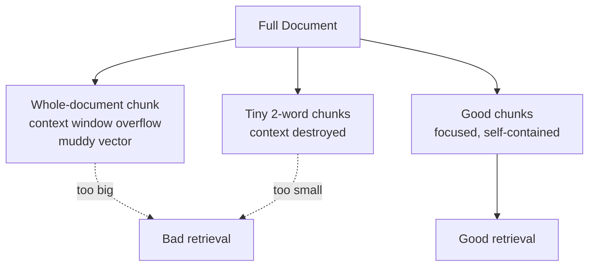

# Why Chunking Matters

## Introduction

In Module 3 you loaded documents and got them clean. The next decision is: **what do we do with the text?**

The naive answer — embed the whole document as one vector — is wrong. The equally naive answer — split everything into tiny 2-word pieces — is also wrong. Chunking is the art of cutting text into pieces that are *just right*, and this chapter explains the two limits that force us to chunk at all.

---

## Learning Objectives

By the end of this chapter, you will understand:

- The two limits: the **context window** and **embedding quality**
- What happens when you embed a whole book as one chunk (bad retrieval)
- What happens when chunks are only 2 words (lost context)
- Why there is a sweet spot, and where it lives

---

## The Two Limits

Chunking exists because two hard constraints meet in the middle of every RAG pipeline.

### Limit 1: The context window

The LLM can only read a limited amount of text per request — its **context window**. A 400-page handbook cannot fit in the prompt.

```text
400-page handbook  →  ~1,000,000 tokens  →  way beyond any context window
```

So the system must *not* send the whole document to the LLM. It sends a small set of **retrieved chunks** instead. That is only possible if the document was already split into chunks.

### Limit 2: Embedding quality

An embedding model turns a piece of text into **one vector**. That vector has to represent the meaning of the text. Here is the problem:

```text
Short, focused text  →  one precise meaning  →  a precise vector
Huge, mixed text     →  many meanings blended  →  a muddy, vague vector
```

A vector that mixes "leave policy, payroll, security, travel" together matches *none* of those topics well. Only by splitting a document into focused chunks can each chunk get a focused vector.

```text
One giant document   →  one muddy vector   →  bad retrieval
Many focused chunks  →  many precise vectors →  good retrieval
```

---

## What Happens with a Whole-Book Chunk

Suppose you embed an entire employee handbook as a single chunk. A user asks:

```text
"How many sick days do I get?"
```

The query vector has to be compared against the handbook's one giant vector — which averages together HR, security, travel, and payroll. The match is mediocre, and the same mediocre match happens for *every* question. The system either returns the whole (useless) blob or returns nothing useful:

```text
One chunk per handbook:
  vector = [0.41, 0.38, 0.22, ...]   ← a blur of everything
  matches every question "okay" and none of them well
```

**Symptom:** the assistant seems to "know" things but answers are vague, off-topic, or the wrong section entirely. This is the classic *muddy vector* failure.

---

## What Happens with 2-Word Chunks

Now go to the other extreme: chunks of 2 words.

```text
"Employees receive 30 paid annual leave days per year."
→
Chunk 1: "Employees receive"
Chunk 2: "30 paid"
Chunk 3: "annual leave"
Chunk 4: "days per"
Chunk 5: "year"
```

The embedding of `"days per"` is meaningless on its own. Even if retrieval finds it, there is no context to answer anything. And a sentence split across a chunk boundary loses its subject or its object:

```text
Chunk 3: "annual leave"     ← which year? which rule?
Chunk 4: "days per"         ← meaningless on its own
```

**Symptom:** retrieval finds *something*, but the retrieved text is too small to answer the question. The LLM has to guess — and guessing is where hallucinations come from.

---

## The Chunking Diagram



```text
Chunk too big    →  muddy vector + context window overflow
Chunk just right →  focused vector + enough context to answer
Chunk too small  →  meaning destroyed, nothing to answer with
```

---

## The Sweet Spot

A good chunk has two properties:

```text
SMALL ENOUGH   →  to be one clear topic  (precise embedding)
BIG ENOUGH     →  to answer on its own   (enough context)
```

In practice this usually lands around **500–1,000 characters** for prose (roughly 100–250 tokens), tuned to your content — but the exact number depends on your documents, which is what chapters 02 and 03 are for.

---

## Real-World Example: The Handbook Question

Your employee handbook covers annual leave, sick leave, and travel. With good chunking, each topic lives in its own chunk:

```text
Chunk A: "Every full-time employee receives 30 annual leave days..."
Chunk B: "Full-time employees receive 15 paid sick leave days..."
Chunk C: "Business travel must be booked through the company portal..."
```

The question *"How many sick days do I get?"* produces a query vector close to **Chunk B**. Retrieval returns exactly that chunk, and the LLM answers precisely. Same handbook, same question — but the chunking decision was the difference between a vague answer and a correct one.

---

## Key Takeaways

- Two limits force chunking: the **context window** of the LLM and the **embedding quality** of each vector.
- Whole-document chunks → **muddy vector**, matches nothing well, overflows the context window.
- Tiny chunks → **meaning destroyed**, nothing has enough context to answer.
- Good chunks are **one clear topic** but **big enough to answer on their own** — typically ~500–1,000 characters for prose.
- Chunking is where most retrieval failures are born, so it's worth getting right.

---

## Test Yourself

1. What are the two limits that make chunking necessary?
2. Why does a whole-book chunk produce a "muddy vector"?
3. What goes wrong with 2-word chunks?
4. What are the two properties of a good chunk?
5. In the handbook example, why did retrieval succeed after chunking?

<details>
<summary>Answers</summary>

1. The **context window** of the LLM (can't fit a whole document in the prompt) and **embedding quality** (a huge text averages into a vague vector).
2. Because one vector must represent many different topics at once, so it ends up matching every topic poorly.
3. The ideas are **cut apart** — chunks like "days per" are meaningless on their own, and sentences lose their subject or object across boundaries.
4. **Small enough to be one clear topic** (precise embedding) and **big enough to answer on its own** (enough context).
5. Because each topic (leave, sick days, travel) got its own focused chunk, so the query about sick days matched the sick-leave chunk directly instead of a blurry whole-handbook vector.

</details>

---

## Next Chapter

Next up: [02-Character-vs-Recursive-Splitting.md](02-Character-vs-Recursive-Splitting.md) — the two splitters you'll use most, compared side by side with runnable code.
