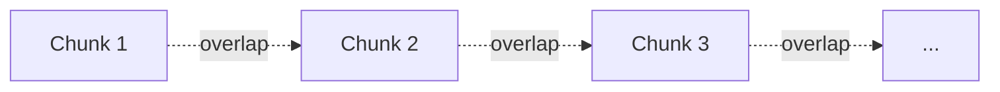

# Chunk Size and Overlap

## Introduction

Every splitter has two tuning knobs, and they matter more than which splitter you pick:

- **`chunk_size`** — how big each chunk is
- **`chunk_overlap`** — how much neighboring chunks share

Get these right and retrieval just works. Get them wrong and you will be fighting retrieval failures for weeks. This chapter explains what the knobs mean, walks through a worked example, and gives you concrete starting points for your own documents.

---

## Learning Objectives

By the end of this chapter, you will understand:

- What `chunk_size` means and how it affects vectors
- What `chunk_overlap` means and which failure it prevents
- A worked example: 1,000-char chunks with 200-char overlap
- The trade-off between small and large chunks
- Rule-of-thumb sizes for tables, code, and prose
- How to pick sizes for your own data

---

## What chunk_size Means

`chunk_size` is the **target length** of each chunk, usually measured in characters (LangChain's default) or tokens. The splitter tries to produce pieces *at most* this long, respecting separators.

```python
from langchain.text_splitter import RecursiveCharacterTextSplitter

splitter = RecursiveCharacterTextSplitter(
    separators=["\n\n", "\n", ". ", " ", ""],
    chunk_size=500,
    chunk_overlap=50,
)
```

The choice of `chunk_size` is a direct trade-off between the two limits from chapter 01:

```text
Small chunks  →  precise vectors, but less context per chunk
Large chunks  →  more context, but the vector gets muddier
```

There is no universal "right" number — it depends on what kind of text you chunk, which is why the rule-of-thumb table below exists.

---

## What chunk_overlap Means

`chunk_overlap` is the amount of text **shared between neighboring chunks**. Without overlap, a sentence that falls exactly on a chunk boundary gets cut in half — and neither chunk contains the full idea:

```text
Chunk 1 ends:   "Unused leave may"
Chunk 2 starts: "be carried forward."
```

A question like *"Can I carry unused leave?"* now matches a chunk that only contains "Unused leave may" — the answer's second half lives in a chunk retrieval never touched.

With overlap, the boundary region appears in **both** chunks:

```text
Chunk 1 ends:   "Unused leave may be carried forward."
Chunk 2 starts: "Unused leave may be carried forward. Up to 10 days."
```

Now the full sentence is present and retrievable. Overlap is cheap insurance against boundary cuts.



---

## Worked Example: 1,000 Characters with 200 Overlap

Say your document is 2,600 characters long. With `chunk_size=1000` and `chunk_overlap=200`:

```text
Document:  |============= 2600 chars =============|

Chunk 1:   [         0 .. 1000         ]
Chunk 2:        [   800 .. 1800        ]
Chunk 3:              [  1600 .. 2600  ]
               ^^^^ 200 chars shared between neighbors ^^^^
```

```python
splitter = RecursiveCharacterTextSplitter(
    chunk_size=1000,
    chunk_overlap=200,
)

chunks = splitter.split_text(handbook_text)   # 2600-char text

print(len(chunks))      # 3 chunks
print(chunks[1][:60])   # starts near character 800 — the overlap region
```

```text
3
"The annual leave policy states that ..."   ← tail of chunk 1, repeated
```

Notice chunk 2 does not start where chunk 1 ended (1000) — it starts at **800**, carrying the last 200 characters of chunk 1 with it. A sentence that straddled position 1000 is now intact in *both* chunks.

---

## The Trade-Off

There is no free lunch — smaller and larger each buy one thing and cost another.

| | Small chunks | Large chunks |
|---|---|---|
| Vector precision | **High** — one clear topic | Low — topics blended |
| Context available | Low — may not answer alone | **High** — usually self-contained |
| Retrieval noise | Low — irrelevant text rarely sneaks in | High — chunk may contain lots of unrelated text |
| Number of chunks | Many | Few |
| Typical failure | Context lost at boundaries | Irrelevant text retrieved |

In practice you'll tune between the extremes until a failure you care about goes away. If retrieval keeps returning *half-answers*, chunk bigger. If retrieval returns *noisy chunks that bury the answer*, chunk smaller.

---

## Rule-of-Thumb Table

Good starting points, tuned by content type:

| Content type | Recommended `chunk_size` | Notes |
|---|---|---|
| **Prose** (policies, handbooks, articles) | 500–1,000 characters (~100–250 tokens) | Recursive splitter; overlap ~10–20% |
| **Tables** | Small, per logical block | **Never split inside a table cell** — keep rows/groups together |
| **Code** | 100–200 lines, function-sized | Split at function/class boundaries; keep imports with their code |
| **Conversational / chat** | 200–500 characters | Keep one turn or intent per chunk |
| **Legal / contracts** | 1,000–1,500 characters | Clauses are long; but keep clauses intact |

These are **starting points, not laws**. They exist because the fastest way to learn is to start close to the right answer and then tune.

---

## How to Pick Sizes for Your Data

There is no formula, but there is a process:

1. **Start with prose defaults** — `chunk_size=1000`, `chunk_overlap=200` on an average document.
2. **Run the example** — [02-chunk-size-overlap-comparison.py](02-chunk-size-overlap-comparison.py) splits the same company-policy text three ways so you can watch chunk counts and previews change. Use it to get a feel for what each setting does before you touch real data.
3. **Sample your own chunks** — print 20 random chunks from your real documents. Ask: *does each chunk make sense on its own?*
4. **Ask real questions** — run queries your users actually ask and inspect the retrieved chunks. Half-answers → bigger chunks or more overlap; noisy chunks → smaller chunks.
5. **Fix the failure, not the number** — if a specific failure disappears, you found your setting.

A sane overlap range is **10–20% of `chunk_size`** (e.g. 100–200 characters of overlap for a 1,000-char chunk). Enough to protect boundaries, not so much that every chunk is half a copy of its neighbor.

---

## Real-World Example: Tuning the Employee Handbook

A company ingests its 400-page handbook with `chunk_size=1000, chunk_overlap=200`. Users complain: *"I asked how many sick days I get and it returned a chunk about travel booking."*

Investigation shows a chunk boundary fell inside the sick-leave section, so the retrieval matched a neighboring topic. The team:

1. Raised overlap to 300 — the boundary sentence now survives in both chunks.
2. Retested the sick-leave query — the correct section now comes back.
3. Kept `chunk_size=1000`; the fix was in the overlap, not the size.

One tuning change, one failure eliminated. That's the whole game.

---

## Key Takeaways

- `chunk_size` = target chunk length; `chunk_overlap` = shared text between neighbors.
- Overlap prevents **boundary cuts** — sentences split across chunks become unreachable.
- Small chunks are **precise but context-losing**; large chunks are **context-rich but noisy**.
- Good starting points: 500–1,000 chars for prose, function-sized for code, per-block for tables, 10–20% overlap.
- Pick sizes by **sampling chunks and asking real questions** — fix the failure, not the number.

---

## Test Yourself

1. In one sentence, what does `chunk_overlap` protect against?
2. A 2,600-character document is split with `chunk_size=1000` and `chunk_overlap=200`. Where does chunk 2 start, and why?
3. What is the main downside of large chunks? Of small chunks?
4. Why should you never split inside a table cell?
5. What overlap range is a reasonable starting point for a 1,000-character chunk?

<details>
<summary>Answers</summary>

1. **Boundary cuts** — a sentence or idea that lands exactly on a chunk boundary appears in both chunks, so retrieval can still find it whole.
2. At character ~**800**, not 1000 — because it carries the last 200 characters of chunk 1 as overlap.
3. Large chunks are **noisy** (lots of irrelevant text retrieved); small chunks are **context-poor** (may not contain enough to answer on their own).
4. Because a split cell is **garbage** — column headers get separated from values, and the chunk is unreadable for both embedding and the LLM.
5. About **100–200 characters** (10–20% of the chunk size).

</details>

---

## Next Chapter

Next up: [04-Semantic-and-Advanced-Chunking.md](04-Semantic-and-Advanced-Chunking.md) — splitting by *meaning* instead of length, and when advanced techniques are worth the effort.
