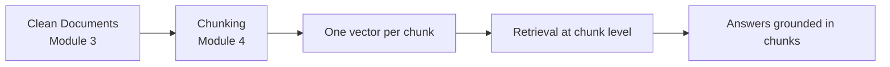

# Module 4: Chunking

Module 4 is the deep dive on the stage right after loading: **cutting your clean documents into pieces**. It is the stage beginners skip or rush — and the stage where the most retrieval failures are born.

A document almost never enters a RAG pipeline as one giant block. It is split into **chunks**, each chunk becomes one vector, and retrieval happens at the *chunk* level. Choose your chunking badly and retrieval will be bad no matter how good your embedding model or vector database is.

> The module folder already contains the starter script [01-recursive-vs-character-splitter.py](01-recursive-vs-character-splitter.py) — chapter 02 walks through exactly what it demonstrates. This module adds [02-chunk-size-overlap-comparison.py](02-chunk-size-overlap-comparison.py) to show the size/overlap trade-off in action.

---

## Why Chunking Matters — At a Glance



```text
Too big a chunk  →  one muddy vector  →  nothing matches well
Too small a chunk →  ideas cut in half  →  context lost
Just right        →  focused, self-contained chunks  →  good retrieval
```

Chunking is where the two limits of RAG meet — the **context window** of the LLM and the **quality of embeddings** — and this module teaches you to balance both.

---

## Chapters in This Module

| File | What it covers | Runnable code |
|---|---|---|
| [01-Why-Chunking-Matters.md](01-Why-Chunking-Matters.md) | The two limits (context window + embedding quality), whole-book vs 2-word chunks, the sweet spot | — |
| [02-Character-vs-Recursive-Splitting.md](02-Character-vs-Recursive-Splitting.md) | `CharacterTextSplitter` vs `RecursiveCharacterTextSplitter`, walking through the starter script | [01-recursive-vs-character-splitter.py](01-recursive-vs-character-splitter.py) |
| [03-Chunk-Size-and-Overlap.md](03-Chunk-Size-and-Overlap.md) | `chunk_size`, `chunk_overlap`, the size trade-off, rule-of-thumb table, picking sizes | [02-chunk-size-overlap-comparison.py](02-chunk-size-overlap-comparison.py) |
| [04-Semantic-and-Advanced-Chunking.md](04-Semantic-and-Advanced-Chunking.md) | Splitting by meaning, `MarkdownHeaderTextSplitter`, sentence-based splitters, when advanced splitting pays off | — |
| [05-Common-Chunking-Mistakes.md](05-Common-Chunking-Mistakes.md) | Fixed-size without overlap, splitting tables/code, ignoring structure, duplicates, one-size-fits-all | — |

---

## Running the Sample Scripts

Both scripts are self-contained and need **nothing but LangChain's splitters** (no API keys, no internet):

```bash
python "Module-4-Chunking/01-recursive-vs-character-splitter.py"
python "Module-4-Chunking/02-chunk-size-overlap-comparison.py"
```

`01` demonstrates why the recursive splitter beats the plain character splitter on real text. `02` splits the same company-policy text three different ways so you can see chunk counts and previews change with `chunk_size` and `chunk_overlap`.

---

## How to Use This Module

1. Read chapters **in order**: the *why* (01), then the two core splitters (02), then the tuning knobs (03), then advanced options (04) and common mistakes (05).
2. Run **`01-recursive-vs-character-splitter.py`** after chapter 02 and compare its chunks to the discussion.
3. Run **`02-chunk-size-overlap-comparison.py`** after chapter 03 and watch the trade-off happen live.
4. Finish every chapter with its **"Test Yourself"** quiz — answers are in the `<details>` block.

---

## Where This Module Fits in the Course

| Previous | Current | Next |
|---|---|---|
| [Module 3: Document Loading](../Module-3-Document-Loading/README.md) | **Module 4: Chunking** | [Module 5: Embeddings](../Module-5-Embeddings/README.md) |

```text
Module 3  →  Document Loading       (clean documents)       ← you were here
Module 4  →  Chunking               (split into pieces)     ← you are here
Module 5  →  Embeddings             (each chunk → a vector)
Module 6  →  Vector Database        (store the vectors)
Modules 7–8  →  Retrieval → Generation
```

Once your documents are split into clean, focused chunks, the next module turns **each chunk into a vector** — the step that makes semantic search possible.
