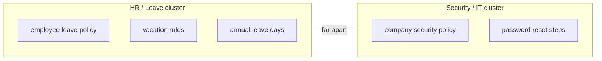

# Visualizing Embeddings

## Introduction

We keep saying embeddings are "points in a high-dimensional space" — 384 dimensions for MiniLM. Nobody can picture 384 dimensions, and that makes the whole idea feel abstract.

The fix is **projection**: squashing a high-dimensional vector down to just 2 (or 3) dimensions so a human can *see* it. The result is a scatter plot where related documents cluster together — and for the first time, you can look at your knowledge base from above.

```text
You can't draw 384 dimensions...
   but you can PROJECT them to 2D and see the structure.
```

This chapter explains how projection works (conceptually), how to read the diagrams, and what a real enterprise knowledge base looks like when you plot it.

---

## Learning Objectives

By the end of this chapter, you will understand:

- Why we can't plot raw embeddings and what **projection** does about it
- The difference between t-SNE and PCA in one sentence each
- How to read an embedding scatter plot
- What clusters of documents look like in an enterprise knowledge base

---

## Why We Project

An embedding is a point in, say, 384-dimensional space. To draw it on a screen we need 2 dimensions. Projection is the act of choosing the 2 dimensions that best preserve the distances and clusters that exist in the original space.

```text
384-dim vector                2D point on your screen
─────────────────              ──────────────────────
[0.23, 0.84, -0.11, ...]   →   (x, y)
```

It is like taking a photograph of a 3D sculpture: the photo is flat, it loses some information, but you can still *see* the shape. Projection deliberately trades detail for visibility.

Two algorithms do this job:

```text
PCA (Principal Component Analysis)
  → picks the 2 "most spread-out" directions of the data
  → fast, preserves global structure
  → good first look at your data

t-SNE (t-Distributed Stochastic Neighbor Embedding)
  → optimizes the plot so that nearby-in-high-dim points
    stay nearby on screen
  → slower, but reveals tight clusters beautifully
  → the classic "clustering" look you see in blog posts
```

Rule of thumb: **PCA for a quick overview, t-SNE for pretty, meaningful clusters.**

---

## Reading an Embedding Diagram

Here is a small projection of the same five phrases you will embed in `01-embeddings-basics.py`:

```text
                        ·
                     security ·
                     ·        ·
                   ·
                         · password
    leave ·            ·
       ·          ·
      ·  vacation ·   ·
     ·           ·   ·
    ·        ·
  annual leave
```

You read it the same way you read the vector-space diagrams from chapter 02:

```text
Points close on screen  →  similar meaning in the original space
Points far apart        →  unrelated topics
```

Notice the leave family (`employee leave policy`, `vacation rules`, `annual leave days`) forms a recognizable blob on the left, while security and password content sit on the right. Projection just made the invisible structure *visible*.

A mermaid version of the same idea:



---

## What Clusters Look Like in an Enterprise KB

Now imagine plotting a real knowledge base — not five phrases, but **20,000 chunks** from HR policies, legal contracts, product docs, and engineering wikis. The same projection shows something like this:

```text
        · ·  ·
    · · · · ·     · · ·   ·
   ·  HR · ·    ·  Legal   · ·
    · ·  ·    · · ·  ·   ·  ·  ·
  ·  · · ·    · ·  · ·   · · ·
                    ·  · · ·
   ·  ·  ·  ·   · ·  · ·  ·
    · Engineering  ·  · · Product ·
    · ·  · · ·   ·  ·  · · · ·
       · ·   ·  ·  ·  ·  ·
               ·  · · ·
```

Each blob is a **topic domain**. Legal chunks cluster with legal chunks, engineering with engineering. Even though the model never saw your org chart, the geometry of meaning discovered it.

Why this is useful in practice:

```text
1. Sanity check your ingestion
   → if HR chunks scatter everywhere, your chunking is broken

2. Spot missing or duplicated content
   → a suspicious lonely point = a document that doesn't fit

3. Choose where to add metadata filters
   → you can literally see which clusters deserve their own
     metadata tag (e.g. "source: legal")
```

---

## Do You Need to Visualize for a Working RAG System?

Short answer: **no**. Visualization is a debugging and communication tool, not a runtime component.

```text
PRODUCTION RAG:
  query → embed → search → retrieve → generate   (no plotting involved)

DEBUGGING / DESIGN:
  embed everything → project → look at clusters → fix your pipeline
```

But professionals do this all the time. When retrieval returns weird results, the first move is often to project the corpus and look — a stray point or a merged cluster explains more than an hour of log reading.

---

## Real Enterprise Example

A company's search quality is bad for legal queries. The engineer projects all 20,000 chunks and sees that **contracts and HR policies overlap in one giant blob**. Reason: chunks were too large (Module 4 territory) and mixed topics. After re-chunking at a smaller size, the projection shows two clean, separate clusters — and legal search quality jumps.

```text
Before:  [HR + Legal mixed blob]  →  legal queries pull HR chunks  ✗
After:   [HR blob] [Legal blob]   →  each query finds its own cluster ✓
```

Visualization didn't fix the system — it *showed the engineer what to fix*.

---

## Key Takeaways

- Raw embeddings are high-dimensional; **projection** squashes them to 2D so humans can see structure.
- **PCA** = fast, preserves global layout. **t-SNE** = slower, reveals tight clusters.
- In a projection, **nearby points = similar meaning**; clusters are topic domains.
- An enterprise KB projected to 2D naturally shows blobs like HR, Legal, Engineering, Product.
- Visualization is a **debugging tool**, not a production step — but it catches broken chunking and bad clusters fast.

---

## Test Yourself

1. Why can't we plot a 384-dimension embedding directly?
2. What is "projection" in this context?
3. In one sentence each, what do PCA and t-SNE do differently?
4. If HR chunks appear scattered all over your projection instead of clustered, what is a likely cause?
5. Is projection part of a production RAG query pipeline?

<details>
<summary>Answers</summary>

1. Because a screen only has 2 (or 3) dimensions — you cannot draw 384 axes. We need to reduce the space to something visible.
2. Projection is **reducing high-dimensional vectors down to 2D while preserving their relative distances/clusters**, so related points stay near each other on screen.
3. **PCA** picks the two directions of greatest spread for a fast global overview; **t-SNE** iteratively optimizes the layout so that nearby-in-high-dimension points stay nearby on screen, revealing tight clusters.
4. Likely **broken chunking** — chunks are mixing topics, so each chunk's meaning is muddled and its point drifts. (Or the data genuinely has no clear domain structure.)
5. **No.** Visualization is a debugging/design-time tool; production query pipelines go query → embed → search → retrieve → generate with no plotting.

</details>

---

## Next Chapter

Module 5's last idea is visual. Up next in the course: [Module 6: Vector Databases](../Module-6-Vector-Databases/README.md) — where these embeddings actually get stored and searched.
