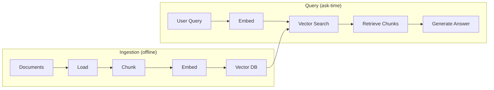

# Module 5: Embeddings

Module 5 is the bridge between **text** and **math**. This is where a RAG system stops treating a document as words and starts treating it as numbers it can compare.

In Module 4 you learned how to chop documents into focused chunks. Now we take each chunk and convert it into an **embedding** — a list of numbers that captures the *meaning* of the text. Once text becomes numbers, a computer can answer the question that powers all of RAG:

```text
"How similar is this chunk to the user's question?"
```

This module teaches you what an embedding is, how meaning becomes direction in vector space, how we measure similarity, and how to pick the right embedding model for your project.

---

## Where Embeddings Sit in the Pipeline



As a plain-text version:

```text
INGESTION (offline)              QUERY (at ask-time)
===================              ===================
Documents                        User Query
  → Load                           → Embed
  → Chunk        ← Module 4         → Search  ← Module 7
  → Embed        ← Module 5 (you are here)
  → Store        ← Module 6
```

Everything a vector database stores (Module 6) and everything a retriever compares (Module 7) depends on the embeddings you produce in this module. Get the embedding right and retrieval is easy; get it wrong and no amount of clever querying will fix it.

---

## Chapters in This Module

| File | What it covers |
|---|---|
| [01-What-is-an-Embedding.md](01-What-is-an-Embedding.md) | Text → list of numbers, what dimensions mean, why numbers beat keywords |
| [02-How-Embeddings-Represent-Meaning.md](02-How-Embeddings-Represent-Meaning.md) | Vector space intuition, meaning as direction, limitations |
| [03-Similarity-and-Distance-Metrics.md](03-Similarity-and-Distance-Metrics.md) | Cosine similarity, dot product, euclidean distance, a worked example |
| [04-Choosing-an-Embedding-Model.md](04-Choosing-an-Embedding-Model.md) | all-MiniLM-L6-v2 vs text-embedding-3-small vs BGE vs E5, and why index & query models must match |
| [05-Visualizing-Embeddings.md](05-Visualizing-Embeddings.md) | Projecting high-dim vectors to 2D with t-SNE/PCA, clustering in an enterprise KB |

Plus one runnable script:

| Script | What it does |
|---|---|
| [01-embeddings-basics.py](01-embeddings-basics.py) | Embeds 5 phrases with all-MiniLM-L6-v2 and prints a cosine similarity matrix with numpy |

---

## Running the Code

The script in this module needs **no API key**. It uses the local embedding model `all-MiniLM-L6-v2`, which runs **fully offline** once the package is installed:

```bash
pip install -r requirements.txt
python "Module-5-Embeddings/01-embeddings-basics.py"
```

If the `sentence-transformers` package is missing, the script prints a friendly message telling you how to install it.

> **Local vs OpenAI embeddings:** the local `all-MiniLM-L6-v2` model runs offline with no key, but needs the `sentence-transformers` package and downloads its weights once. OpenAI's `text-embedding-3-small` needs an `OPENAI_API_KEY` in a `.env` file and calls the OpenAI API. Chapter 04 explains when to use which.

---

## Where This Module Fits in the Course

| Previous | Current | Next |
|---|---|---|
| [Module 4: Chunking](../Module-4-Chunking/README.md) | **Module 5: Embeddings** | [Module 6: Vector Databases](../Module-6-Vector-Databases/README.md) |

```text
Module 4  →  Chunking              (split documents into pieces)   ↑
Module 5  →  Embeddings            (turn each piece into numbers) ← you are here
Module 6  →  Vector Databases      (store and search the numbers)  ↓
Module 7  →  Retrieval             (get the right chunks back)
```

When you finish this module, open Module 6 and run its `01-ingestion-pipeline.py` — you will finally *see* these embeddings being built and stored for your own `docs/` files.

Links:

- Back to the course home: [../README.md](../README.md)
- Previous module: [Module 4: Chunking](../Module-4-Chunking/README.md)
- Next module: [Module 6: Vector Databases](../Module-6-Vector-Databases/README.md)
