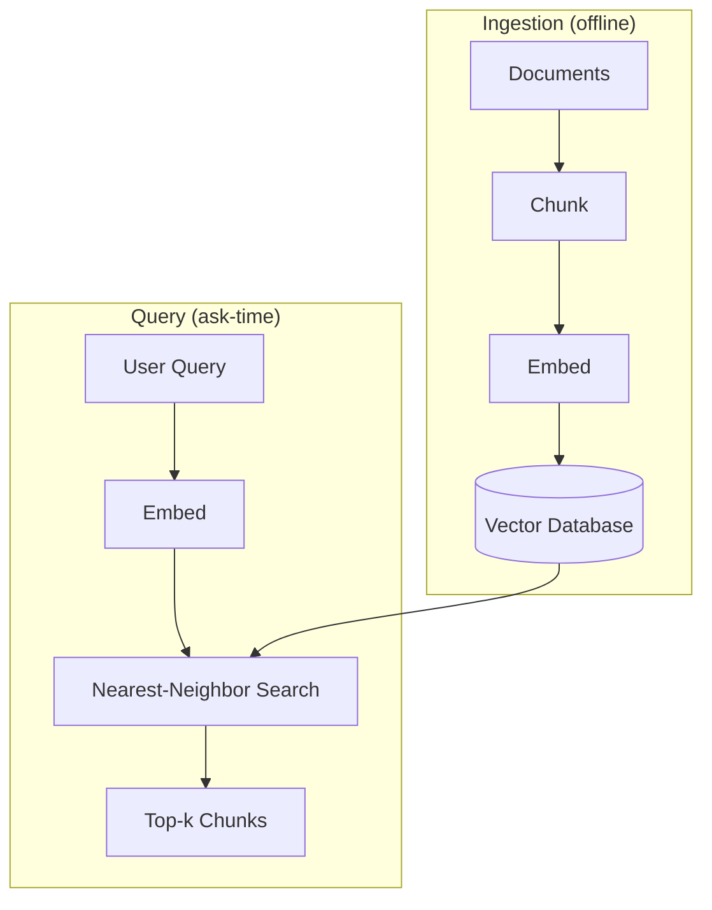

# Why a Vector Database?

## Introduction

You have a vector for every chunk in your knowledge base. Now what?

You could store the vectors in a plain list and, for each query, compare it to every chunk one by one. That works for ten chunks. It falls apart for ten million.

```text
10 chunks    →  10 comparisons per query   →  trivial
1,000 chunks →  1,000 comparisons          →  still fine
1,000,000 chunks →  1,000,000 comparisons  →  way too slow
```

A **vector database** is a specialized store built for exactly this problem: holding vectors and finding the ones *nearest* to a query — fast. This chapter explains what a vector database is, why you need one, and how it differs from a traditional keyword database.

---

## Learning Objectives

By the end of this chapter, you will understand:

- What a vector database is and what it stores
- Why brute-force comparison stops working at scale
- The difference between keyword search (SQL `LIKE`) and semantic vector search
- The main vector database options and when you might use each

---

## What a Vector Database Is

A vector database stores two things for every chunk:

```text
1. The vector        →  [0.23, 0.84, -0.11, ...]   (the meaning)
2. The chunk text    →  "Employees receive 30 annual leave days."
   + metadata        →  {"source": "docs/microsoft.txt", "page": 3, ...}
```

More importantly, it stores them in a way optimized for the operation a RAG system performs constantly:

```text
Given a query vector, return the k chunks whose vectors are most similar.
```

That operation has a name: **nearest-neighbor search** (find the nearest `k` neighbors). A vector database is a database whose *primary* query type is nearest-neighbor search.

---

## Why You Need One (The Scale Problem)

The naive approach — compare the query to every stored vector, keep the best `k` — is called a **brute-force scan**. It is simple and perfectly accurate. The problem is speed.

```text
query time ≈ (number of chunks) × (cost of one similarity computation)
```

Your company ingests 200,000 contracts and splits them into ~5 million chunks:

```text
5,000,000 chunks × one similarity computation each  →  ~seconds per query
```

And this must happen on **every** query, for **every** user. Multiply by a busy workday and brute force collapses. A vector database uses an **index** to find the nearest neighbors without scanning everything (chapter 02 explains how).

```text
Brute force:   compare query to ALL 5,000,000 chunks  →  slow
Indexed search: compare query to a smartly chosen FEW hundred  →  fast
```

---

## Keyword DB vs Vector DB

A traditional database searches by **exact words**. Vector search searches by **meaning**. The contrast is the heart of why RAG exists.

```text
KEYWORD DATABASE (e.g. SQL LIKE)          VECTOR DATABASE
=============================             ==============
Query: "leave policy"                     Query: "leave policy"
Finds text CONTAINING "leave policy"      Finds text MEANING "leave policy"
Matches exact substrings only             "vacation rules" scores 0.99
"vacation rules" → NO match               "vacation rules" → top result
"No leave policy" → matched (wrong!)      "No leave policy" → low score (right!)
```

A concrete SQL example:

```sql
SELECT * FROM chunks
WHERE content LIKE '%leave policy%';    -- only exact substring matches
```

```python
vectorstore.similarity_search("leave policy")   # meaning-based, ranks by similarity
```

The keyword DB answers "which rows contain these words?" The vector DB answers "which chunks are *about* this topic?" — even when no word matches.

---

## Where the Vector DB Sits



As plain text:

```text
Ingestion writes:   chunks + vectors + metadata  →  Vector DB
Query reads:        query vector  →  Vector DB  →  top-k similar chunks
```

The vector DB is the persistent brain of the system. Everything else (retrieval logic, prompt building, generation) sits downstream of it.

---

## The Main Options

| Tool | Type | Good for |
|---|---|---|
| **ChromaDB** | Open-source vector DB (embedded) | Local dev, small/medium corpora, easy Python setup — used in this course |
| **FAISS** | Indexing *library* (not a server) | High-performance similarity search embedded in your app |
| **Pinecone** | Managed cloud vector DB | Production at scale without running infrastructure |
| **Weaviate** | Open-source vector DB (server) | Production with rich metadata filtering and hybrid search |

```text
Course uses:  ChromaDB for the main store (Module 6 chapter 03),
              FAISS for a second look (Module 6 chapter 04).
```

They all speak the same language: store vectors, answer nearest-neighbor queries. They differ in features, scale, and whether they run embedded or as a server.

---

## Real Enterprise Example

An HR bot's knowledge base is 2 million chunks. A query arrives:

```text
"how many annual leave days do I get"
```

The vector DB does not scan 2 million chunks. It uses its index to focus on a few hundred candidates, computes exact similarity on those, and returns the top 5 — in tens of milliseconds. The user gets an answer grounded in the actual policy, and the system stays fast at any size.

---

## Key Takeaways

- A **vector database** stores chunks, their vectors, and metadata, and answers **nearest-neighbor** queries.
- **Brute-force comparison** works for small data but is too slow at millions of chunks.
- Keyword search (SQL `LIKE`) matches words; vector search matches **meaning**.
- Options span ChromaDB (embedded, easy) to FAISS (library) to Pinecone/Weaviate (production servers).
- The vector DB sits between ingestion and query: it is written once and read on every query.

---

## Test Yourself

1. What two pieces of information does a vector database store for each chunk?
2. What is the name of the core operation a vector database performs?
3. Why does brute-force comparison stop working at scale?
4. A user queries "leave policy" and a chunk says only "vacation rules". Which type of search still finds it?
5. Name two vector database options mentioned in this chapter.

<details>
<summary>Answers</summary>

1. The **vector** (the embedding) plus the **chunk text and its metadata** (source, page, date, etc.).
2. **Nearest-neighbor search** — given a query vector, return the `k` most similar stored vectors.
3. Because query time grows linearly with the number of chunks (compare against **every** vector, on every query), so millions of chunks make it far too slow for real users.
4. **Vector search** — it matches meaning, so "leave policy" and "vacation rules" are close even though no words are shared.
5. **ChromaDB** and **FAISS** (also acceptable: Pinecone, Weaviate).

</details>

---

## Next Chapter

Next up: [02-How-Vector-Databases-Work.md](02-How-Vector-Databases-Work.md) — how the database stores vectors and makes search fast with indexes.
