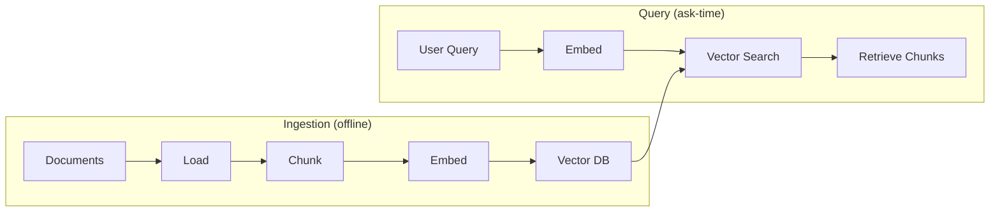

# Module 6: Vector Databases

Module 6 is where embeddings get a **home**. In Module 5 you learned how text becomes vectors; now we learn how those vectors are stored, indexed, and searched at scale.

A vector database is the component that makes retrieval fast. When your knowledge base is a handful of chunks, you could compare the query to everything by hand. When it is **millions** of chunks — 200,000 contracts, an entire intranet — brute force is impossible. A vector database stores vectors with a structure that lets you find the nearest ones quickly.

In this module you will:

- Understand why a vector database beats a plain SQL/`LIKE` search
- See how indexing (approximate nearest neighbor, HNSW) makes search fast
- Walk through the course's real ingestion script line by line
- Compare ChromaDB with FAISS
- Use metadata filters to narrow searches by source, date, or type
- Run scripts that filter, build, save, and reload vector stores

---

## Where the Vector DB Sits in the Pipeline



As plain text:

```text
INGESTION (offline)              QUERY (at ask-time)
===================              ===================
Documents                        User Query
  → Load                           → Embed
  → Chunk        ← Module 4         → Search
  → Embed        ← Module 5         → Retrieve chunks  ← Module 7
  → Store        ← Module 6 (you are here)
```

The vector database is the **shared memory** between the two halves of the system: the ingestion pipeline writes into it once, and every query reads from it forever after.

---

## Chapters in This Module

| File | What it covers |
|---|---|
| [01-Why-a-Vector-Database.md](01-Why-a-Vector-Database.md) | What a vector DB is, why you need one, keyword DB vs semantic search |
| [02-How-Vector-Databases-Work.md](02-How-Vector-Databases-Work.md) | How vectors are stored, indexes, approximate nearest neighbor, HNSW, collections |
| [03-ChromaDB-Deep-Dive.md](03-ChromaDB-Deep-Dive.md) | Line-by-line walkthrough of `01-ingestion-pipeline.py` |
| [04-FAISS-Deep-Dive.md](04-FAISS-Deep-Dive.md) | FAISS from langchain_community, Chroma vs FAISS comparison |
| [05-Metadata-Filters-and-Persistence.md](05-Metadata-Filters-and-Persistence.md) | Filtering by source/date/type, persistence, and idempotent re-ingestion |

Plus two runnable scripts:

| Script | What it does |
|---|---|
| [02-metadata-filtering.py](02-metadata-filtering.py) | Loads `db/chroma_db` and shows search with vs without a metadata filter |
| [03-faiss-example.py](03-faiss-example.py) | Builds an in-memory FAISS store, saves it, and reloads it |

---

## Running the Code

The core ingestion script already exists at `Module-6-Vector-Databases/01-ingestion-pipeline.py`. Run it from the **repo root** — it reads `docs/` and builds `db/chroma_db`:

```bash
pip install -r requirements.txt
python "Module-6-Vector-Databases/01-ingestion-pipeline.py"
```

The first run loads `docs/google.txt`, `docs/microsoft.txt`, and `docs/Nvidia.txt`, chunks them, embeds each chunk with the local `all-MiniLM-L6-v2` model (offline), and persists everything to `db/chroma_db`. Run it a **second time** and it detects the existing store and skips re-processing — the idempotency pattern taught in [05-Metadata-Filters-and-Persistence.md](05-Metadata-Filters-and-Persistence.md).

The new scripts in this module:

```bash
python "Module-6-Vector-Databases/02-metadata-filtering.py"   # needs db/chroma_db from the ingestion script
python "Module-6-Vector-Databases/03-faiss-example.py"        # standalone, builds db/faiss_index
```

> `02-metadata-filtering.py` requires the vector store from `01-ingestion-pipeline.py`. If it's missing, the script prints a friendly reminder instead of crashing.

---

## Where This Module Fits in the Course

| Previous | Current | Next |
|---|---|---|
| [Module 5: Embeddings](../Module-5-Embeddings/README.md) | **Module 6: Vector Databases** | [Module 7: Retrieval](../Module-7-Retrieval/README.md) |

```text
Module 5  →  Embeddings            (turn text into numbers)       ↑
Module 6  →  Vector Databases      (store & index the numbers) ← you are here
Module 7  →  Retrieval             (query the numbers)            ↓
```

Links:

- Back to the course home: [../README.md](../README.md)
- Previous module: [Module 5: Embeddings](../Module-5-Embeddings/README.md)
- Next module: [Module 7: Retrieval](../Module-7-Retrieval/README.md)
