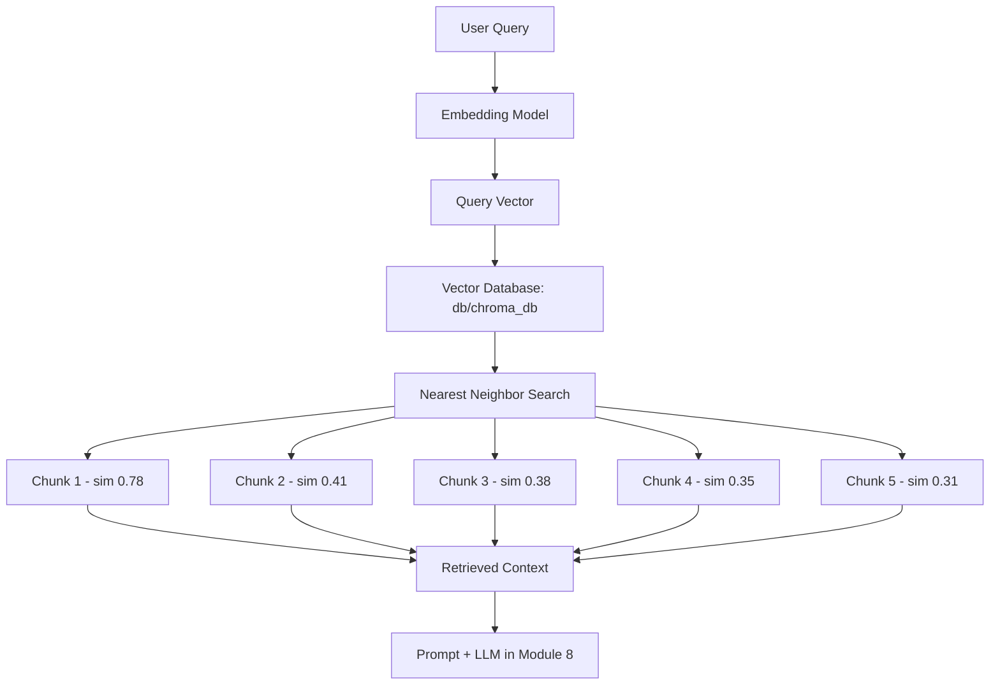

# How Retrieval Works

## Introduction

Your vector store is built. `db/chroma_db` holds the embedded chunks of your company documents. Now someone asks a question and the system has to find the evidence to answer it. That is retrieval.

Retrieval is the middle stage of the ask-time pipeline:

```text
User Query → Embed → Vector Search → Top-k Chunks → Prompt → LLM → Answer
```

It is the part that decides **which evidence the LLM gets to see**. Everything downstream depends on it.

---

## Learning Objectives

By the end of this chapter, you will understand:

- The retrieval recipe: query → embed → search → top-k chunks
- What a retriever is in LangChain, and how `db.as_retriever()` works
- Why retrieval quality controls answer quality
- Where retrieval stops and generation begins

---

## The Retrieval Recipe

Retrieval is four small steps, run every time someone asks a question:

### 1. Take the query

The user's question, as a string:

```text
"How much did Microsoft pay to acquire GitHub?"
```

### 2. Embed it

The same embedding model that embedded the chunks (`text-embedding-3-small`) turns the query into a vector.

### 3. Search

The query vector is compared against every chunk vector in the store, using cosine similarity — the `"hnsw:space": "cosine"` setting from Module 6.

### 4. Return top-k chunks

The `k` chunks closest to the query are returned. These become the "context".

```text
Query: "How much did Microsoft pay to acquire GitHub?"

  rank 1   sim 0.78   "On June 4, 2018, Microsoft officially announced the acquisition of GitHub for $7.5 billion..."  (microsoft.txt)
  rank 2   sim 0.41   "ZeniMax ... about $7.5 billion"
  rank 3   sim 0.38   "LinkedIn for $26.2 billion"
  rank 4   sim 0.35   "Activision Blizzard ... $68.7 billion"
  rank 5   sim 0.31   "Yammer for US$1.2 billion"
```

Only the chunks make it into the next stage. The vectors themselves never reach the LLM.

---

## Retrieval Diagram



---

## What Is a Retriever in LangChain?

In LangChain a **retriever** is a reusable object with one job: given a query string, return relevant documents.

For our vector store the retriever is created in one line:

```python
retriever = db.as_retriever(search_kwargs={"k": 5})
```

`db.as_retriever()` takes a `Chroma` vector store and wraps its search methods behind a uniform interface. Calling it:

```python
relevant_docs = retriever.invoke(query)
```

returns a list of `Document` objects — the retrieved chunks, ready to drop into a prompt.

Two things to notice:

- You build the retriever **once** and reuse it for every query.
- `search_kwargs` carries options like `k` (how many chunks) and, later in this module, `search_type` (which search algorithm to use).

---

## Why Retrieval Quality = Answer Quality

The LLM can only answer from what you give it:

```text
Good retrieval  →  correct evidence in the prompt  →  grounded, correct answer
Bad retrieval   →  wrong or missing evidence       →  hallucinated or useless answer
```

Two classic failure modes:

```text
Missed context   →  the right chunk exists but never made it into the prompt → the LLM guesses
Noisy context    →  irrelevant chunks crowd the prompt → the LLM gets confused
```

In an HR setting: an employee asks *"How many sick days do I get?"*. If retrieval returns the *vacation* policy chunk, the answer will be confidently wrong. Retrieval does the filtering before the LLM ever sees the text — that is why it is called the most important step in RAG.

---

## Where Retrieval Ends

Retrieval stops the moment the top-k chunks are returned. Building the prompt, feeding the model, and writing the answer is **generation** — Module 8. If you are unsure whether a decision belongs to retrieval or generation, ask: *does it change which chunks we grab, or what the LLM does with them?*

---

## Key Takeaways

- Retrieval = **query → embed → search → top-k chunks**.
- A **retriever** (`db.as_retriever()`) is a reusable object that turns a query into relevant documents.
- `k` controls **how many** chunks come back.
- Retrieval quality is the single biggest driver of **answer quality**.
- Retrieval ends when the chunks are returned; prompt building and answering are **generation**.

> **Deep dive: covered in this module** — chapters 02–05 go deep on similarity search, score thresholds, MMR, `k`, and filtering. Module 8 takes the retrieved chunks and turns them into answers.

---

## Test Yourself

1. What are the four steps of retrieval?
2. What does `db.as_retriever(search_kwargs={"k": 5})` create, and what does `k` mean?
3. Why must the query be embedded with the same model that embedded the chunks?
4. What does `retriever.invoke(query)` return?
5. Why is a missed relevant chunk as bad as a noisy irrelevant chunk?

<details>
<summary>Answers</summary>

1. **Take the query, embed it, search the vector store, and return the top-k closest chunks.**
2. It creates a **retriever** — a reusable object that turns a query into relevant documents. `k = 5` means it returns the **5 closest chunks**.
3. If the models differ, the query vector lives in a different space than the chunk vectors, and similarity scores become meaningless.
4. A **list of `Document` objects** — the retrieved chunks (with `page_content` and `metadata`), ready for the prompt.
5. Both deny the LLM the evidence it needs: a **missed** chunk leaves it guessing, a **noisy** chunk confuses it. Either way the answer suffers.

</details>

---

## Next Chapter

Next up: [02-Similarity-Search.md](02-Similarity-Search.md) — similarity search in action and a line-by-line walkthrough of `01-retrieval-pipeline.py`.
