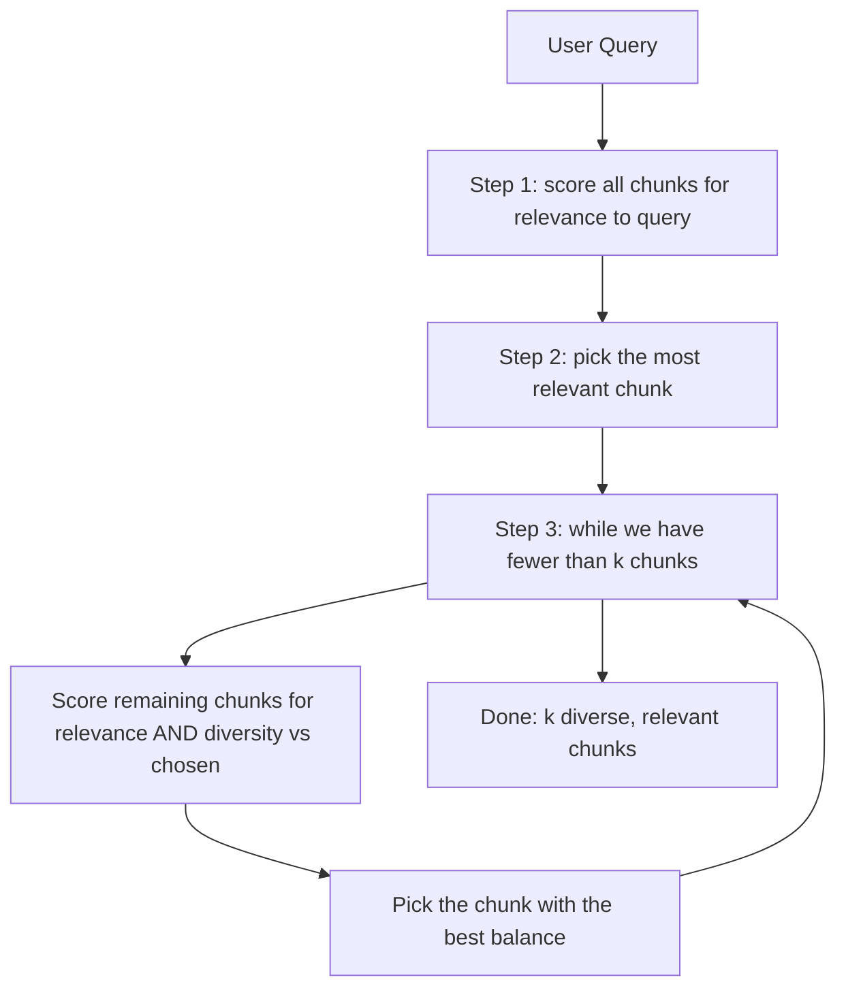

# MMR for Diversity

## Introduction

Similarity search has a blind spot: the top-k most similar chunks can be **almost identical**. If one page of your document says "GitHub for $7.5 billion" and the next chunk repeats the same sentence, both rank in the top-5 — and your prompt now contains the same fact twice while a different, useful fact got pushed out.

**Maximum Marginal Relevance (MMR)** fixes this by rewarding diversity: it picks chunks that are relevant *and* don't repeat what is already selected.

---

## Learning Objectives

By the end of this chapter, you will:

- Explain why top-k similarity can return duplicate information
- Describe what Maximum Marginal Relevance (MMR) does
- Understand the `lambda_mult` knob
- Use `search_type="mmr"` in a retriever

---

## The Repetition Problem

Consider a query about GitHub and these four chunks:

```text
chunk A  "Microsoft acquired GitHub for $7.5 billion in 2018."        sim 0.90
chunk B  "GitHub was acquired by Microsoft for $7.5 billion."         sim 0.88
chunk C  "The GitHub deal closed in October 2018."                    sim 0.87
chunk D  "Microsoft also acquired LinkedIn for $26.2 billion."        sim 0.55
```

With `k = 4` and plain similarity, the prompt would contain **A, B, C** — three ways of saying the same thing — and the useful fact in D never arrives. The model gets a prompt that is simultaneously repetitive and incomplete.

```text
Plain similarity (k=4):  A, B, C, D   → three copies of one fact, one real fact
```

---

## What MMR Does

MMR scores every candidate chunk with two goals in mind:

```text
relevance : how similar is this chunk to the query?
diversity : how different is this chunk from the ones already chosen?
```

It walks through candidates one at a time. A chunk gets a high combined score if it is relevant **and** adds something new. The result is a set that covers the topic instead of repeating it:

```text
MMR (k=4):  A, D, C, ...  → the GitHub fact once, plus the LinkedIn fact
```

---

## The MMR Diagram



---

## The `lambda_mult` Knob

MMR has one tuning parameter: **`lambda_mult`** (λ).

```text
lambda_mult = 1.0  →  only relevance matters  (identical to similarity search)
lambda_mult = 0.5  →  balanced                (a common default)
lambda_mult = 0.0  →  only diversity matters  (may pick irrelevant chunks)
```

```text
λ = 1.0   →  pure relevance, duplicates come back
λ = 0.5   →  relevance + diversity, the balanced default
λ = 0.0   →  pure diversity, can drift off-topic
```

In practice `lambda_mult` stays near its default (0.5) unless you see repetition (nudge down) or irrelevant chunks (nudge up).

---

## Using MMR in LangChain

Switching a retriever to MMR is a one-line change:

```python
retriever = db.as_retriever(
    search_type="mmr",
    search_kwargs={
        "k": 5,
        "lambda_mult": 0.5  # balance relevance and diversity
    }
)
```

Just like the threshold variant, you switch between `similarity`, `similarity_score_threshold`, and `mmr` by changing `search_type`. The rest of your pipeline (invoke, print, prompt) stays the same.

---

## Enterprise Example

An HR assistant retrieves chunks about the *sick leave policy*. Plain similarity returns three chunks that all quote the same sentence. With MMR, the third chunk becomes the paragraph about *documenting sick days* — a different, useful fact. The final answer is more complete without using extra tokens.

---

## Key Takeaways

- Plain top-k similarity can return **near-duplicate chunks**.
- **MMR** scores chunks for relevance **and** diversity.
- `lambda_mult` trades relevance against diversity (default 0.5).
- MMR gives **broader, less repetitive context** at the same `k`.
- Switch search types with `search_type`; the rest of the code doesn't change.

---

## Test Yourself

1. What problem does MMR solve?
2. What two scores does MMR combine?
3. What happens to MMR as `lambda_mult` approaches 1.0?
4. What does `lambda_mult = 0.0` do?
5. Why might you still prefer plain similarity over MMR?

<details>
<summary>Answers</summary>

1. The **repetition problem** — the top-k most similar chunks can repeat the same information, crowding out other relevant facts.
2. **Relevance** (similarity to the query) and **diversity** (difference from chunks already selected).
3. It becomes pure relevance — effectively identical to plain similarity search.
4. Only diversity matters, so results can drift **off-topic** (relevance ignored).
5. It is simpler, faster, and fine when your chunks are long or the store is small enough that duplicates are rare.

</details>

---

## Next Chapter

Next up: [05-Choosing-k-and-Filtering.md](05-Choosing-k-and-Filtering.md) — how many chunks should you grab, and how to narrow the search with metadata filters.
