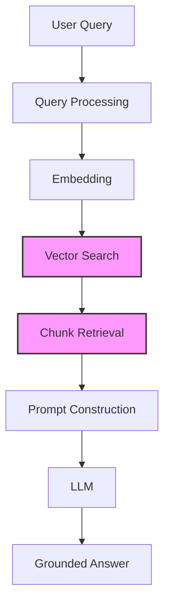

# Module 7: Retrieval

Module 7 is the **retrieval deep dive**. In Module 2 you saw the pipeline from a distance; in Module 6 you built the vector store that holds every chunk of your company documents. Now it is time to ask that store a question and get the right chunks back.

Retrieval is often called the **most important step in RAG**: if the wrong chunks come back, the LLM has nothing trustworthy to answer from. This module makes you comfortable with the two big levers you control — *how many* chunks (`k`) and *how* the store picks them (plain similarity, score thresholds, and MMR) — plus metadata filtering so you can narrow the search before it starts.

---

## Where Retrieval Sits in the Pipeline



Retrieval spans the middle of the ask-time pipeline:

```text
User Query
  → Embed the query
  → Vector search          ← RETRIEVAL (this module)
  → Top-k chunks           ← RETRIEVAL (this module)
  → Build the prompt       ← generation (Module 8)
  → LLM
  → Grounded answer
```

In short: retrieval turns a user question into **evidence**. Module 8 then turns that evidence into an **answer**.

---

## Chapters in This Module

| File | What it covers |
|---|---|
| [01-How-Retrieval-Works.md](01-How-Retrieval-Works.md) | Query → embed → search → top-k chunks; what a LangChain retriever is; why retrieval quality = answer quality |
| [02-Similarity-Search.md](02-Similarity-Search.md) | Similarity search in action, a full walkthrough of `01-retrieval-pipeline.py`, document structure (`page_content` + `metadata`), what `k` means |
| [03-Similarity-Score-Thresholds.md](03-Similarity-Score-Thresholds.md) | `similarity_score_threshold`, `score_threshold`, the too-high/too-low trade-off, worked example scores |
| [04-MMR-for-Diversity.md](04-MMR-for-Diversity.md) | Maximum Marginal Relevance, why top-k similar chunks repeat info, `lambda_mult`, the `"mmr"` search type |
| [05-Choosing-k-and-Filtering.md](05-Choosing-k-and-Filtering.md) | Choosing `k` (3–5 typical), cost & noise trade-offs, metadata filters combined with retrieval |

### Sample code in this module

| Script | What it does |
|---|---|
| [01-retrieval-pipeline.py](01-retrieval-pipeline.py) | Loads `db/chroma_db`, retrieves top-5 chunks for a sample query |
| [02-mmr-and-thresholds.py](02-mmr-and-thresholds.py) | Runs the same query three ways — plain similarity, score threshold, and MMR — side by side |

---

## Prerequisites

Before running the code in this module, make sure you have:

1. **The vector store** — run Module 6 ingestion first:

   ```bash
   python "Module-6-Vector-Databases/01-ingestion-pipeline.py"
   ```

   This builds `db/chroma_db` from the company documents in `docs/`. Both scripts in this module load that store; if it is missing, they print a friendly message pointing you back here.

2. **An OpenAI API key** — the scripts embed the query with `text-embedding-3-small`:

   ```bash
   echo OPENAI_API_KEY=your-key > .env
   ```

3. The repo's Python environment from the [course setup](../README.md).

> These scripts must be run from the **repo root** so the relative path `db/chroma_db` resolves.

---

## Where This Module Fits in the Course

| Previous | Current | Next |
|---|---|---|
| [Module 6: Vector Databases](../Module-6-Vector-Databases/README.md) | **Module 7: Retrieval** | [Module 8: Generation](../Module-8-Generation/README.md) |

```text
Module 1  →  Why RAG exists          (the problem)
Module 2  →  How RAG works           (the architecture)
Modules 3–8  →  Deep dives            (3–6 build the knowledge base,
                                      7 = retrieval, 8 = generation)
Module 9  →  Advanced RAG            (make it better)
Module 10 →  Evaluation              (prove it works)
Module 11 →  Mini Project            (put it all together)
```

Read the chapters **in order** — each builds on the previous one. Run `01-retrieval-pipeline.py` after chapter 02, and `02-mmr-and-thresholds.py` after chapters 03–04.

> **Deep dive pointers:** Module 6 explained how the store is built. Module 8 takes the chunks you retrieve here and turns them into grounded answers. Module 9 adds query rewriting, reranking, and hybrid search on top of everything in this module.
