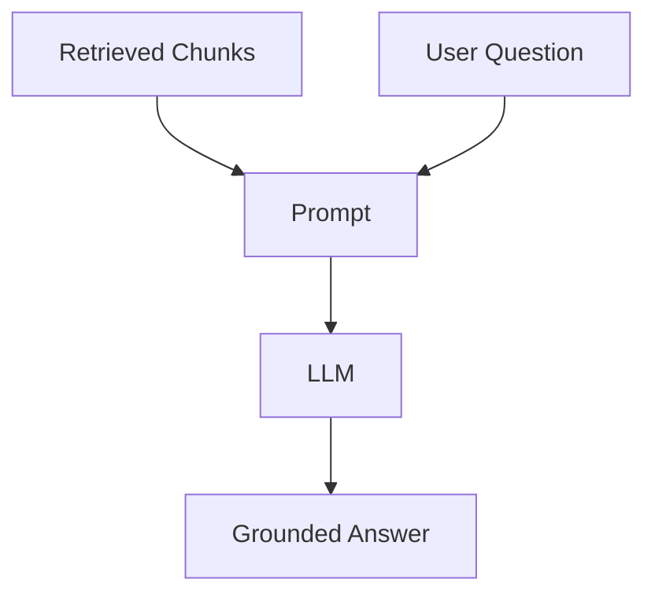

# From Context to Answer

## Introduction

Retrieval handed you `k` chunks of evidence. Now the final stage of RAG runs: **turn that context into an answer**.

```text
Retrieved chunks + user question → prompt → LLM → grounded answer
```

This chapter explains what happens at this last step and why the answer it produces is fundamentally different from a plain LLM answer.

---

## Learning Objectives

By the end of this chapter, you will:

- Describe the generation stage of the RAG pipeline
- Explain what makes an answer "grounded"
- Explain how grounding reduces hallucination
- Say where generation starts and stops in the pipeline

---

## The Last Stage

Generation is two small steps:

### 1. Build the prompt

The retrieved chunks are inserted into a prompt alongside the question:

```text
System:  You are a helpful assistant.
User:    Based on the following documents, please answer this question: ...
         Documents:
         - <chunk 1>
         - <chunk 2>
         ...
```

### 2. Ask the LLM

The prompt is sent to the model, which writes the answer. Nothing else happens — no new search, no database lookups. The model works from what is in front of it.



---

## What "Grounded" Means

A **grounded** answer is one whose content is **traceable to the context** you provided. Every claim in it can be pointed back at a specific retrieved chunk.

```text
Grounded answer:
  "Microsoft acquired GitHub for $7.5 billion."
     ↑ traceable to the chunk: "Microsoft officially announced the acquisition of
       GitHub for $7.5 billion, a deal that closed on October 26, 2018."
```

If the chunks don't contain the fact, a grounded system does **not** invent it — it says it doesn't know.

---

## How Context Reduces Hallucination

A plain LLM answer is generated from the model's memory. A grounded answer is generated from the prompt's context. The difference:

```text
Without context (plain LLM):  the model free-associates from training data
With context (RAG):           the model is constrained to the evidence in front of it
```

The context acts like a **fence**: the model can only build its answer with the pieces inside it. Two things still have to be true for the fence to hold:

1. The context must **contain the answer** (that's retrieval's job — Module 7).
2. The prompt must **force the model to stay inside** the fence (that's grounding — next chapter).

This is why RAG does not *eliminate* hallucination — it makes it far less likely, and far easier to catch when the model is told to only answer from what it was given.

---

## Enterprise Example

An employee asks the HR assistant: *"How many paid leave days do I get?"*

```text
Retrieved chunk:  "Permanent employees receive 25 paid leave days per year."
Grounded answer:  "You receive 25 paid leave days per year."
```

Every word of the answer comes from the chunk. Compare that with a plain LLM that might answer "the standard US is 10 days" from its own training data — fluent, confident, and wrong for your company.

---

## Key Takeaways

- Generation = **prompt construction + LLM call**; the last stage of RAG.
- A **grounded** answer is traceable to the retrieved context.
- The context **constrains** the model, which reduces hallucination.
- Grounding only works if retrieval provides the right context **and** the prompt enforces it.
- RAG makes hallucinations less likely and easier to catch — not impossible.

> **Deep dive: covered in this module** — chapter 02 shows the exact prompt pattern; chapters 03–05 add citations, "I don't know" handling, and chat history.

---

## Test Yourself

1. What are the two steps of the generation stage?
2. What does "grounded" mean?
3. How does retrieved context reduce hallucination?
4. Which two conditions must hold for grounding to work?
5. Does RAG eliminate hallucination? Why or why not?

<details>
<summary>Answers</summary>

1. **Building the prompt** (chunks + question) and **calling the LLM** to generate the answer.
2. The answer's content is **traceable to the provided context** — every claim can be pointed back at a chunk.
3. The context **constrains the model** — it builds its answer from the evidence in front of it instead of free-associating from training data.
4. The context must **contain the answer** (good retrieval), and the prompt must **force the model to answer only from that context** (good grounding).
5. No — it makes hallucinations **less likely** and easier to catch, but a poor prompt or weak retrieval can still produce them.

</details>

---

## Next Chapter

Next up: [02-Grounded-Prompting.md](02-Grounded-Prompting.md) — the exact prompt pattern that enforces grounding, line by line.
