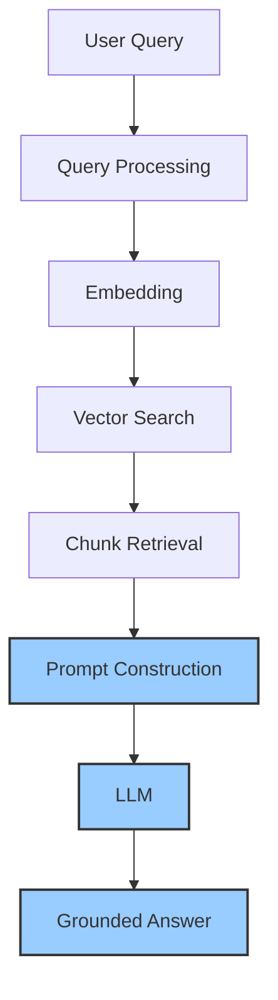

# Module 8: Generation

Module 8 is the **final stage of the RAG pipeline**. Retrieval (Module 7) found the evidence; now the LLM turns that evidence into a clear, grounded answer.

Generation is where everything you have built comes together: the retrieved chunks and the user's question are assembled into a prompt, and the LLM writes the answer. But an LLM will happily invent facts if you let it — this module is about the **prompt discipline** that keeps answers grounded in your documents: answer only from context, say "I don't know" when the evidence is missing, cite sources, and (in the last chapter) remember the conversation so far.

---

## Where Generation Sits in the Pipeline



```text
User Query
  → Retrieval (Module 7): top-k chunks
  → Build the prompt with the chunks   ← GENERATION (this module)
  → LLM generates the answer           ← GENERATION (this module)
  → Grounded answer
```

Generation turns **evidence into words** — and, done well, into words you can trust.

---

## Chapters in This Module

| File | What it covers |
|---|---|
| [01-From-Context-to-Answer.md](01-From-Context-to-Answer.md) | The last stage: chunks + question → prompt → LLM → grounded answer; what "grounded" means; how context reduces hallucination |
| [02-Grounded-Prompting.md](02-Grounded-Prompting.md) | A line-by-line walkthrough of `01-answer-pipeline.py`, the exact prompt pattern, and why each instruction exists |
| [03-Citations-and-Evidence.md](03-Citations-and-Evidence.md) | Citing sources, adding `metadata['source']` to the prompt, quote-the-source prompt patterns |
| [04-Handling-I-Dont-Know.md](04-Handling-I-Dont-Know.md) | Why the "say you don't know" instruction matters, and the other safety patterns that prevent confident hallucination |
| [05-Chat-History-and-Context.md](05-Chat-History-and-Context.md) | Making the assistant conversational — history + retrieved context, multi-turn vs single-turn RAG |

### Sample code in this module

| Script | What it does |
|---|---|
| [01-answer-pipeline.py](01-answer-pipeline.py) | Retrieves 5 chunks and produces a grounded answer with ChatOpenAI (`gpt-4o`) |
| [02-grounded-prompt-styles.py](02-grounded-prompt-styles.py) | Feeds the same context through a weak prompt and a strong grounded prompt so you can see the difference |

---

## Prerequisites

Before running the code in this module, make sure you have:

1. **The vector store** — run Module 6 ingestion (and ideally the Module 7 scripts) first:

   ```bash
   python "Module-6-Vector-Databases/01-ingestion-pipeline.py"
   ```

   Both scripts in this module load `db/chroma_db`; if it is missing, they print a friendly message pointing you back here.

2. **An OpenAI API key** — generation calls `gpt-4o` and embedding uses `text-embedding-3-small`:

   ```bash
   echo OPENAI_API_KEY=your-key > .env
   ```

3. The repo's Python environment from the [course setup](../README.md).

> Run from the **repo root** so `db/chroma_db` resolves. If the store or key is missing, the scripts print a friendly message instead of crashing.

---

## Where This Module Fits in the Course

| Previous | Current | Next |
|---|---|---|
| [Module 7: Retrieval](../Module-7-Retrieval/README.md) | **Module 8: Generation** | [Module 9: Advanced RAG](../Module-9-Advanced-RAG/README.md) |

```text
Module 1  →  Why RAG exists          (the problem)
Module 2  →  How RAG works           (the architecture)
Modules 3–8  →  Deep dives            (Module 8 = the last building block)
Module 9  →  Advanced RAG            (make it better — history-aware, reranking, ...)
Module 10 →  Evaluation              (prove it works)
Module 11 →  Mini Project            (put it all together)
```

Read the chapters **in order**: 01 and 02 are the core (what generation is, and the exact prompt pattern); 03–05 layer on citations, safety, and chat history. Run `01-answer-pipeline.py` after chapter 02 and `02-grounded-prompt-styles.py` after chapter 04.

> **Deep dive pointers:** Module 7 is the retrieval side of this pair. Module 9 covers reranking, query rewriting, and full history-aware (multi-turn) RAG. Module 10 shows how to evaluate the answers you generate here.
