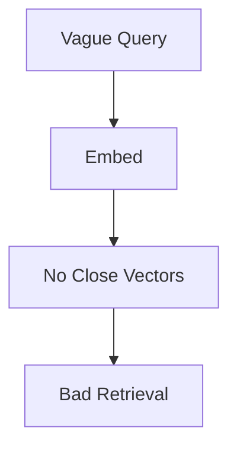
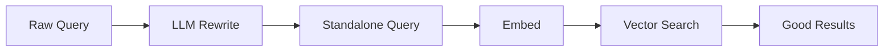

# Query Rewriting

## Introduction

Users rarely type clean search queries.

They type:

```text
what about it?
```

or

```text
the retention thing
```

If you embed that text as-is and search, the vector database has very little to
match against.

Query rewriting fixes this: the system **rewrites the user's question into a
better search query** before retrieving.

```text
Raw Question          Rewritten Query
"what about it?"  →   "customer data retention policy"
```

---

## Learning Objectives

By the end of this chapter, you will understand:

- Why raw user queries retrieve badly
- What query rewriting is
- How an LLM can rewrite a query
- When rewriting helps and when it does not

---

## The Problem

Consider a user mid-conversation:

```text
What is our data retention period?
```

Follow-up:

```text
What happens to it after 30 days?
```

"it" has no meaning on its own. The embedding of that sentence points nowhere
useful in the vector space.



---

## The Fix: Rewrite First



The LLM is asked to produce a standalone, searchable version of the question.

---

## Example

Input:

```text
Conversation history:
- User: What is our data retention policy?
- Assistant: Data is retained for 30 days.

New question: what about it after that?
```

Rewritten search query:

```text
What happens to customer data after the 30 day retention period?
```

That query embeds cleanly and retrieves the right chunks.

---

## Rewriting Prompt Pattern

```text
Given the chat history, rewrite the new question to be standalone
and searchable. Just return the rewritten question.

Chat history: ...
New question: ...
```

The rewritten text replaces the original for the retrieval step.

---

## When Rewriting Helps

| Situation | Rewriting effect |
|---|---|
| Conversational follow-ups | High impact |
| Vague or short questions | High impact |
| Well-formed standalone questions | No change needed |
| Domain-specific jargon questions | Low impact if model lacks domain knowledge |

---

## Key Takeaways

- The query you retrieve with does not have to be the question the user typed.
- LLM-based rewriting converts vague or conversational input into a good search query.
- Rewriting only helps the **retrieval** step; the answer is still generated from the question the user actually asked.

---

## Test Yourself

1. Why does a vague query like "what about it?" retrieve badly?
2. What does the LLM return during query rewriting?
3. True or False: Query rewriting changes the question used to generate the final answer.
4. Which kind of input benefits most from rewriting: well-formed standalone questions or conversational follow-ups?
5. In the rewriting prompt, what is included along with the new question?

<details>
<summary>Answers</summary>

1. Because the text has no close vectors in the vector space — there is nothing meaningful to match.
2. A standalone, searchable version of the question.
3. False. Rewriting only affects retrieval; the final answer uses the user's original question.
4. Conversational follow-ups.
5. The chat history.
</details>
