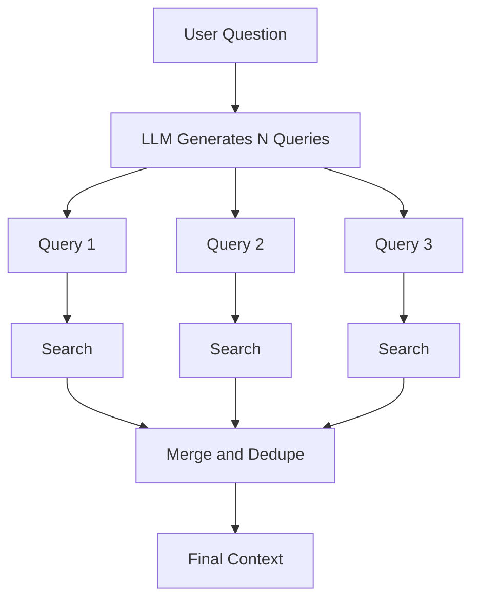

# Multi-Query Retrieval

## Introduction

One question can be phrased many ways. The user's phrasing is just one of them.

```text
How do I access VPN?
```

Could also be written as:

```text
VPN access
Remote access setup
VPN requirements
VPN authentication
```

If the user's phrasing does not match the wording in the documents, a single
search can miss good chunks.

**Multi-query retrieval** generates several paraphrased questions, searches with
each one, and merges the results.

---

## Learning Objectives

By the end of this chapter, you will understand:

- The recall problem with single-query search
- How multi-query retrieval works
- How results from multiple searches are combined
- The trade-offs (better recall, more cost)

---

## The Single-Query Problem


If the query wording is far from the document wording, the top-k results miss
the relevant chunk.

This is called a **recall failure**: the right information exists, but search did
not return it.

---

## The Multi-Query Solution



Each search may find different relevant chunks. Merging them improves the chance
that the right information is included.

---

## Example

Original question:

```text
How do I access VPN?
```

Generated queries:

```text
1. How do I access VPN?
2. What are the VPN requirements?
3. How do I connect remotely to the network?
```

Each query is embedded and searched independently. The results are combined and
duplicates removed.

---

## Cost Trade-off

| Query count | Recall | Cost / latency |
|---|---|---|
| 1 | Baseline | Cheapest |
| 3 | Better | 3x search cost |
| 5 | Slightly better | 5x search cost |

More queries help up to a point, then add cost without benefit.

---

## Key Takeaways

- Multi-query retrieval reduces recall failures by searching with several phrasings.
- Results from all searches are merged and deduplicated before being sent to the LLM.
- It trades extra search cost for better retrieval coverage.

---

## Test Yourself

1. What is a recall failure in retrieval?
2. What does multi-query retrieval generate before searching?
3. How are the results of multiple searches combined?
4. What is the main downside of using many queries?
5. True or False: Multi-query retrieval changes the documents embedded in the vector database.

<details>
<summary>Answers</summary>

1. The right information exists in the store but the search did not return it.
2. Several paraphrased versions of the user's question.
3. They are merged and deduplicated.
4. More cost and latency per question.
5. False. It changes the queries, not the stored documents.
</details>
