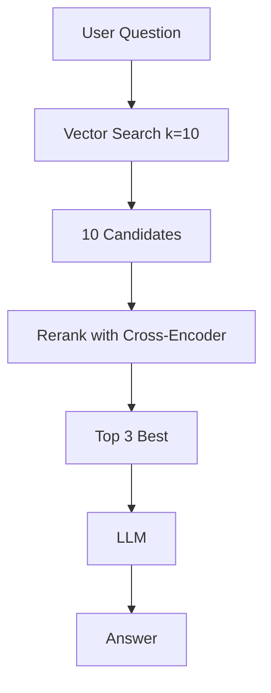

# Reranking

## Introduction

Vector search is fast, but it is not the final word on relevance.

A chunk can be "close" in embedding space while still missing the exact
information the question needs. Or the top-5 results can contain the answer at
position 7, which a k=5 retriever never returns.

**Reranking** fixes this with a two-stage approach:

```text
Stage 1: Vector search quickly returns many candidates (e.g. top 10-20)
Stage 2: A reranker re-scores them against the question and keeps the best few
```

---

## Learning Objectives

By the end of this chapter, you will understand:

- Why vector search alone is not precise enough
- What a cross-encoder reranker is
- The retrieve-then-rerank pattern
- How reranking changes your `k` choices

---

## Two Families of Models

### Bi-encoders (embedding models)

The question and the document are embedded **separately** into vectors, then
compared with a distance metric.

```text
Question → [vector]
Document → [vector]
similarity = cosine(question, document)
```

Fast, because vectors are pre-computed at index time. But each text is encoded
in isolation, so fine details of the match are lost.

### Cross-encoders (rerankers)

The question and the document are passed through the model **together**.

```text
Question + Document → single model → relevance score
```

This is much more accurate, but slow — you can only run it on a small set of
candidates.

---

## The Retrieve-then-Rerank Pattern



Notice the `k` values:

- **Vector search** uses a larger `k` (e.g. 10-20) so good chunks are not missed.
- **Reranking** narrows it to the best few (e.g. 3) for the LLM.

---

## Example Scores

```text
Candidate        Vector Score   Rerank Score
"VPN setup guide"     0.81        0.94
"VPN troubleshooting" 0.79        0.20
"Remote access"       0.72        0.88
```

The reranker correctly demotes the troubleshooting chunk, which vector search
ranked too highly.

---

## Local Cross-Encoder

The course example uses a small local cross-encoder via `sentence-transformers`:

```python
from sentence_transformers import CrossEncoder

reranker = CrossEncoder("cross-encoder/ms-marco-MiniLM-L-6-v2")
scores = reranker.predict([[question, chunk] for chunk in chunks])
```

No API key needed, but the model downloads on first use.

---

## Key Takeaways

- Vector search is the fast **candidate generator**; a cross-encoder is the accurate **re-ranker**.
- Retrieve more (larger k), then rerank down to the best few for the LLM.
- Reranking fixes "close but wrong" results that pure vector search ranks too high.

---

## Test Yourself

1. Why is vector search alone not precise enough for the final context?
2. What is the difference between a bi-encoder and a cross-encoder?
3. In retrieve-then-rerank, should vector search use a larger or smaller `k` than the final context count?
4. Why can a cross-encoder only be run on a small set of candidates?
5. True or False: Reranking changes the documents stored in the vector database.

<details>
<summary>Answers</summary>

1. Because texts are encoded in isolation, so fine details of question-chunk matching can be wrong.
2. A bi-encoder embeds question and document separately; a cross-encoder processes them together.
3. Larger — it returns candidates that the reranker then narrows down.
4. Because it processes question and document together, which is slow per pair.
5. False. It re-scores existing candidates at query time.
</details>
