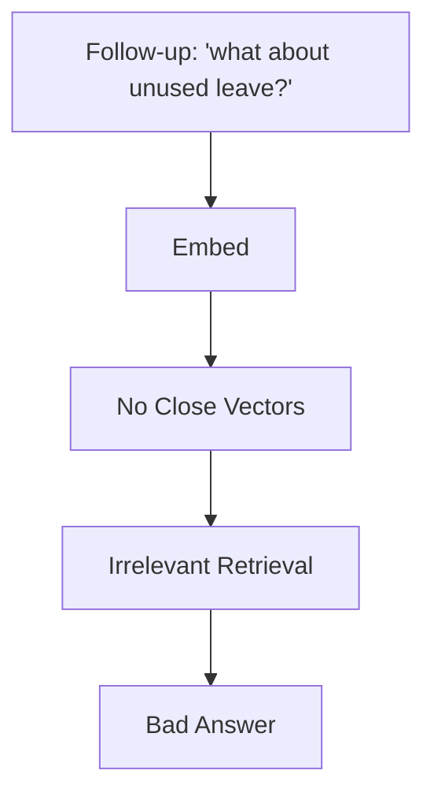
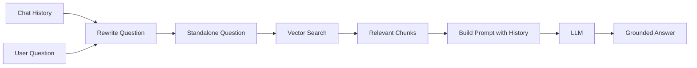

# History-Aware RAG

## Introduction

A RAG assistant that cannot remember the conversation is frustrating to use.

```text
User:   What is our leave policy?
Bot:    Employees receive 30 annual leave days.
User:   What about unused leave?
```

The word "unused" refers back to "leave". Without conversation history, the
second question has no context to retrieve against.

**History-aware RAG** solves this by:
1. Rewriting the follow-up into a standalone question (using the history)
2. Retrieving with that standalone question
3. Answering with the full conversation as context

---

## Learning Objectives

By the end of this chapter, you will understand:

- Why follow-up questions break plain RAG
- The three steps of history-aware generation
- How chat history is stored and used
- The code flow in `01-history-aware-generation.py`

---

## The Problem with Follow-ups



The chunk "Unused leave may be carried forward" exists in the store, but the
sentence "what about unused leave?" is too vague to find it.

---

## The Solution



---

## Step 1: Rewrite the Question

```text
Given the chat history, rewrite the new question to be standalone and
searchable. Just return the rewritten question.

Chat history:
  User: What is our leave policy?
  Assistant: Employees receive 30 annual leave days.

New question: what about unused leave?
```

The model returns:

```text
Can unused annual leave be carried forward?
```

---

## Step 2: Retrieve with the Standalone Question

The rewritten question is embedded and searched normally. The chunks about
carrying forward unused leave are now retrieved.

---

## Step 3: Answer with History

The final prompt contains:

```text
Chat history (previous messages)
+ Retrieved documents
+ The user's actual question
```

The assistant answers **the user's real question**, grounded in the documents,
while remembering the conversation.

---

## Code Walkthrough

`01-history-aware-generation.py` implements exactly this:

- `chat_history` is a Python list of LangChain message objects.
- On each question, if history exists, the model rewrites the question into a
  standalone search query.
- The retriever uses the rewritten query.
- The answer prompt includes the history and retrieved documents.
- After answering, the Human and AI messages are appended to `chat_history`.

```python
chat_history.append(HumanMessage(content=user_question))
chat_history.append(AIMessage(content=answer))
```

This is what makes the assistant conversational.

---

## Key Takeaways

- Follow-up questions need context from history to retrieve well.
- History-aware RAG = rewrite with history → retrieve → answer with history.
- Storing the conversation as message objects lets LangChain replay it in later prompts.

---

## Test Yourself

1. Why does the sentence "what about unused leave?" retrieve badly without history?
2. What does step 1 of history-aware RAG produce?
3. What three things go into the final answer prompt?
4. How is the conversation remembered between questions?
5. True or False: The retrieval step uses the rewritten, standalone question.

<details>
<summary>Answers</summary>

1. Because it is vague — "unused" has no meaning without the earlier question.
2. A standalone, searchable version of the follow-up question.
3. Chat history, retrieved documents, and the user's actual question.
4. By storing Human and AI messages in a `chat_history` list and including it in later prompts.
5. True.
</details>
