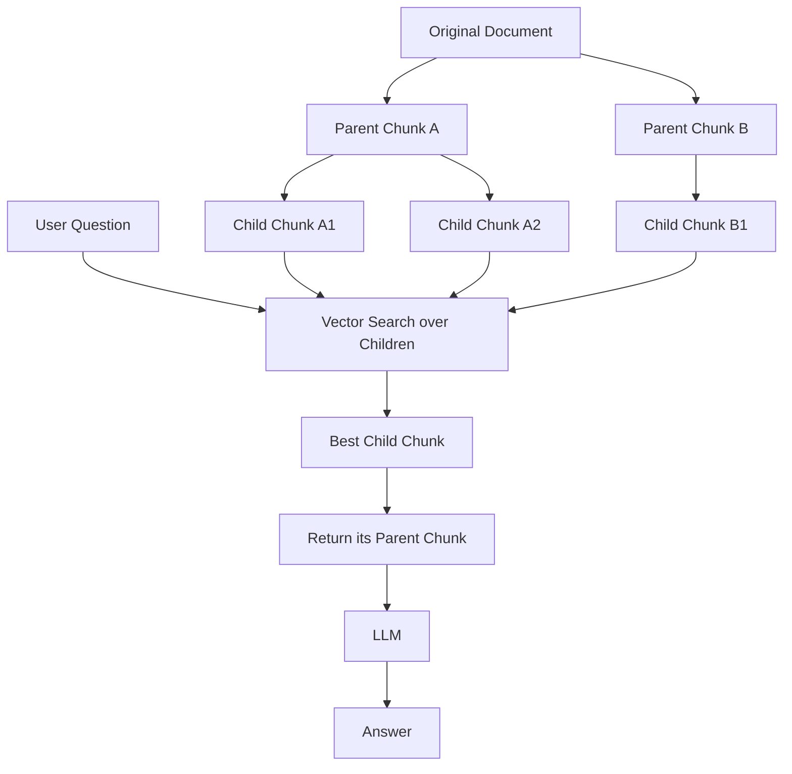

# Parent Document Retrieval

## Introduction

Small chunks retrieve precisely. Large chunks provide context.

These two goals pull in opposite directions:

```text
Tiny chunk   →  precise match, but often lacks surrounding meaning
Huge chunk   →  full context, but noisy and hard to match precisely
```

**Parent document retrieval** gets the best of both:

```text
Embed small chunks (child)
Retrieve the small chunk
Return the larger chunk it came from (parent)
```

---

## Learning Objectives

By the end of this chapter, you will understand:

- The precision-vs-context trade-off in chunk sizing
- How parent document retrieval works
- When it is worth the extra complexity

---

## The Trade-off Problem

### Embedding big chunks

```text
Chunk: a whole section about leave policy
Embedding: average of many ideas → fuzzy match
```

### Embedding tiny chunks

```text
Chunk: "carried forward to next year"
Embedding: precise, but the sentence alone may confuse the LLM
```

---

## The Pattern



1. Small **child** chunks are embedded and searched (precise matching).
2. When a child matches, its **parent** chunk is returned.
3. The LLM gets the full context from the parent.

---

## Concrete Example

A leave policy document is split into sections:

```text
Parent: "Leave Entitlement" section (5 sentences)
  Child 1: "Employees receive 30 annual leave days."
  Child 2: "Unused leave may be carried forward."
  Child 3: "Requests must be approved by a manager."
```

Question: "Can I carry forward vacation time?"

- Vector search matches **Child 2** precisely.
- The system returns the whole **"Leave Entitlement"** section.
- The LLM answers with full context instead of one bare sentence.

---

## When to Use It

| Situation | Recommendation |
|---|---|
| Answers need surrounding context | Use parent document retrieval |
| Chunks are small (100-300 chars) | Worth considering |
| Simple FAQ with self-contained chunks | Not needed |
| Your chunks already carry enough context | Skip it |

---

## Key Takeaways

- Small chunks are good at **finding** information; large chunks are good at **explaining** it.
- Parent document retrieval searches small children but returns big parents.
- It improves answer quality when small chunks lack surrounding context.

---

## Test Yourself

1. What is the advantage of small chunks for retrieval?
2. What is the advantage of large chunks for answering?
3. In parent document retrieval, which chunks are searched against the question?
4. Which chunks are sent to the LLM?
5. True or False: Parent document retrieval requires re-embedding every parent chunk.

<details>
<summary>Answers</summary>

1. They match specific information precisely.
2. They provide surrounding context so answers are not taken out of context.
3. The small child chunks.
4. The parent chunks that the matched children belong to.
5. False. Only the children are embedded and searched; parents are stored and returned by reference.
</details>
