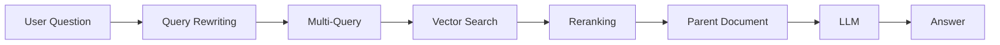

# Module 9: Advanced RAG

## Introduction

A basic RAG pipeline works for demos. Real-world systems need more:

```text
Simple RAG          Advanced RAG
Retrieve → Answer   Rewrite → Retrieve → Rerank → Answer
```

This module layers proven techniques on top of the basic pipeline to improve
**retrieval quality**, **conversational flow**, and **answer precision**.

---

## Where Advanced RAG Fits



---

## Chapters

| Chapter | File | What you will learn |
|---|---|---|
| 01 | `01-Query-Rewriting.md` | Turning raw, vague questions into searchable queries |
| 02 | `02-Multi-Query-Retrieval.md` | Retrieving with several paraphrases, then merging results |
| 03 | `03-Reranking.md` | Using a cross-encoder to re-score candidates for precision |
| 04 | `04-History-Aware-RAG.md` | Conversational RAG with chat history |
| 05 | `05-Parent-Document-Retrieval.md` | Embedding small, returning big |

---

## Sample Code

| File | What it demonstrates | How to run |
|---|---|---|
| `01-history-aware-generation.py` | Full conversational RAG (chat history + query rewriting) | `python "Module-9-Advanced-RAG/01-history-aware-generation.py"` |
| `02-query-rewriting.py` | Raw vs rewritten query retrieval comparison | `python "Module-9-Advanced-RAG/02-query-rewriting.py"` |
| `03-reranking.py` | Cross-encoder reranking of retrieved chunks | `python "Module-9-Advanced-RAG/03-reranking.py"` |

**Prerequisites:** run `Module-6-Vector-Databases/01-ingestion-pipeline.py` once to build
`db/chroma_db`, and add your `OPENAI_API_KEY` to `.env`.

---

## Navigation

- Back to [Module 8: Generation](../Module-8-Generation/README.md)
- Forward to [Module 10: Evaluation](../Module-10-Evaluation/README.md)
- Course home: [README](../README.md)
